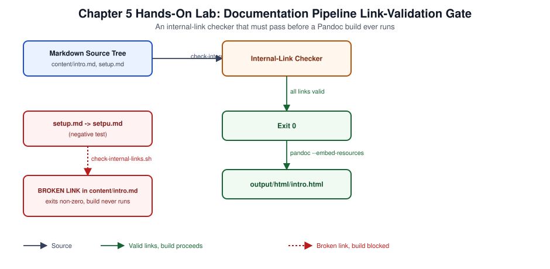

# Chapter 05: Documentation Pipelines and Publishing



*Figure 5-1. Flow used throughout this chapter's Hands-On Lab: the internal-link validation gate that must pass before the Pandoc HTML build runs, including the broken-link negative test.*

## Learning Objectives

- Explain the docs-as-code model and why Markdown-as-source-of-truth
  simplifies multi-format publishing compared to authoring directly in a
  binary or proprietary format.
- Build a Pandoc-based build pipeline that produces multiple output formats
  from a single Markdown source tree.
- Configure automated linting, spell-checking, and internal/external link
  validation as part of a documentation CI gate.
- Design a static-site publishing workflow (GitHub Pages) with a
  build-validate-deploy sequence.
- Diagnose common multi-format publishing failures (broken links, encoding
  issues, malformed front matter).

## Theory and Architecture

Documentation pipelines and publishing is the practice of treating written
content the way software teams treat code: stored as plain-text source
under version control, validated by automated checks before merge, and
transformed by a repeatable build into one or more distribution formats.
This is commonly called **docs-as-code**. It stands in contrast to
authoring directly inside a word processor or wiki, where content has no
diff-friendly history, no automated validation, and no reliable way to
regenerate multiple output formats from one source.

### Why Markdown as the source of truth

Markdown is the dominant docs-as-code source format because it is a thin,
mostly unambiguous layer over plain text: it diffs cleanly in `git diff`,
renders natively on every major Git hosting platform, and is a well-
supported input format for general-purpose document converters. The
critical architectural decision is committing to Markdown (or another
plain-text markup) as the **single source of truth**, and treating every
other format — HTML, PDF, EPUB, DOCX — as a *generated artifact* that is
never hand-edited. Generated output belongs in a gitignored build
directory, never in version control, so there is exactly one place a
correction can be made.

### The publishing pipeline as a sequence of gates

A mature documentation pipeline is a sequence of gates, each of which must
pass before the next runs:

1. **Editorial/structural validation** — required sections present, file
   naming conventions followed, cross-reference manifest matches the files
   on disk ([Chapter 02](02-repository-architecture.md)'s structural validator is the general form of this
   gate).
2. **Style and mechanical validation** — Markdown lint rules
   (heading-level skips, consistent list markers), spell-checking against a
   project-specific dictionary, and prose-style rules where defined.
3. **Link validation** — internal relative links resolve to files that
   exist (fast, no network required, safe to run on every commit) and
   external links return a successful status (slower, requires network,
   typically run separately so a flaky third-party site cannot block a
   local commit).
4. **Multi-format build** — a document converter (Pandoc is the common
   choice) transforms validated Markdown into the target formats: HTML,
   PDF, EPUB, DOCX.
5. **Publish** — the built artifacts are deployed to their distribution
   target: a static site host for HTML, a release asset for downloadable
   formats.

Each gate should fail the pipeline outright rather than produce a degraded
but "successful" build — a documentation pipeline that publishes despite a
broken internal link has silently shipped a defect to readers.

### Single-source, multi-format publishing

Pandoc is the workhorse for turning one Markdown source into several output
formats because it supports a wide matrix of input and output formats
through a common internal document model. A typical enterprise
documentation set built this way produces:

| Format | Typical use | Notes |
| --- | --- | --- |
| Self-contained HTML | Online reading, searchable portal | Can embed CSS/JS for a fully offline single file |
| Tagged PDF | Print, formal distribution, accessibility-compliant archival | Accessible/tagged PDF (PDF/UA) requires a converter that preserves document structure, such as Typst or a properly configured Pandoc+LaTeX chain |
| EPUB | E-reader distribution | Benefits from a defined chapter/section hierarchy in source |
| DOCX | Stakeholders who require an editable Word document | Round-trips reasonably well through Pandoc for review workflows |

Maintaining five formats from five separately maintained sources is not
tractable at enterprise scale; the entire value of the docs-as-code model
is that correcting one Markdown file and re-running the build corrects
every downstream format simultaneously.

## Design Considerations

- **Where validation stops and build begins.** Running an expensive
  multi-format build before cheap structural/lint checks wastes CI minutes
  on content that was already known to be broken. Order the pipeline
  cheapest-and-fastest-first.
- **Network-dependent checks must not block local commits.** External
  link checking depends on third-party site availability outside the
  project's control; running it as a blocking pre-commit or required PR
  check makes every contributor's workflow hostage to sites they do not
  control. Run it on a schedule or as a separate, non-blocking CI job
  instead.
- **Accessible output is a design requirement, not a finishing touch.**
  Tagged/structured PDF output (PDF/UA), meaningful alt text on every image,
  and never encoding information in color alone (see
  [EDITORIAL_STANDARDS.md](../../../EDITORIAL_STANDARDS.md)) must be
  decided before authoring begins, because retrofitting alt text and
  document structure across a large corpus after the fact is far more
  expensive than requiring it at authoring time.
- **Versioned vs. always-latest publishing.** A documentation set that
  changes frequently needs a decision about whether published output
  represents an immutable, versioned release (tagged and archived) or a
  continuously updated "latest" view — most enterprise documentation
  benefits from both: a continuously updated online edition, plus versioned
  release artifacts for compliance or offline distribution.
- **Build scope granularity.** Supporting a build of the complete corpus,
  one logical section, and one individual document (see this repository's
  `--volume` and `--chapter` build flags) lets contributors validate their
  own change's rendered output quickly without triggering a full-corpus
  build on every edit.
- **Theming and offline support.** A reading portal that must work for
  readers with accessibility needs (dark/light mode, adequate contrast) and
  for readers without reliable connectivity (a downloadable offline
  website archive) requires those requirements to shape the publishing
  pipeline's output targets, not just its visual design.

## Implementation and Automation

### 1. Markdown lint and spell-check configuration

```yaml
# .markdownlint-cli2.yaml
config:
  default: true
  MD013: false   # line length — prose wraps naturally, not enforced
  MD033: false   # inline HTML permitted for accessibility affordances
  MD041: false   # first line does not have to be a top-level heading in every included file
globs:
  - "**/*.md"
ignores:
  - "node_modules/**"
  - "output/**"
```

```json
{
  "version": "0.2",
  "language": "en",
  "words": ["Pandoc", "Typst", "Lychee", "cspell", "markdownlint"],
  "ignorePaths": ["node_modules/**", "output/**"]
}
```

Run both locally before pushing:

```bash
pnpm exec markdownlint-cli2 "**/*.md"
pnpm exec cspell "**/*.md"
```

### 2. Internal link validation (no network required)

```bash
#!/usr/bin/env bash
# scripts/bash/check-internal-links.sh
set -euo pipefail
fail=0
while IFS= read -r -d '' file; do
  dir=$(dirname "$file")
  # Extract relative Markdown links, ignoring external http(s) links.
  grep -oE '\]\(([^)]+\.md[^)]*)\)' "$file" | sed -E 's/^\]\((.*)\)$/\1/' | while read -r link; do
    target="${link%%#*}"
    [[ -z "$target" ]] && continue
    resolved=$(cd "$dir" && realpath -m "$target" 2>/dev/null || true)
    if [[ -n "$resolved" && ! -f "$resolved" ]]; then
      echo "BROKEN LINK in $file -> $link" >&2
      fail=1
    fi
  done
done < <(find . -name "*.md" -not -path "./node_modules/*" -not -path "./output/*" -print0)
exit "$fail"
```

### 3. External link validation with Lychee (network required, non-blocking)

```toml
# lychee.toml
accept = [200, 429]
exclude = ["^mailto:"]
timeout = 20
max_retries = 2
```

```bash
lychee --config lychee.toml "**/*.md"
```

### 4. Multi-format Pandoc build

```bash
#!/usr/bin/env bash
# scripts/bash/build-book.sh (simplified single-chapter example)
set -euo pipefail
SRC="$1"
OUT_DIR="output/html"
mkdir -p "$OUT_DIR"

pandoc "$SRC" \
  --standalone \
  --embed-resources \
  --css publishing/web.css \
  --metadata title="$(basename "$SRC" .md)" \
  -o "${OUT_DIR}/$(basename "$SRC" .md).html"
```

```bash
# EPUB build
pandoc SUMMARY.md --toc --epub-cover-image=cover.png -o output/epub/encyclopedia.epub

# DOCX build
pandoc chapter.md -o output/docx/chapter.docx

# Tagged PDF via Typst (accessible PDF/UA output)
pandoc chapter.md -t typst -o output/pdf/chapter.typ
typst compile output/pdf/chapter.typ output/pdf/chapter.pdf
```

### 5. GitHub Pages deployment workflow

```yaml
# .github/workflows/pages.yml
name: Deploy documentation portal

on:
  push:
    branches: [main]

permissions:
  contents: read
  pages: write
  id-token: write

concurrency:
  group: pages
  cancel-in-progress: true

jobs:
  build:
    runs-on: ubuntu-latest
    steps:
      - uses: actions/checkout@v4
      - uses: actions/setup-node@v4
        with:
          node-version-file: .node-version
      - run: corepack enable && corepack prepare pnpm@11.9.0 --activate
      - run: pnpm install --frozen-lockfile
      - name: Validate before publishing
        run: scripts/bash/validate.sh
      - name: Build download and reading portal
        run: scripts/bash/build-download-site.sh --output _site
      - uses: actions/upload-pages-artifact@v3
        with:
          path: _site

  deploy:
    needs: build
    runs-on: ubuntu-latest
    environment:
      name: github-pages
      url: ${{ steps.deployment.outputs.page_url }}
    steps:
      - id: deployment
        uses: actions/deploy-pages@v4
```

Validation runs as a required step immediately before the build, so a
structurally broken source tree can never reach a published deployment.

## Validation and Troubleshooting

- **Pandoc silently drops content.** A missing closing fence on a code
  block, or unescaped pipe characters inside a Markdown table cell, causes
  Pandoc to render the remainder of the block as raw text or truncate a
  table row without erroring. Run `pandoc --standalone -t html5 file.md -o
  /dev/null 2>&1 | grep -i warning` to surface non-fatal parser warnings
  that a silent success would otherwise hide.
- **EPUB validation failures.** Many e-reader platforms reject an EPUB
  that passes Pandoc's own build without complaint; validate output with
  `epubcheck output/epub/encyclopedia.epub` before treating an EPUB build
  as done — Pandoc's success only means the container was well-formed
  enough to write, not that it satisfies the full EPUB specification.
- **Broken internal links after a file rename.** A renamed chapter file
  breaks every relative link pointing at its old path; the internal-link
  checker (script above) catches this only if run after the rename, which
  is why it belongs in the same required CI gate as structural validation,
  not as an optional/manual step.
- **Encoding and character issues in DOCX output.** Curly quotes, em
  dashes, or non-breaking spaces pasted from a word processor into
  Markdown source can render correctly in HTML but corrupt in DOCX/EPUB
  conversion; normalize source text to plain ASCII punctuation with
  Markdown's own escape conventions where exact typography matters.
- **GitHub Pages deployment succeeds but shows stale content.** This is
  almost always a caching issue at the CDN edge, not a build failure;
  confirm the deployed commit SHA in the Pages deployment's environment
  record matches the latest `main` commit before troubleshooting the build
  itself.
- **Lychee false positives from rate limiting.** A `429 Too Many Requests`
  response from a legitimate external site is common when checking many
  links against the same domain quickly; the `accept = [200, 429]` and
  `max_retries` settings shown above prevent this from failing the check
  outright.

## Security and Best Practices

- Never hand-edit generated output (`output/`, `_site/`); gitignore it and
  regenerate from source, so there is exactly one place — the Markdown
  source — where a correction can silently diverge from what is published.
- Sanitize or restrict any raw HTML permitted in Markdown source
  (`MD033` disabled deliberately, as shown above) to accessibility
  affordances and known-safe patterns; unrestricted raw HTML in
  contributor-authored Markdown is an injection surface if the built HTML
  is ever served with elevated trust (for example, inside an internal
  portal with authenticated sessions).
- Pin the document-conversion toolchain (Pandoc, Typst) to the versions
  recorded in [SOFTWARE_VERSIONS.md](../../../SOFTWARE_VERSIONS.md) so a
  toolchain upgrade cannot silently change published output without a
  reviewed, intentional version bump.
- Run structural and lint validation as a required status check before the
  publish job, never after — a "publish first, validate after" ordering
  means defects are only caught once they are already live.
- Treat the publishing deployment credential (GitHub Pages' `id-token:
  write` permission, or any external hosting credential) with the same
  least-privilege scoping discussed in [Chapter 03](03-automation-architecture.md); the publish job should
  hold no more access than deploying the built artifact requires.
- Do not reproduce proprietary or licensed third-party content (vendor
  documentation excerpts, certification exam questions) in published
  output; cite and link to authoritative sources instead, consistent with
  this encyclopedia's own editorial constraints.

## References and Knowledge Checks

**References**

- [Pandoc User's Guide](https://pandoc.org/MANUAL.html) — format conversion options and metadata handling.
- [`epubcheck`](https://github.com/w3c/epubcheck) — the reference EPUB validation tool.
- [Lychee documentation](https://lychee.cli.rs/) — external link-checking configuration.
- [EDITORIAL_STANDARDS.md](../../../EDITORIAL_STANDARDS.md) — Markdown and
  accessibility conventions this pipeline enforces.
- [README.md](../../../README.md#validation) — this repository's own
  validation and multi-format build commands as a complete worked example.

**Knowledge checks**

1. Why must generated output formats never be hand-edited, and where
   should the correction for a rendering defect actually be made?
2. Why should external link checking run separately from the blocking
   pre-merge validation gate?
3. What does a successful Pandoc build *not* guarantee about EPUB output,
   and what closes that gap?
4. Why does validation need to run as a required step immediately before
   the publish job, rather than as an independent, unordered check?

## Hands-On Lab

This chapter carries a topic-level walkthrough lab for **each documentation-pipeline skill** —
authoring and linting Markdown, multi-format builds with Pandoc, static publishing, and the docs-as-
code CI gate. This is exactly how this encyclopedia is produced. Each ends **`**Lab verified by:**
*pending*`** until a human runs it.

**Shared prerequisites for Labs 5.1–5.4** — `pandoc`, `node`/`npx` (for `markdownlint-cli2` and
`cspell`), and `git`. **Cost:** none.

### Lab 5.1 — Author and lint Markdown (Topic: Docs-as-code authoring)

**Objective:** Write docs as linted, version-controlled Markdown.

```bash
mkdir -p ~/docs && cd ~/docs
cat > guide.md <<'EOF'
# Deployment Guide

## Prerequisites

- A configured workstation

## Steps

1. Clone the repo
2. Run `make deploy`
EOF
npx markdownlint-cli2 "guide.md" 2>&1 | tail -2
npx cspell "guide.md" 2>&1 | tail -1
```

**Expected result:** the Markdown lints clean for style (markdownlint) and spelling (cspell) —
docs-as-code treats documentation like source: plain-text Markdown in Git, linted for consistency and
spelling, reviewed in PRs, so docs stay current and consistent with the code.

**Negative test:** keep documentation in a binary word processor or a wiki outside version control;
it drifts from the code, is un-reviewable in PRs, and cannot be linted — Markdown-in-Git keeps docs
alongside and in sync with the code.

**Cleanup:** `rm -rf ~/docs`.

### Lab 5.2 — Multi-format build with Pandoc (Topic: Publishing pipeline)

**Objective:** Render one source into multiple formats.

```bash
cd ~/docs 2>/dev/null || { mkdir -p ~/docs && cd ~/docs && printf '# Guide\n\nHello.\n' > guide.md; }
pandoc guide.md -o guide.html --standalone
pandoc guide.md -o guide.pdf 2>/dev/null || pandoc guide.md -o guide.epub
ls -1 guide.*
```

**Expected result:** the single `guide.md` renders to HTML (and PDF/EPUB) — Pandoc is the
single-source-multi-output engine: author once in Markdown, publish to HTML for the web, PDF for
print, and EPUB for readers, which is how this encyclopedia produces all its formats from one source.

**Negative test:** maintain separate hand-written HTML and PDF versions of the same doc; they diverge
and double the work — a single Markdown source rendered by Pandoc keeps every format consistent.

**Cleanup:** `rm -rf ~/docs`.

### Lab 5.3 — Static publishing (Topic: Publishing)

**Objective:** Publish rendered docs as a static site.

```bash
mkdir -p ~/site && cd ~/site
pandoc <(printf '# Home\n\nWelcome.\n') -o index.html --standalone --embed-resources
# A static site (self-contained HTML) is served by GitHub Pages / any web host with no backend:
python3 -m http.server 8080 & sleep 1; curl -s http://localhost:8080/ | head -3; kill %1
```

**Expected result:** a self-contained `index.html` served statically — static sites (embedded
resources, no server-side code) are cheap, fast, secure, and easily hosted (GitHub Pages), which is
why documentation portals are typically static builds published from CI.

**Negative test:** run a dynamic CMS/backend just to serve read-only documentation; it adds attack
surface and operational cost for no benefit — static rendered docs need no backend to serve.

**Cleanup:** `rm -rf ~/site`.

### Lab 5.4 — The docs-as-code CI gate (Topic: Quality gate)

**Objective:** Fail the build on doc-quality violations.

```yaml
# .github/workflows/docs.yml — lint + build docs on every change
name: docs
on: [push, pull_request]
jobs:
  docs:
    runs-on: ubuntu-latest
    steps:
      - uses: actions/checkout@v4
      - run: npx markdownlint-cli2 "**/*.md"
      - run: npx cspell "**/*.md"
      - run: pandoc README.md -o /tmp/out.html
```

**Expected result:** a CI job that lints, spell-checks, and builds the docs on every change, failing
on any violation — gating docs in CI (exactly as this repository does) keeps documentation
consistently formatted, correctly spelled, and buildable, so quality does not depend on individual
diligence.

**Negative test:** publish docs with no CI gate; broken links, lint violations, and typos accumulate
and the site build eventually fails silently — the CI gate catches each violation at the PR.

**Cleanup:** none.

## Lab Verification

Complete this sign-off once the lab has been run end to end, including the
negative test. Until then, the lab is unverified.

- **Lab verified by:** *pending*
- **Date:** *pending*

## Summary and Completion Checklist

Docs-as-code treats Markdown as the single, version-controlled source of
truth and every other format — HTML, PDF, EPUB, DOCX — as a regenerated
artifact, never hand-edited. A well-architected pipeline orders its gates
from cheapest to most expensive: structural and style validation, then
internal link checking, then the multi-format build, then publish — with
network-dependent external link checks kept separate so they cannot block
routine commits. Validation must run as a required, ordered step
immediately before publish, not as an optional or disconnected check.

- [ ] Can explain the docs-as-code model and why generated output is never
      hand-edited.
- [ ] Can configure Markdown lint, spell-check, and internal link
      validation as an ordered pipeline.
- [ ] Can build at least two output formats from the same Markdown source
      with Pandoc.
- [ ] Can explain why external link checks should not block routine
      commits.
- [ ] Completed the hands-on lab, including the negative test and cleanup.
