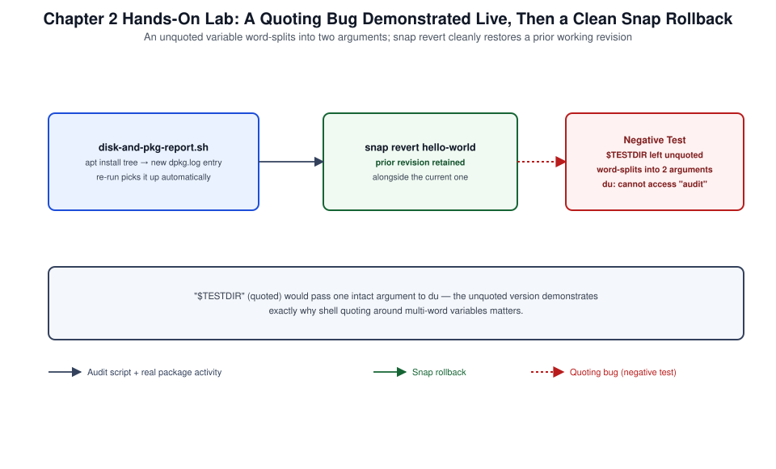

# Chapter 02: Essential Tools, Shell Scripting, APT, and Snap Management



*Figure 2-1. The audit script, snap rollback, and shell quoting-bug negative test exercised in this chapter's lab.*

## Learning Objectives

- Compose core coreutils, `grep`, `sed`, `awk`, and `find` into working
  administrative pipelines on Ubuntu Server.
- Write idempotent, correctly quoted Bash scripts suitable for cron,
  systemd, and Ansible invocation.
- Operate APT's full command surface (`apt`, `apt-get`, `apt-cache`,
  `apt-mark`) and understand its relationship to `dpkg`.
- Manage Snap packages, including channels, confinement, and revision
  rollback.
- Diagnose a broken APT transaction and a misbehaving Snap.

## Theory and Architecture

Ubuntu Server's shell environment is the same GNU coreutils, Bash 5.x,
and text-processing toolkit used across the Linux ecosystem, but two
package management systems sit side by side: **APT/dpkg**, the classic
Debian-family package manager operating against the repositories
described in [Chapter 01](01-installation-autoinstall-ubuntu-pro-repositories-and-landscape.md), and **Snap**, Canonical's containerized,
transactional package format. A competent Ubuntu administrator needs
both, plus the scripting discipline to automate around them safely.

### The Unix pipeline model

Every tool in this chapter reads from standard input or a file
argument and writes to standard output, letting pipelines (`|`) chain
single-purpose utilities into one composed operation. Redirection
(`>`, `>>`, `<`, `2>`, `&>`) routes those streams independently of the
pipeline, so `command 2>errors.log | tee output.log` can capture
failures to one file while a human still watches the pipeline's
successful output on the terminal.

### Text processing tools

| Tool | Role | Typical use |
| --- | --- | --- |
| `grep` | Pattern matching (BRE/ERE) | Filter lines matching or excluding a pattern |
| `sed` | Stream editing | Scripted, line-oriented text transformation |
| `awk` | Field-oriented processing | Column extraction, arithmetic, report generation |
| `find` | Filesystem traversal | Locate files by name, type, age, size, owner |
| `xargs` | Argument construction | Turn a stream of names into arguments, with parallelism |

`grep` defaults to basic regular expressions (BRE) unless invoked as
`grep -E`; `awk` always speaks extended regular expressions (ERE).
Knowing which dialect a given tool expects avoids a large share of
"my pattern doesn't match" debugging.

### Shell scripting fundamentals

Three habits separate a production-quality Bash script from an ad hoc
one-liner:

1. **Exit status discipline.** Every command sets `$?`; `0` is success.
   `set -e` (or explicit checks) turns an unhandled failure into a hard
   stop instead of a script that silently continues on bad data.
2. **Quoting.** Unquoted variable expansion (`$var`) is subject to
   word-splitting and glob expansion — a routine source of scripts that
   break the first time they meet a filename with a space. Default to
   `"$var"`.
3. **Idempotency.** A script safe to run once should be safe to run
   five times, producing the same end state — the same expectation this
   volume places on cloud-init ([Chapter 09](09-cloud-init-maas-juju-ansible-landscape-operations-and-capstone.md)) and Ansible ([Chapter 09](09-cloud-init-maas-juju-ansible-landscape-operations-and-capstone.md)).

### APT and dpkg architecture

`dpkg` is the low-level package tool: it installs, removes, and queries
individual `.deb` files against the package database at
`/var/lib/dpkg`, with no concept of remote repositories or dependency
resolution beyond what is already on disk. **APT** (Advanced Package
Tool) is the layer above it: it reads repository metadata ([Chapter 01](01-installation-autoinstall-ubuntu-pro-repositories-and-landscape.md)),
resolves dependencies, downloads `.deb` files, and hands them to
`dpkg` to actually install. In practice:

- `apt` is the modern, human-oriented front end (progress bars,
  sensible defaults) recommended for interactive use.
- `apt-get`/`apt-cache` are the older, script-stable front ends —
  their output format is guaranteed not to change across releases,
  which is why automation and documentation still frequently prefer
  them over `apt` for exact command output.
- `dpkg` and `dpkg-query` remain the tools for questions APT does not
  answer directly: "which package owns this file," "what files does
  this package contain," "is this package's on-disk state consistent
  with its manifest."

### Snap architecture

Snap packages bundle an application with its runtime dependencies into
a single compressed, read-only, squashfs-backed image, mounted at
`/snap/<name>/<revision>` and confined by AppArmor ([Chapter 06](06-apparmor-permissions-cryptography-and-system-hardening.md)) and
seccomp. This trades some disk space and a slightly different
filesystem layout for two properties APT-based packages generally
lack: **automatic background updates** on a defined schedule, and
**atomic rollback** to the previous revision if an update misbehaves.
Snaps track one of four **channels** per release track — `stable`,
`candidate`, `beta`, `edge` — and run under one of three **confinement**
levels:

| Confinement | Isolation | Typical use |
| --- | --- | --- |
| `strict` | Full AppArmor/seccomp sandbox, explicit interface grants required | Most snaps |
| `classic` | No sandboxing, full system access | Tools that must behave like a traditional package (e.g., development toolchains) |
| `devmode` | Sandboxed but violations logged, not enforced | Snap development/debugging only |

## Design Considerations

- **grep/sed/awk vs. a general-purpose language.** These tools excel at
  single-pass, line-oriented text a human can reason about. Once a task
  needs structured data (JSON, complex state, error handling beyond
  exit codes), Python or an Ansible module is usually less fragile than
  a long `awk` script.
- **Script location and packaging.** Ad hoc scripts belong in an
  administrator's personal tooling; anything scheduled or invoked by
  another system belongs under `/usr/local/sbin` (root-only) or
  `/usr/local/bin`, version-controlled, not hand-edited on production
  hosts.
- **`apt` vs. `apt-get`/`apt-cache` in automation.** Prefer `apt-get`
  and `apt-cache` (or the `ansible.builtin.apt` module, which itself
  wraps `python-apt`) in scripts and playbooks, since `apt`'s
  human-oriented output is explicitly not guaranteed stable across
  versions; reserve `apt` for interactive sessions.
- **Unattended-upgrades policy.** Decide, per environment, whether
  security updates apply automatically (`unattended-upgrades`, the
  Ubuntu default for `-security`) or only through a change-controlled
  window; unattended patching reduces CVE exposure time but removes the
  human checkpoint before a kernel or service-affecting update lands.
- **APT holds and pinning.** Environments with strict compatibility
  requirements should use `apt-mark hold` or an APT pin rather than
  relying on staff discipline to avoid an unwanted upgrade — and should
  document why, so a hold does not silently block a future security fix.
- **Snap vs. APT for a given application.** Snap's automatic updates
  and rollback favor fast-moving or security-sensitive applications
  (browsers, `certbot`); APT's fully declarative, repository-pinned
  model favors infrastructure components where an administrator wants
  precise control over exactly when a version changes.
- **Exit-code contracts in automation.** Any script invoked by
  systemd, cron, or Ansible must return accurate exit codes; a script
  that always exits `0` regardless of internal failure silently breaks
  monitoring built on top of it.

## Implementation and Automation

### 1. Filesystem navigation and inspection

```bash
# Long listing with human-readable sizes, including hidden files
ls -lah /var/log

# Disk usage summary, one level deep, human-readable
du -h --max-depth=1 /var

# Filesystem-level free space
df -hT

# Find files modified in the last 24 hours under /etc
find /etc -type f -mtime -1

# Find and remove files older than 30 days in a scratch directory
find /var/tmp/reports -type f -mtime +30 -exec rm -f {} \;

# Find world-writable files (a common hardening audit)
find / -xdev -type f -perm -0002 -exec ls -l {} \;
```

### 2. Text processing with grep, sed, and awk

```bash
# Show lines matching a pattern, with line numbers, case-insensitive
grep -in "failed password" /var/log/auth.log

# Extended regex: match either "error" or "critical" in the journal export
journalctl -k --no-pager | grep -E "error|critical"

# In-place substitution across a config file, with a backup
sed -i.bak 's/^PermitRootLogin.*/PermitRootLogin no/' /etc/ssh/sshd_config

# Print the third column (UID) of /etc/passwd-style colon data
awk -F: '{ print $1, $3 }' /etc/passwd

# Sum the second column of a report and print the total
awk '{ sum += $2 } END { print "Total:", sum }' disk-report.txt
```

### 3. A production-style Bash script

```bash
#!/usr/bin/env bash
# package-audit.sh — report packages not from an enabled, trusted source
set -euo pipefail

LOGFILE="/var/log/package-audit.log"

log() {
  printf '%s %s\n' "$(date '+%Y-%m-%d %H:%M:%S')" "$1" | tee -a "$LOGFILE"
}

log "Starting package audit"

# Packages with no candidate version from any configured repository
orphaned=$(apt list --installed 2>/dev/null | grep -v "^Listing" | \
  awk -F/ '{ print $1 }' | while read -r pkg; do
    apt-cache policy "$pkg" | grep -q "Candidate: (none)" && echo "$pkg"
  done || true)

if [[ -n "${orphaned}" ]]; then
  log "WARNING: packages with no candidate in configured repositories:"
  echo "${orphaned}" | tee -a "$LOGFILE"
  exit_code=1
else
  log "OK: all installed packages have a repository candidate"
  exit_code=0
fi

log "Audit complete"
exit "${exit_code}"
```

Key patterns worth calling out: `set -euo pipefail` turns unset
variables and mid-pipeline failures into hard errors instead of silent
continuations; `log()` centralizes timestamped output to both console
and file; and the script's final `exit` code reflects whether a finding
occurred, so it composes correctly with cron, systemd `OnFailure=`, or
an Ansible `command` task's `failed_when`.

### 4. Software management with apt, apt-get, and dpkg

```bash
# Refresh repository metadata before any install/upgrade
sudo apt update

# Search for a package by name or description
apt search nginx

# Show detailed package metadata and origin before installing
apt-cache policy nginx

# Install with automatic dependency resolution
sudo apt install -y nginx

# Upgrade everything (respects held packages), or a single package
sudo apt upgrade -y
sudo apt install --only-upgrade -y nginx

# Full-upgrade resolves changed dependencies, including removals
sudo apt full-upgrade -y

# Remove a package but keep its configuration files
sudo apt remove -y nginx

# Remove a package and purge its configuration
sudo apt purge -y nginx

# Remove packages no longer required by anything
sudo apt autoremove -y

# List currently held (pinned-not-to-upgrade) packages
apt-mark showhold

# Hold a package at its current version
sudo apt-mark hold nginx
sudo apt-mark unhold nginx

# Query the dpkg database directly
dpkg -l | grep nginx
dpkg -L nginx                    # list files owned by the package
dpkg -S /etc/nginx/nginx.conf    # which package owns this file
sudo dpkg --verify nginx         # compare installed files to the package manifest
```

### 5. Unattended-upgrades

```bash
sudo apt install -y unattended-upgrades
sudo dpkg-reconfigure -plow unattended-upgrades

# Inspect what origin patterns are enabled for automatic upgrade
grep -A5 "Allowed-Origins" /etc/apt/apt.conf.d/50unattended-upgrades

# Dry-run to see what would be upgraded
sudo unattended-upgrade --dry-run --debug
```

### 6. Snap management

```bash
# List installed snaps, including revision and channel
snap list

# Search and install a snap
snap find lxd
sudo snap install lxd

# Install from a specific channel (candidate/beta/edge)
sudo snap install lxd --channel=latest/candidate

# Refresh a snap (or all snaps) immediately, outside the scheduled window
sudo snap refresh lxd
sudo snap refresh

# Inspect refresh schedule and hold status
snap refresh --time
sudo snap refresh --hold=24h lxd

# Roll back to the previous revision after a bad update
sudo snap revert lxd

# List available revisions retained on disk
snap list lxd --all

# Inspect and manage interface connections (strict-confinement plumbing)
snap connections lxd
sudo snap connect lxd:network-control

# Remove a snap, keeping its data for a possible reinstall
sudo snap remove lxd
```

## Validation and Troubleshooting

- **Confirm a script's logic without side effects.** Run with `bash -x
  script.sh` to trace execution, or `bash -n script.sh` to check
  syntax only, before running against production data.
- **Diagnose "command not found" in a script vs. shell.** A script
  invoked via `sh script.sh` may not have the same `PATH` or builtins
  as an interactive Bash session; always invoke with `./script.sh`
  (respecting the shebang) or explicitly `bash script.sh`.
- **Diagnose a stuck or failed APT transaction.**

  ```bash
  sudo lsof /var/lib/dpkg/lock-frontend
  sudo fuser /var/lib/dpkg/lock-frontend
  ```

  If no `apt`/`dpkg` process actually holds the lock, a stale lock file
  can be removed as a last resort, followed by
  `sudo dpkg --configure -a` to finish any half-configured package.
- **Diagnose unmet dependencies.** `apt install` failing with a
  dependency error benefits from `apt-get install -f` (fix broken
  dependencies) and `apt-cache policy <package>` to confirm which
  repository is (or is not) offering a satisfying version.
- **Verify installed-file integrity.** `sudo dpkg --verify <package>`
  flags files that differ from the package manifest; combine with
  `debsums -c` (package `debsums`) for a checksum-based sweep across
  the whole system.
- **A snap fails to refresh or start.** `snap changes` lists recent
  operations; `snap change <id>` shows detail on a failed one, and
  `journalctl -u snapd` surfaces daemon-level errors (commonly a
  confinement/interface denial, visible as an AppArmor `DENIED` entry —
  see [Chapter 06](06-apparmor-permissions-cryptography-and-system-hardening.md)).
- **Common failure: `sed` in-place edits without a backup.** `sed -i`
  without a suffix overwrites the file with no recovery path if the
  expression was wrong. Always use `sed -i.bak` (or test with `sed`
  alone, no `-i`, first) against configuration files.

## Security and Best Practices

- Never pipe an untrusted, unreviewed script directly into `bash`
  (`curl ... | bash`); download, inspect, and then execute, or verify a
  checksum/signature first.
- Quote every variable expansion in scripts that touch filenames
  (`"$file"`, not `$file`) to prevent word-splitting and glob-expansion
  bugs from becoming path-traversal or unintended-deletion incidents.
- Use `set -euo pipefail` in administrative scripts so a failed command
  in the middle of a pipeline does not silently allow the script to
  continue as if nothing happened.
- Leave APT's GPG signature verification (`Signed-By`) enabled for
  every source, including third-party and PPA sources; never pass
  `--allow-unauthenticated` to work around a signing issue — fix the
  key import instead.
- Prefer `strict` confinement snaps; treat `classic`-confinement snaps
  as equivalent to a traditional unsandboxed package and vet the
  publisher accordingly.
- Use `apt-mark hold` and APT pinning deliberately and document why a
  package is pinned, so the pin does not silently block a future
  security update; review holds on a schedule.
- Keep `find -exec` and `xargs`-driven deletions behind a dry-run pass
  (`find ... -print` before adding `-delete`/`-exec rm`) when the
  pattern is new or broad.

## References and Knowledge Checks

**References**

- [`bash(1)`, `grep(1)`, `sed(1)`, `gawk(1)`, `find(1)` man pages.](https://man7.org/linux/man-pages/man1/bash.1.html)
- [`apt(8)`, `apt-get(8)`, `apt-cache(8)`, `dpkg(1)` man pages, Ubuntu
  Server Guide](https://ubuntu.com/server/docs/) — Package management.
- [`snap(1)` man page and Snapcraft documentation](https://snapcraft.io/docs/) — confinement and
  channels reference.
- [SOFTWARE_VERSIONS.md](../../../SOFTWARE_VERSIONS.md) — Ubuntu Server
  26.04 baseline referenced throughout this chapter.

**Knowledge checks**

1. Why does an unquoted `$variable` expansion in a Bash script risk
   incorrect behavior on filenames containing spaces?
2. What is the practical difference between `apt` and `apt-get` for use
   inside an automated script?
3. What does `apt-mark hold` do, and what operational discipline should
   accompany its use?
4. Why might an administrator choose a snap over an APT package for a
   given application, and what is the trade-off of `classic`
   confinement?

## Hands-On Lab

This chapter carries a topic-level walkthrough lab for **each skill in the "Using Linux
Terminal" competency** — files and links, text processing, package management (APT and snap),
and shell scripting. Every step is a runnable Ubuntu 26.04 command. Each ends **`**Lab verified
by:** *pending*`** until a human runs it.

**Shared prerequisites for Labs 2.1–2.4** — an Ubuntu 26.04 shell with `sudo`, and a scratch dir
`mkdir -p ~/lab && cd ~/lab`. **Cost:** none.

### Lab 2.1 — Files, directories, and links (Topic: Navigating filesystems)

**Objective:** Manage files and create hard and symbolic links.

```bash
cd ~/lab
echo "data" > file.txt
ln file.txt hard.txt          # hard link (same inode)
ln -s file.txt soft.txt       # symbolic link (points to the name)
ls -li file.txt hard.txt soft.txt
```

**Expected result:** `file.txt` and `hard.txt` share one inode and link count 2; `soft.txt` is a
separate inode pointing to the name — a hard link is another name for the same data, a symlink is
a pointer that breaks if the target is removed; distinguishing them is core terminal fluency.

**Negative test:** `rm file.txt`, then `cat hard.txt` (works — data persists) vs `cat soft.txt`
(fails — dangling symlink) — this proves the inode-vs-name distinction.

**Cleanup:** `rm -f ~/lab/file.txt ~/lab/hard.txt ~/lab/soft.txt`.

### Lab 2.2 — Text processing and redirection (Topic: Managing system resources)

**Objective:** Filter and transform text with pipes and redirection.

```bash
cd ~/lab
getent passwd > users.txt
grep -c bash users.txt
awk -F: '$3 >= 1000 {print $1}' users.txt
ps -eo pid,comm,%mem --sort=-%mem | head -5 > topmem.txt && cat topmem.txt
```

**Expected result:** counts of bash users, the regular (UID≥1000) accounts, and the top
memory-consuming processes — `grep`/`awk`/`sed` with pipes and redirection (`>`, `>>`, `2>`) are
the terminal's core tools for extracting and reporting on system data.

**Negative test:** use `>` where you meant `>>` and overwrite a report you meant to append to;
prior content is lost — redirection operators are exact.

**Cleanup:** `rm -f ~/lab/users.txt ~/lab/topmem.txt`.

### Lab 2.3 — APT and snap package management (Topic: Managing applications)

**Objective:** Manage software through both Ubuntu package systems.

```bash
sudo apt update && sudo apt install -y tree
apt-mark hold tree && apt-mark showhold          # pin against upgrades
sudo snap install hello-world
snap list | grep hello-world
snap info hello-world | grep -E "channels:|tracking" 
```

**Expected result:** `tree` installs via APT and is held from upgrades, while `hello-world`
installs as a snap tracking a channel — Ubuntu has two package systems: APT (debs, versioned in
repos) and snap (self-contained, channel-based, auto-updating); managing both, including holds
and channels, is an exam competency.

**Negative test:** expect a snap to stay on a fixed version by default; snaps auto-refresh from
their channel — pin with `snap refresh --hold` or a specific channel, unlike an APT `hold`.

**Cleanup:** `sudo apt-mark unhold tree; sudo apt remove -y tree; sudo snap remove hello-world`.

### Lab 2.4 — A simple shell script (Topic: Scripting)

**Objective:** Write a script with a conditional, a loop, and exit status.

```bash
cd ~/lab
cat > report.sh <<'EOF'
#!/bin/bash
dir="${1:-.}"
if [ ! -d "$dir" ]; then echo "Not a directory: $dir" >&2; exit 1; fi
for f in "$dir"/*; do [ -f "$f" ] && echo "file: $f"; done
exit 0
EOF
chmod +x report.sh
./report.sh /etc >/dev/null; echo "exit=$?"
./report.sh /nope; echo "exit=$?"
```

**Expected result:** the script lists files and exits 0, then reports the bad directory to stderr
and exits 1 — scripting with positional parameters, conditionals, loops, and meaningful exit
codes is expected across the terminal and DevOps domains.

**Negative test:** omit the `#!/bin/bash` shebang or `chmod +x`; the script runs under the wrong
interpreter or is not executable — both are required to run a script directly.

**Cleanup:** `rm -f ~/lab/report.sh`.

## Lab Verification

Complete this sign-off once the lab has been run end to end, including the
negative test. Until then, the lab is unverified.

- **Lab verified by:** *pending*
- **Date:** *pending*

## Summary and Completion Checklist

Command-line fluency with coreutils, `grep`/`sed`/`awk`, `find`, and
disciplined Bash scripting underpins every later chapter's automation.
APT and `dpkg` form a two-layer software management model — APT
resolves dependencies and manages repositories, `dpkg` provides
low-level query and verification — while Snap adds a parallel,
transactional model with automatic updates and rollback for
applications where that trade-off makes sense. Scripts intended for
production or automation use should be idempotent, correctly quoted,
and honest about their exit status.

- [ ] Can compose `grep`, `sed`, `awk`, and `find` into working
      text-processing pipelines.
- [ ] Can write a Bash script using `set -euo pipefail`, functions, and
      correct variable quoting.
- [ ] Can install, query, hold, and remove software using `apt`,
      `apt-mark`, and `dpkg`.
- [ ] Can manage Snap channels, confinement, and revision rollback.
- [ ] Can diagnose a broken script, a locked APT transaction, and a
      failed snap refresh.
- [ ] Completed the hands-on lab, including the negative test and
      cleanup.
