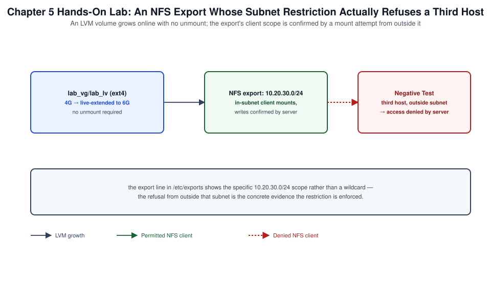

# Chapter 05: Storage, LVM, Filesystems, Swap, and Shared-Storage Services



*Figure 5-1. The LVM growth and NFS export topology exercised in this chapter's lab, including the out-of-subnet negative test.*

## Learning Objectives

- Partition block devices and build an LVM stack (PV, VG, LV) that
  supports online growth.
- Create, mount, and tune ext4, XFS, and ZFS filesystems on Ubuntu
  Server.
- Configure swap correctly, including the zram-first default on modern
  Ubuntu cloud images.
- Stand up and consume NFS and Samba shares, and connect to an iSCSI
  target.
- Diagnose common storage, mount, and shared-storage failures.

## Theory and Architecture

Ubuntu Server's storage stack layers in the same order most enterprise
Linux systems do — block device, optional LVM, filesystem, mount — but
Ubuntu's installer defaults and native tooling choices (LVM-on-root by
default in Subiquity, first-class ZFS support, zram-based swap on cloud
images) are distinctive enough to treat as their own topic rather than
assuming RHEL or generic Linux conventions carry over unchanged.

### Block devices and partitioning

`lsblk` and `blkid` remain the starting point for any storage
investigation: `lsblk` shows the device tree (disks, partitions, LVM
logical volumes, their mount points), while `blkid` resolves each
device to its filesystem type and UUID — the identifier `/etc/fstab`
should reference instead of a `/dev/sdX` path, which can shift across
reboots on hosts with multiple disks. `parted` (GPT/MBR-aware) and
`gdisk` (GPT-focused) create and modify partition tables; GPT is the
Subiquity installer default and the only sane choice for disks larger
than 2 TiB.

### LVM: PV, VG, LV

**LVM (Logical Volume Management)** inserts an abstraction layer
between raw partitions and filesystems:

1. A **Physical Volume (PV)** is a partition or whole disk initialized
   for LVM use.
2. One or more PVs form a **Volume Group (VG)**, a pool of storage
   capacity.
3. A **Logical Volume (LV)** is carved from a VG's free space and is
   what actually gets a filesystem and a mount point.

This indirection is why LVM can grow a filesystem online by adding a
new PV to the VG and extending the LV into the new space, and why LVM
snapshots (a copy-on-write LV tracking changes since creation) exist —
neither is possible with a filesystem sitting directly on a raw
partition. Subiquity's default "LVM" storage layout in [Chapter 01](01-installation-autoinstall-ubuntu-pro-repositories-and-landscape.md) uses
exactly this structure for the root filesystem, which is why an LVM
root can be grown non-disruptively when a cloud disk is resized.

### Filesystem choices

| Filesystem | Strengths | Typical use on Ubuntu Server |
| --- | --- | --- |
| **ext4** | Mature, fast `fsck`, broad tooling support | Default root and general-purpose filesystem |
| **XFS** | Strong large-file and parallel I/O performance, online grow | Large data volumes, database storage |
| **ZFS** | Native on Ubuntu (`zfsutils-linux`, in-tree `zfs` root support since 20.04), checksummed, snapshots, built-in volume management | Storage-heavy hosts wanting snapshots/compression without a separate LVM layer |

ZFS deserves particular note: Ubuntu is the only major distribution
shipping ZFS as a fully supported, installer-selectable root filesystem
option, folding pool management, volume management, snapshots, and
checksumming into one subsystem rather than layering LVM under ext4/
XFS. Choosing ZFS root trades the familiarity of the LVM+ext4/XFS stack
for built-in data integrity and instant snapshots, at the cost of
higher memory use (ARC cache) and a steeper operational learning curve.

### Swap on modern Ubuntu

Ubuntu Server cloud images default to **zram** — a compressed block
device in RAM used as swap — configured by `systemd-zram-generator`,
rather than a traditional disk-backed swap partition or file. zram
trades some CPU for compression against much faster effective swap I/O
than a disk-backed swap file, and avoids provisioning a dedicated swap
partition on ephemeral cloud storage. Traditional swap (file or
partition) is still fully supported and often still preferred for bare
metal with predictable memory pressure, or when hibernation support is
required (zram cannot back hibernation).

### Shared-storage services

- **NFS** — the standard Unix network filesystem; Ubuntu Server runs
  either the kernel NFS server (`nfs-kernel-server`) for exporting or
  the client tools (`nfs-common`) for mounting remote exports.
- **Samba** — SMB/CIFS file and (optionally) domain services,
  necessary wherever Windows clients or Windows-interoperable tooling
  need file access.
- **iSCSI** — block-level storage over IP; Ubuntu's `open-iscsi`
  initiator discovers and logs into targets exposed by a SAN or a
  software target (`targetcli`), presenting them to the OS as ordinary
  block devices that can then carry LVM, a filesystem, or be handed
  directly to a hypervisor.

## Design Considerations

- **LVM vs. filesystem-native volume management.** LVM+ext4/XFS is the
  broadly compatible default most tooling (backup agents, monitoring,
  documentation) assumes; ZFS consolidates more capability into fewer
  moving parts but requires the whole team to understand `zpool`/`zfs`
  semantics, which are meaningfully different from LVM's.
  Standardize on one model per fleet rather than mixing arbitrarily.
- **Partition/PV sizing headroom.** Leave unallocated space in the VG
  (or an unpartitioned region of disk) deliberately when building a
  new host, so a future `lvextend` doesn't require adding a whole new
  disk for what could have been a small existing-VG grow.
- **ext4 vs. XFS for a given workload.** XFS generally wins for large
  files and highly parallel I/O (video, backup targets, some database
  workloads); ext4 remains a safe, well-understood default and has a
  faster `fsck` at very large sizes, though both are shrink-limited
  (XFS cannot shrink at all; ext4 can but only offline).
- **zram vs. disk-backed swap.** zram is the right default for cloud
  and most virtualized instances; provision traditional disk swap
  instead (or in addition) for bare-metal hosts expected to hibernate,
  or for workloads with sustained memory pressure beyond what
  compression in RAM can absorb without contending with the workload's
  own CPU needs.
- **NFS vs. Samba vs. iSCSI for a given consumer.** NFS is the default
  choice between Linux hosts; Samba is required the moment a Windows
  client or Active Directory integration is in scope; iSCSI is the
  right choice when the consumer needs a real block device (a
  hypervisor datastore, a database wanting direct filesystem control)
  rather than a shared network filesystem.
- **Export and share access control.** NFS exports and Samba shares
  should be scoped by client subnet/host and, for NFS, by
  `root_squash` (never export with `no_root_squash` to an untrusted
  network) — treat an overly permissive export as equivalent to an
  overly permissive firewall rule.

## Implementation and Automation

### 1. Partitioning and PV/VG/LV

```bash
# Inventory current block devices
lsblk -f

# Create a GPT partition table and one LVM-flagged partition on a new disk
sudo parted /dev/sdb --script mklabel gpt mkpart primary 0% 100%
sudo parted /dev/sdb --script set 1 lvm on

# Initialize the partition as a Physical Volume
sudo pvcreate /dev/sdb1

# Create a Volume Group from it
sudo vgcreate data_vg /dev/sdb1

# Carve a Logical Volume from the VG
sudo lvcreate -L 50G -n app_data data_vg

# Confirm the stack
sudo pvs; sudo vgs; sudo lvs
```

### 2. Filesystems, mounting, and online growth

```bash
# ext4
sudo mkfs.ext4 -L appdata /dev/data_vg/app_data

# XFS
sudo mkfs.xfs -L appdata /dev/data_vg/app_data

# Mount by UUID via /etc/fstab (recommended over /dev path)
UUID=$(blkid -s UUID -o value /dev/data_vg/app_data)
echo "UUID=${UUID}  /srv/appdata  ext4  defaults  0  2" | sudo tee -a /etc/fstab
sudo mkdir -p /srv/appdata
sudo mount -a

# Grow the LV online, then the filesystem
sudo lvextend -L +20G /dev/data_vg/app_data
sudo resize2fs /dev/data_vg/app_data      # ext4
sudo xfs_growfs /srv/appdata              # XFS (mounted, by mount point)
```

### 3. ZFS

```bash
sudo apt install -y zfsutils-linux

# Create a pool directly on a whole disk (mirrored for redundancy)
sudo zpool create tank mirror /dev/sdc /dev/sdd

# Create a dataset with compression enabled
sudo zfs create -o compression=lz4 tank/appdata
sudo zfs set mountpoint=/srv/appdata tank/appdata

# Snapshot and clone
sudo zfs snapshot tank/appdata@pre-upgrade
sudo zfs list -t snapshot
sudo zfs rollback tank/appdata@pre-upgrade

# Pool health
sudo zpool status tank
```

### 4. Swap configuration

```bash
# Confirm zram-backed swap (default on current cloud images)
swapon --show
cat /etc/systemd/zram-generator.conf 2>/dev/null || echo "zram-generator not configured on this image"

# Configure zram explicitly if not already present
sudo apt install -y systemd-zram-generator
sudo tee /etc/systemd/zram-generator.conf <<'EOF'
[zram0]
zram-size = ram / 2
compression-algorithm = zstd
EOF
sudo systemctl restart systemd-zram-setup@zram0.service

# Traditional disk-backed swap file (bare metal / hibernation use case)
sudo fallocate -l 4G /swapfile
sudo chmod 600 /swapfile
sudo mkswap /swapfile
sudo swapon /swapfile
echo "/swapfile none swap sw 0 0" | sudo tee -a /etc/fstab
```

### 5. NFS server and client

```bash
# Server
sudo apt install -y nfs-kernel-server
sudo mkdir -p /srv/nfs/shared
sudo chown nobody:nogroup /srv/nfs/shared
echo "/srv/nfs/shared 10.20.30.0/24(rw,sync,no_subtree_check,root_squash)" | \
  sudo tee -a /etc/exports
sudo exportfs -ra
sudo systemctl enable --now nfs-kernel-server

# Client
sudo apt install -y nfs-common
sudo mkdir -p /mnt/shared
sudo mount -t nfs 10.20.30.15:/srv/nfs/shared /mnt/shared
echo "10.20.30.15:/srv/nfs/shared /mnt/shared nfs defaults 0 0" | sudo tee -a /etc/fstab
```

### 6. Samba share

```bash
sudo apt install -y samba
sudo mkdir -p /srv/samba/team
sudo tee -a /etc/samba/smb.conf <<'EOF'
[team]
   path = /srv/samba/team
   valid users = @sambashare
   read only = no
   browsable = yes
EOF
sudo groupadd sambashare
sudo usermod -aG sambashare jdoe
sudo smbpasswd -a jdoe
sudo systemctl restart smbd nmbd
testparm -s   # validate smb.conf syntax
```

### 7. iSCSI initiator

```bash
sudo apt install -y open-iscsi

# Discover targets on a portal
sudo iscsiadm -m discovery -t sendtargets -p 10.20.40.10

# Log in to a discovered target
sudo iscsiadm -m node -T iqn.2026-01.com.example:target0 -p 10.20.40.10 --login

# Confirm the new block device and persist the session across reboots
lsblk
sudo iscsiadm -m node -T iqn.2026-01.com.example:target0 -p 10.20.40.10 --op update -n node.startup -v automatic
```

## Validation and Troubleshooting

- **`lvextend` succeeds but the filesystem doesn't show new space.**
  The filesystem itself must be grown separately after the LV
  (`resize2fs` for ext4, `xfs_growfs` for XFS — note `xfs_growfs`
  takes the mount point, not the device); confirm with `df -h` after
  both steps.
- **A VG has no free space for `lvextend`.** `vgs` shows `VFree`; if
  it is zero, either add a new PV (`vgextend`) or free space by
  shrinking another LV (ext4 only, and always after backing up — XFS
  cannot shrink).
- **A `zpool` shows `DEGRADED`.** `zpool status -v tank` names the
  failed device and any affected files; replace the disk
  (`zpool replace tank <old> <new>`) and let resilvering complete
  before removing the failed disk physically.
- **Swap isn't being used despite memory pressure.** Check
  `vm.swappiness` (`sysctl vm.swappiness`); a very low value delays
  swap use until memory pressure is severe, which is often desirable
  with zram but can mask genuine capacity problems — correlate with
  `free -h` and `journalctl -k | grep -i oom` for OOM-killer activity.
- **An NFS mount hangs instead of failing.** NFS's default `hard` mount
  behavior retries indefinitely if the server is unreachable, by
  design (data safety over availability); use `soft,timeo=` deliberately
  only where an application can tolerate a partial-write risk in
  exchange for not hanging.
- **A Samba share exists but a Windows client can't authenticate.**
  Confirm the user has a Samba password set (`smbpasswd -a`, separate
  from the Linux account password) and that `testparm` reports no
  syntax errors in `smb.conf`.
- **An iSCSI login succeeds but no new device appears.** `iscsiadm -m
  session -P 3` shows session and SCSI device mapping detail; a target
  requiring CHAP authentication that wasn't configured
  (`node.session.auth.authmethod`) is a common silent-failure cause.

## Security and Best Practices

- Never export NFS shares with `no_root_squash` to a network broader
  than a single trusted, controlled subnet — it grants any root user on
  a client host root-equivalent access to the export.
- Scope NFS exports and Samba shares to specific client subnets, not
  `*`/`0.0.0.0/0`, and pair them with host firewall rules ([Chapter 04](04-identity-privilege-ssh-netplan-and-firewalling.md))
  restricting NFS (2049/tcp) and Samba (139, 445/tcp) to those same
  subnets.
- Enable ZFS compression (`lz4`, effectively free CPU-wise) by default
  on new datasets, and take scheduled snapshots (`zfs-auto-snapshot` or
  a systemd timer) of any dataset holding data an administrator would
  regret losing between backups.
- Encrypt swap when the host may hold sensitive data in memory that
  could be paged out: zram is RAM-only and disappears on power-loss,
  which is itself a security property; disk-backed swap should use
  `cryptsetup`-backed encrypted swap ([Chapter 06](06-apparmor-permissions-cryptography-and-system-hardening.md)) if enabled at all on
  a host handling sensitive data.
- Require CHAP authentication on iSCSI targets exposed on any network
  segment shared with untrusted hosts; an unauthenticated iSCSI target
  is equivalent to an unauthenticated raw disk.
- Monitor filesystem and pool capacity proactively (`df -h`, `zpool
  list`) — a filesystem that fills unexpectedly is one of the most
  common causes of cascading service failure, and both ext4 and XFS
  behave badly (read-only remount, allocation failures) at or near
  100% full.

## References and Knowledge Checks

**References**

- [`lvm(8)`, `pvcreate(8)`, `vgcreate(8)`, `lvcreate(8)` man pages.](https://man7.org/linux/man-pages/man8/lvm.8.html)
- [`mkfs.ext4(8)`, `mkfs.xfs(8)`, OpenZFS documentation
  (`openzfs.github.io`).](https://openzfs.github.io/openzfs-docs/)
- [`exports(5)`, `smb.conf(5)`, `iscsiadm(8)` man pages.](https://man7.org/linux/man-pages/man5/exports.5.html)
- [Ubuntu Server Guide](https://ubuntu.com/server/docs/) — Storage, and ZFS root guide.
- [SOFTWARE_VERSIONS.md](../../../SOFTWARE_VERSIONS.md) — Ubuntu Server
  26.04 baseline referenced throughout this chapter.

**Knowledge checks**

1. Why does an LVM-backed filesystem support online growth in a way a
   filesystem on a raw partition does not?
2. What must an administrator do differently to grow an XFS filesystem
   compared to an ext4 filesystem after extending the underlying LV?
3. Why is zram the default swap mechanism on current Ubuntu Server
   cloud images, and in what scenario would traditional disk-backed
   swap still be preferred?
4. Why is `no_root_squash` on an NFS export considered a serious
   security risk on anything but a fully trusted network segment?

## Hands-On Lab

This chapter carries a topic-level walkthrough lab for **each storage task in the "Securing
Filesystem Access" and server competencies** — partitioning, LVM, filesystems and persistent
mounts, swap, and network storage. Every step is a runnable Ubuntu 26.04 command. Each ends
**`**Lab verified by:** *pending*`** until a human runs it.

**Shared prerequisites for Labs 5.1–5.5** — an Ubuntu 26.04 system with a **spare disk you can
destroy** (e.g. `/dev/vdb`), `sudo`, and (for Lab 5.5) an NFS export. **Safety:** these labs write
partition tables — use a scratch disk, never the system disk. **Cost:** none.

### Lab 5.1 — Partition a disk (Topic: Configuring storage)

**Objective:** Create a GPT partition on a spare disk.

```bash
lsblk
sudo parted -s /dev/vdb mklabel gpt
sudo parted -s /dev/vdb mkpart primary 1MiB 2GiB
sudo parted -s /dev/vdb set 1 lvm on
lsblk /dev/vdb
```

**Expected result:** `/dev/vdb1` appears as a 2 GiB partition flagged for LVM — creating
partitions with `parted` (or `fdisk`) and choosing GPT for modern disks is a storage competency.

**Negative test:** create a partition but skip re-reading the table (`partprobe`) on a busy disk;
the kernel may not see it — confirm with `lsblk` before building on it.

**Cleanup:** carried through Lab 5.2's cleanup.

### Lab 5.2 — Logical Volume Management (Topic: Configuring storage)

**Objective:** Build and extend an LVM logical volume.

```bash
sudo apt install -y lvm2
sudo pvcreate /dev/vdb1
sudo vgcreate datavg /dev/vdb1
sudo lvcreate -L 1G -n datalv datavg
sudo lvextend -L +512M /dev/datavg/datalv
sudo vgs ; sudo lvs
```

**Expected result:** a PV, a VG `datavg`, and an LV `datalv` grown to 1.5 G — LVM (PV → VG → LV)
lets you resize storage online, which fixed partitions cannot; `lvextend` grows the LV (Lab 5.3
grows the filesystem on it).

**Negative test:** `lvextend` past the VG's free space; it fails with insufficient extents — an LV
cannot exceed its VG, so extend the VG (add a PV) first.

**Cleanup:** carried through Lab 5.3's cleanup.

### Lab 5.3 — Filesystems and persistent mounts (Topic: Creating file systems)

**Objective:** Format, mount, and persist a filesystem by UUID.

```bash
sudo mkfs.ext4 /dev/datavg/datalv
sudo mkdir -p /data
UUID=$(sudo blkid -s UUID -o value /dev/datavg/datalv)
echo "UUID=$UUID /data ext4 defaults 0 2" | sudo tee -a /etc/fstab
sudo systemctl daemon-reload
sudo mount -a && df -h /data
sudo resize2fs /dev/datavg/datalv       # grow ext4 to the LV size after lvextend
```

**Expected result:** the ext4 filesystem mounts at `/data`, `mount -a` succeeds (proving the
`/etc/fstab` entry), and `resize2fs` extends it — persistent mounts by UUID and online growth
(`resize2fs` for ext4, `xfs_growfs` for XFS) are storage competencies.

**Negative test:** put a bad UUID/option in `/etc/fstab`; the next boot drops to emergency mode —
always run `mount -a` after editing `fstab` to catch errors before rebooting.

**Cleanup:** `sudo umount /data`; remove the `fstab` line; `sudo lvremove -y /dev/datavg/datalv;
sudo vgremove -y datavg; sudo pvremove /dev/vdb1; sudo wipefs -a /dev/vdb`.

### Lab 5.4 — Swap space (Topic: Configuring storage)

**Objective:** Add swap and enable it persistently.

```bash
sudo lvcreate -L 512M -n swaplv datavg
sudo mkswap /dev/datavg/swaplv
SWAP_UUID=$(sudo blkid -s UUID -o value /dev/datavg/swaplv)
echo "UUID=$SWAP_UUID none swap sw 0 0" | sudo tee -a /etc/fstab
sudo swapon -a ; swapon --show
```

**Expected result:** the swap area is active (`swapon --show`) and persists via `/etc/fstab` —
creating swap (`mkswap`), enabling it (`swapon`), and persisting it is expected; note Ubuntu
default installs often use a `/swap.img` file rather than a partition.

**Negative test:** `swapon` a device you never ran `mkswap` on; it fails "invalid argument" — swap
must be formatted before it can be enabled.

**Cleanup:** `sudo swapoff /dev/datavg/swaplv`; remove the swap `fstab` line;
`sudo lvremove -y /dev/datavg/swaplv`.

### Lab 5.5 — Network storage: NFS client (Topic: Configuring services)

**Objective:** Mount an NFS export persistently.

```bash
sudo apt install -y nfs-common
showmount -e nfsserver.example.com
sudo mkdir -p /mnt/shared
echo "nfsserver.example.com:/export/shared /mnt/shared nfs defaults,_netdev 0 0" | sudo tee -a /etc/fstab
sudo mount -a && df -h /mnt/shared
```

**Expected result:** the export mounts at `/mnt/shared` and persists with `_netdev` (so the mount
waits for the network) — mounting network filesystems is a services competency, and `_netdev`
prevents a boot hang before networking is ready.

**Negative test:** add an NFS entry without `_netdev`; boot can hang or the mount fails before the
network is up — network mounts need `_netdev` to order correctly.

**Cleanup:** `sudo umount /mnt/shared`; remove the `fstab` line.

## Lab Verification

Complete this sign-off once the lab has been run end to end, including the
negative test. Until then, the lab is unverified.

- **Lab verified by:** *pending*
- **Date:** *pending*

## Summary and Completion Checklist

Ubuntu Server's storage stack combines the familiar LVM+ext4/XFS layer
model with first-class ZFS support and zram-first swap defaults on
modern cloud images. LVM's PV/VG/LV abstraction is what makes online
growth possible; ZFS consolidates volume management, checksumming, and
snapshots into one subsystem at the cost of a distinct operational
model. NFS, Samba, and iSCSI cover the three common shared-storage
patterns — network filesystem for Unix clients, SMB for Windows
interoperability, and block-level access over IP — each with its own
access-control model that must be scoped deliberately.

- [ ] Can build and grow an LVM stack (PV, VG, LV) online.
- [ ] Can create and tune ext4, XFS, and ZFS filesystems appropriately
      for a given workload.
- [ ] Can explain and configure zram-based and traditional swap.
- [ ] Can stand up and securely scope an NFS export and a Samba share.
- [ ] Can connect to an iSCSI target with the `open-iscsi` initiator.
- [ ] Completed the hands-on lab, including the negative test and
      cleanup.
