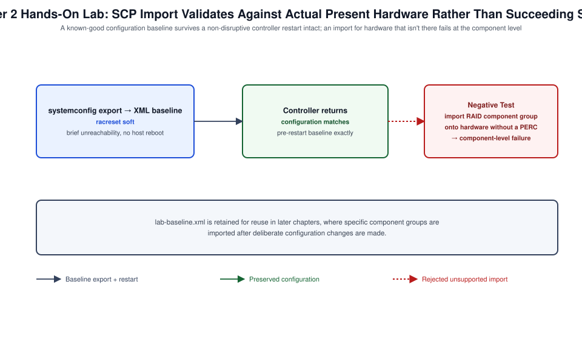

# Chapter 02: Configuration, Restart, Factory Reset, Full Power Cycle, and Recovery



*Figure 2-1. The SCP baseline export and controller restart flow exercised in this chapter's lab, including the unsupported-component-import negative test.*

## Learning Objectives

- Distinguish the four operations this chapter covers — iDRAC configuration
  export/import, iDRAC restart, iDRAC factory reset, and a full server
  power cycle — and identify which one solves a given operational problem
  without over-reaching into a more disruptive action.
- Export and import an iDRAC configuration as a Server Configuration
  Profile (SCP) to capture and reproduce a known-good baseline.
- Restart the iDRAC controller itself without affecting host OS uptime.
- Perform an iDRAC factory reset and understand exactly what state it
  clears versus what it preserves.
- Perform a full AC power cycle safely, understanding when it is required
  versus when a lesser action is sufficient.
- Recover an iDRAC that has become unresponsive, including the paths
  available when network access to iDRAC itself is unavailable.

## Theory and Architecture

### Four distinct operations, four distinct blast radii

Administrators new to iDRAC frequently conflate operations that have very
different scope, and choosing the wrong one either fails to fix the
problem or causes unnecessary disruption. This chapter treats four
operations as a deliberately ordered escalation path:

1. **Configuration export/import** — reads or writes iDRAC, BIOS, and
   (optionally) storage/NIC settings as a structured document, with no
   restart of anything. Non-disruptive; the tool you reach for first to
   capture or reproduce a baseline.
2. **iDRAC restart** (`racadm racreset`) — reboots the BMC's own embedded
   operating environment. Host OS is entirely unaffected; only
   iDRAC-facing sessions (GUI, RACADM, Redfish, Virtual Console/Media) are
   briefly interrupted, typically for one to two minutes.
3. **iDRAC factory reset** — returns iDRAC's own configuration to factory
   defaults: network settings, local users, certificates, alerting
   configuration, and most customized settings are cleared. The host OS
   and its data are never touched by this operation; this is a reset of
   the management controller's configuration, not of the server.
4. **Full AC power cycle** — physically removes and restores power to the
   entire chassis (both PSUs, if redundant), which resets the host
   platform hardware state at a level that a warm reboot or even a
   BIOS-level reset cannot reach — clearing certain hung hardware states,
   forcing PSU firmware and midplane logic to reinitialize, and is
   sometimes required as the final step after a factory reset or a
   firmware flash that leaves the platform in an inconsistent state.

Because these operations differ so much in disruption, this chapter's
Design Considerations section is built around choosing the least
disruptive operation that actually resolves the problem in front of you.

### Server Configuration Profile (SCP)

The Server Configuration Profile is Lifecycle Controller's structured
export/import format (XML or JSON) covering iDRAC network and security
settings, BIOS settings, NIC and PERC/RAID controller settings, and
several other component groups, all in one document. SCP is simultaneously
a backup mechanism (export before a risky change), a templating mechanism
(export from a known-good "golden" server, import into new servers), and
a disaster-recovery mechanism (reproduce a lost configuration from a
retained export). SCP operations can target the whole configuration or a
specific component group (`IDRAC`, `BIOS`, `NIC`, `RAID`, and others), and
can run against a locally attached share, an iDRAC-local file, or a remote
CIFS/NFS/HTTP(S) share for scripted, unattended operation.

### What survives a factory reset, and what doesn't

A common misconception is that an iDRAC factory reset is equivalent to
reinstalling the server or wiping the host. It is not. Factory reset
clears iDRAC's *own* configuration — IP addressing, local user accounts
(reverting to the original factory-default credential state, not a blank
slate), uploaded certificates, alerting destinations, and most
customizable iDRAC.* attribute values. It does not touch host OS storage,
does not clear BIOS settings by itself (BIOS reset is a separate, optional
action), and does not clear RAID/virtual disk configuration. For the more
aggressive case where you do need to sanitize BIOS, Lifecycle Controller
data, diagnostics, and other platform-level state — for example, before
decommissioning or redeploying hardware across a security boundary — LC's
**System Erase** capability ([Chapter 4](04-identity-certificates-security-and-compliance.md) covers its security rationale in
depth) is the correct, purpose-built tool, not a factory reset used as a
substitute.

### Recovery paths when iDRAC itself is unreachable

iDRAC's independence from the host is also what makes it recoverable even
when badly misconfigured, with several fallback layers:

- **iDRAC Direct** ([Chapter 5](05-idrac-direct-virtual-console-virtual-media-and-local-service.md)) provides a local, network-independent path
  to iDRAC over USB, useful when the network-facing configuration itself
  is the problem.
- **The front LCD panel**, on platforms that include one, can reset
  networking to DHCP without any other access path.
- **A full AC power cycle** clears certain wedged states in the BMC itself,
  not only the host, since the BMC's own runtime can occasionally reach an
  unresponsive state that only a power-rail-level reset clears (rare, but
  a known last resort before RMA).
- **iDRAC firmware recovery** via a dedicated recovery process (available
  on many platforms through a specific boot-time key sequence or a
  recovery image mechanism) exists for the case where the iDRAC firmware
  image itself is corrupted rather than merely misconfigured — consult
  the platform-specific service documentation for the exact recovery key
  sequence, since it has varied across chassis designs.

## Design Considerations

- **Default to export/import before default to reset.** Before making any
  change you're not fully confident about, export the current SCP. This
  turns "I need to reset this" into "I can restore this" and is the
  cheapest insurance available in this chapter.
- **Prefer `racreset` over factory reset for "iDRAC seems stuck."** A
  slow, unresponsive, or erroring iDRAC web session is far more often
  resolved by a simple BMC restart than by a factory reset. Escalate to
  factory reset only when configuration state itself (not runtime
  behavior) is the suspected problem.
- **Never treat factory reset as a substitute for System Erase.** If the
  goal is sanitizing a server before it leaves your organization's
  control (resale, return, redeployment across a security boundary),
  factory reset alone is insufficient — it does not clear BIOS passwords,
  Lifecycle Controller data, or storage configuration. Plan for System
  Erase ([Chapter 4](04-identity-certificates-security-and-compliance.md)) explicitly in any decommissioning runbook.
- **Schedule full AC power cycles like the disruptive event they are.**
  Unlike an iDRAC restart, a full power cycle takes the host down. Treat
  it with the same change-management rigor as any other planned outage,
  and confirm redundant PSU behavior (pulling one cord at a time, if
  testing PSU redundancy specifically, versus pulling both for a genuine
  full cycle) matches your actual intent.
- **Decide your SCP storage strategy before you need it in an emergency.**
  A local export saved to a technician's laptop is fine for a one-off
  change; a fleet of servers needs SCPs retained centrally (a Git
  repository, an artifact store, or OME's template library, [Volume XXII](../../volume-022-dell-openmanage-enterprise/README.md)
  [Chapter 8](08-firmware-idrac-bios-lifecycle-controller-and-platform-updates.md)) with a clear naming and retention convention, so recovery
  during an incident isn't also a search for where the last known-good
  export lives.
- **Plan for the "no network path to iDRAC" case explicitly.** Identify,
  before you need it, whether your environment has physical access for
  iDRAC Direct, a working LCD panel, or neither — this determines whether
  a badly misconfigured remote iDRAC is a five-minute fix or requires
  physical dispatch.

## Implementation and Automation

### Exporting a Server Configuration Profile

Using RACADM against a network share:

```bash
racadm set iDRAC.LCAttributes.AutoBackup Disabled
racadm racadm systemconfig export -t xml -f idrac-baseline.xml \
  -l //10.0.0.50/scp-share -u svc-scp -p '<password>'
```

Exporting only the iDRAC component group, useful for a lightweight backup
before a networking or identity change (Chapters 3 and 4):

```bash
racadm get -f idrac-network-baseline.xml -t xml -c idrac
```

Over Redfish, using Dell's OEM export action:

```bash
curl -s -k -u root:'<password>' -X POST \
  -H "Content-Type: application/json" \
  -d '{"ExportFormat": "XML", "ShareParameters": {"Target": "ALL"}}' \
  https://192.168.1.120/redfish/v1/Managers/iDRAC.Embedded.1/Actions/Oem/EID_674_Manager.ExportSystemConfiguration
```

This returns a job ID; poll the job resource until it reports completion,
then retrieve the exported document from the job's result location.
Confirm the exact OEM action name and response shape against the Redfish
API guide for your firmware build — Dell's Redfish OEM action naming has
been stable across recent iDRAC9 and iDRAC10 releases but is not part of
the DMTF standard schema and can be firmware-specific.

### Importing a Server Configuration Profile

```bash
racadm systemconfig import -t xml -f idrac-baseline.xml \
  -l //10.0.0.50/scp-share -u svc-scp -p '<password>' \
  --target idrac
```

The `--target` flag scopes the import to a specific component group
(`idrac`, `bios`, `nic`, `raid`, or `all`); scoping an import narrows the
blast radius of what changes, which matters when you are restoring a
single subsystem rather than the entire baseline.

### Restarting the iDRAC controller

```bash
racadm racreset soft
```

`racreset soft` performs a graceful controller restart; a `hard` variant
exists for cases where a soft restart itself does not complete, forcing a
lower-level reset of the BMC. Over Redfish:

```bash
curl -s -k -u root:'<password>' -X POST \
  -H "Content-Type: application/json" \
  -d '{"ResetType": "GracefulRestart"}' \
  https://192.168.1.120/redfish/v1/Managers/iDRAC.Embedded.1/Actions/Manager.Reset
```

Expect the session to drop and the web console/API to become briefly
unreachable (typically one to two minutes) while the BMC reinitializes.
The host OS is not affected.

### Factory-resetting iDRAC configuration

```bash
racadm racresetcfg
```

Over Redfish, using the standard `LabelChanges`/`ResetType` style OEM
reset action (attribute naming for this specific action has shifted
between Dell's older WSMAN-derived actions and its current Redfish action
set; confirm current syntax against your firmware's action list at
`/redfish/v1/Managers/iDRAC.Embedded.1` under `Actions`):

```bash
curl -s -k -u root:'<password>' -X POST \
  -H "Content-Type: application/json" \
  -d '{"ResetType": "ResetAllWithRootDefaults"}' \
  https://192.168.1.120/redfish/v1/Managers/iDRAC.Embedded.1/Actions/Oem/DellManager.ResetToDefaults
```

After a factory reset, iDRAC reboots and returns to a default networking
state (commonly DHCP-enabled) with local user credentials reset — treat
the post-reset unit exactly like a freshly racked server from [Chapter 1](01-architecture-generations-licensing-and-first-access.md)
and repeat first-login procedures, including the password rotation step.

### Performing a full AC power cycle

A full power cycle is a physical action, not a software command against
iDRAC alone, though iDRAC can initiate a graceful or forced host power-off
as a first step:

```bash
racadm serveraction powerdown
```

Confirm the host has fully powered off (`racadm serveraction powerstatus`
reports `Off`), then physically disconnect all power sources (both PSU
cords on a redundant-PSU chassis) for at least 30 seconds to allow standby
capacitors to discharge, then reconnect. Where physical access is not
available and the platform supports it, some environments accomplish an
equivalent result through PDU-level outlet power cycling — confirm this
achieves a genuine full discharge cycle rather than a fast off/on that
some smart PDUs perform, which may not clear the same hardware states.

## Validation and Troubleshooting

- **After `racreset`, the GUI/API takes longer than expected to return.**
  Normal within roughly two minutes; if the controller does not respond
  after five minutes, escalate to `racreset hard`, and if that also fails
  to bring the controller back, proceed to a full AC power cycle as
  described in this chapter's recovery path.
- **After a factory reset, the expected DHCP address never appears.**
  Confirm the factory-default NIC selection (dedicated vs. shared LOM,
  [Chapter 3](03-management-network-ipv4-ipv6-dns-ntp-and-connectivity.md)) matches your current cabling — a factory reset also resets
  NIC selection to its default, which may not match how the server is
  physically cabled if it was previously reconfigured for shared LOM.
- **SCP import reports partial failure.** Review the returned job's
  message log — a common cause is a target component group referencing
  hardware not present on the destination server (for example, a NIC
  component group written from a server with a different mezzanine card
  configuration). Scope subsequent imports to only the component groups
  relevant to the destination hardware.
- **A server appears "hung" and does not respond to a graceful power-down
  request.** Confirm this is genuinely a host-hang and not an iDRAC
  session issue by checking `racadm serveraction powerstatus`; if iDRAC
  itself responds and reports the host as `On` but the OS is unresponsive,
  a forced power-down (`racadm serveraction powerdown -f` where supported,
  or Virtual Console power-button emulation, [Chapter 5](05-idrac-direct-virtual-console-virtual-media-and-local-service.md)) is appropriate
  before escalating to a full AC power cycle.
- **iDRAC is completely unreachable over the network after a
  misconfiguration.** Use iDRAC Direct ([Chapter 5](05-idrac-direct-virtual-console-virtual-media-and-local-service.md)) to reach the controller
  locally and correct the network configuration ([Chapter 3](03-management-network-ipv4-ipv6-dns-ntp-and-connectivity.md)) without
  needing a factory reset at all — reserve factory reset for cases where
  the configuration itself, not just current network reachability, is
  unknown or untrusted.

## Security and Best Practices

- Treat SCP exports as sensitive artifacts: they can contain hashed
  credentials, SNMP community strings, and other configuration secrets.
  Store them with the same access controls as any other credential
  material, not as plaintext build artifacts in an open repository.
- Require change-ticket or maintenance-window justification for any full
  AC power cycle on a production server, the same as any other planned
  outage — it is easy to underestimate the disruption of this operation
  because the command that triggers the preceding power-down looks
  routine.
- After any factory reset, immediately re-apply your organization's
  hardened baseline ([Chapter 4](04-identity-certificates-security-and-compliance.md): strong local credentials, directory
  integration, certificate replacement, alerting destinations) before
  leaving the unit in its post-reset default state, even temporarily.
- Validate SCP baselines periodically against a live server's actual
  configuration (a scheduled export-and-diff) so configuration drift is
  caught proactively rather than discovered only when a restore is
  attempted and doesn't match expectations.
- Document your organization's specific iDRAC firmware recovery key
  sequence (platform-specific) in your runbooks before it is needed — this
  is not information you want to be searching for during an actual
  corrupted-firmware incident.

## References and Knowledge Checks

**References**

- [Dell Technologies, *iDRAC9/iDRAC10 User's Guide*](https://www.dell.com/support/product-details/en-us/product/idrac10-lifecycle-controller-v1-xx-series/resources/manuals) — Server Configuration
  Profile and factory reset sections
- [Dell Technologies, *iDRAC RACADM CLI Guide*](https://www.dell.com/support/manuals/en-us/idrac9-lifecycle-controller-v4.x-series/idrac_4.00.00.00_racadm/supported-racadm-interfaces?guid=guid-a5747353-fc88-4438-b617-c50ca260448e&lang=en-us) — `racresetcfg`, `racreset`,
  and `systemconfig` command reference
- [Dell Technologies, *iDRAC Redfish API Guide*](https://www.dell.com/support/kbdoc/en-us/000178045/redfish-api-with-dell-integrated-remote-access-controller) — Manager reset and Dell
  OEM export/import actions
- [`SOFTWARE_VERSIONS.md`](../../../SOFTWARE_VERSIONS.md) in this repository for the dated iDRAC9/iDRAC10
  baseline

**Knowledge Checks**

1. Rank the four operations covered in this chapter by disruption, and
   give an example symptom that would justify escalating from one to the
   next.
2. What exactly does an iDRAC factory reset clear, and what does it leave
   untouched?
3. Why is System Erase, not factory reset, the correct tool before
   decommissioning a server across a security boundary?
4. What recovery paths exist for an iDRAC that is unreachable over the
   network due to its own misconfiguration?
5. Why should an SCP export be treated as sensitive data rather than a
   plain configuration backup?

## Hands-On Lab

This chapter carries a topic-level walkthrough lab for **each recovery task under the
"Troubleshooting" domain** — iDRAC reset, server power control, configuration/factory reset, and
part-replacement recovery. Every step is a runnable RACADM/Redfish action. Each ends **`**Lab
verified by:** *pending*`** until a human runs it.

**Shared prerequisites for Labs 2.1–2.4** — a PowerEdge server with iDRAC 9/10 you can safely
power-cycle (lab server, not production), admin credentials, and RACADM/`curl`. **Cost:** none.

### Lab 2.1 — Reset the iDRAC (Topic: Controller recovery)

**Objective:** Reboot the management controller without touching the host.

```bash
racadm racreset soft
# wait ~2 minutes for the iDRAC to come back, then:
racadm getsysinfo | grep -i "iDRAC"
```

**Expected result:** the iDRAC reboots and returns while the **host keeps running** — `racadm
racreset` restarts only the management controller (out-of-band), a safe first step for an
unresponsive iDRAC that does not disrupt the running operating system.

**Negative test:** power-cycle the whole server to "fix" a hung iDRAC; you needlessly take down the
running OS — an iDRAC reset (`racreset`) recovers the controller alone, so try it before any host
action.

**Rollback:** None — read-only; this lab changes no persistent state, so there is nothing to revert.

### Lab 2.2 — Server power control (Topic: Power actions)

**Objective:** Control host power gracefully and forcibly.

```bash
racadm serveraction powerstatus
racadm serveraction graceshutdown        # ask the OS to shut down cleanly
# racadm serveraction powerup             # power on
# racadm serveraction powercycle          # forced cold reboot (last resort)
```

Redfish equivalent:

```bash
curl -sk -u root:<password> -X POST https://<idrac-ip>/redfish/v1/Systems/System.Embedded.1/Actions/ComputerSystem.Reset \
  -H "Content-Type: application/json" -d '{"ResetType":"GracefulShutdown"}'
```

**Expected result:** `graceshutdown` signals the OS to shut down cleanly; power status reflects the
change — iDRAC power control offers graceful (OS-cooperative) and forced (`powercycle`/`hardreset`)
actions, and the graceful path avoids data loss when the OS is responsive.

**Negative test:** use `powercycle` (forced) on a healthy running server; you risk filesystem
damage and lost work — prefer `graceshutdown`/graceful restart, reserving forced actions for a hung
host.

**Rollback:** power the server back to its intended state.

### Lab 2.3 — Configuration and factory reset (Topic: Reset)

**Objective:** Return the iDRAC to default configuration.

```bash
racadm get iDRAC.IPv4.Address              # note current config before resetting
# Reset iDRAC config to defaults (keeps firmware), preserving/resetting network as chosen:
racadm racresetcfg
# Full factory default (iDRAC + optionally other components) is also available in the GUI:
#   iDRAC Settings > Reset iDRAC to Default Settings / Lifecycle Controller > Factory Default
```

**Expected result:** `racresetcfg` clears iDRAC configuration back to defaults (users, network,
settings) while keeping firmware — a configuration reset is the recovery for a mis-configured or
being-repurposed controller; a full factory reset via the GUI/LC goes further to hardware defaults.

**Negative test:** run `racresetcfg` on a remote production iDRAC without preserving the network
settings; you lose management connectivity to it — understand which settings a reset clears
(especially network) before running it remotely.

**Rollback:** reconfigure the iDRAC (network/users) after the lab reset.

### Lab 2.4 — Part-replacement recovery (Topic: Hardware recovery)

**Objective:** Reason through Easy Restore and part replacement.

```bash
racadm get LifecycleController.LCAttributes.PartConfigurationUpdate
racadm get LifecycleController.LCAttributes.CollectSystemInventoryOnRestart
# On motherboard/part replacement, the Lifecycle Controller's Easy Restore/Part Replacement
#   restores service tag, config, and firmware to the new part automatically when enabled.
```

**Expected result:** the LC attributes show Part Configuration Update and inventory-on-restart
enabled, so a replaced part (motherboard, NIC, PSU) is auto-configured to match the old one — the
Lifecycle Controller stores system config/firmware and reapplies it on part replacement (Easy
Restore), minimizing manual reconfiguration after hardware service.

**Negative test:** replace a motherboard with Part Replacement disabled; the service tag and
firmware/config do not carry over and must be restored by hand — the LC's Easy Restore is what
automates recovery, but only if enabled beforehand.

**Rollback:** none (leave LC attributes enabled).

## Lab Verification

Complete this sign-off once the lab has been run end to end, including the
negative test. Until then, the lab is unverified.

- **Lab verified by:** *pending*
- **Date:** *pending*

## Summary and Completion Checklist

This chapter separated four operations that are often conflated —
configuration export/import, iDRAC restart, iDRAC factory reset, and full
AC power cycle — into a deliberate escalation path ordered by disruption,
and was explicit about what a factory reset does and does not clear,
pointing to System Erase ([Chapter 4](04-identity-certificates-security-and-compliance.md)) as the correct tool for genuine
sanitization. It covered the Server Configuration Profile as the
mechanism underlying backup, templating, and recovery, walked through
RACADM and Redfish syntax for each operation, and covered the recovery
paths available when iDRAC itself is unreachable. The baseline SCP export
produced in this chapter's lab is reused as a recovery point in later
chapters as you make deliberate network, identity, and hardware
configuration changes.

- [ ] I can distinguish configuration export/import, iDRAC restart,
      factory reset, and full power cycle by disruption and correct use
      case.
- [ ] I can export and import a Server Configuration Profile, scoped to
      specific component groups.
- [ ] I understand exactly what a factory reset clears versus preserves,
      and why System Erase is the correct tool for decommissioning.
- [ ] I can restart the iDRAC controller without affecting host OS uptime.
- [ ] I can describe the recovery paths available when iDRAC is
      unreachable over the network due to its own misconfiguration.
