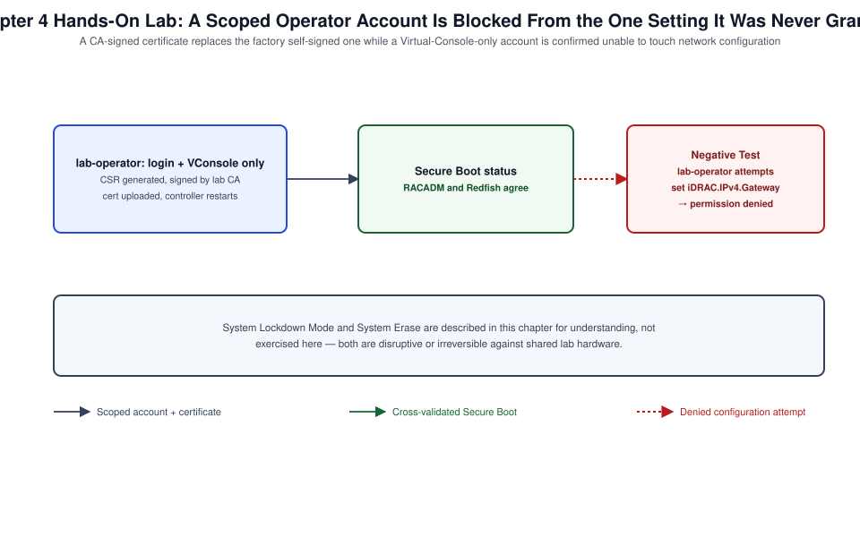

# Chapter 04: Identity, Certificates, Security, and Compliance



*Figure 4-1. The scoped identity and certificate replacement flow exercised in this chapter's lab, including the denied-configuration-attempt negative test.*

## Learning Objectives

- Configure local iDRAC user accounts with role-based privilege scoping
  appropriate to least-privilege administration.
- Integrate iDRAC with Active Directory or LDAP for centralized
  authentication and describe the trade-offs against local accounts.
- Generate a certificate signing request, install a CA-issued certificate,
  and explain why the factory self-signed certificate is unsuitable for
  production use.
- Explain and configure the silicon root of trust, Secure Boot, and System
  Lockdown Mode as layered hardening controls.
- Perform a System Erase and explain how it differs from the factory reset
  covered in [Chapter 2](02-configuration-restart-factory-reset-full-power-cycle-and-recovery.md).
- Map iDRAC security controls to common compliance frameworks referenced
  by enterprise security teams.

## Theory and Architecture

### Local users and role-based access

iDRAC supports up to sixteen local user accounts (exact maximum varies
slightly by generation and license tier; confirm against your firmware's
user management documentation), each assigned a privilege level —
Administrator, Operator, ReadOnly, or a custom combination of discrete
privileges (login, configure, configure users, logs, system control,
access virtual console, access virtual media, test alerts, and others).
Discrete privilege assignment lets you build roles narrower than the
built-in presets — for example, an account that can view health and logs
and use Virtual Console but cannot modify network configuration or user
accounts, appropriate for a helpdesk tier that needs remote-hands
capability without full administrative control.

### Directory services integration

Beyond local accounts, iDRAC (Express tier and above, per [Chapter 1](01-architecture-generations-licensing-and-first-access.md)'s
licensing discussion) integrates with centralized identity through two
distinct mechanisms:

- **Active Directory** — either the "standard schema" mode, which maps
  AD group membership to iDRAC roles using generic AD groups and
  attributes without requiring any schema extension, or the legacy
  "extended schema" mode, which requires a one-time Active Directory
  schema extension to create Dell-specific object classes. Standard
  schema is the far more commonly deployed mode in current environments
  because it avoids AD schema changes entirely.
- **Generic LDAP** — for directory services other than Active Directory,
  or where an organization prefers not to use the AD-specific integration
  path.

Both mechanisms let an organization manage iDRAC access through the same
identity lifecycle (onboarding, role change, offboarding) as every other
enterprise system, which is materially more auditable at fleet scale than
per-device local account management, and is one of the strongest
arguments for licensing at least Express/Enterprise tier across a
production fleet rather than relying on local accounts everywhere.

### Certificates: why the factory default isn't enough

Every iDRAC ships with a self-signed TLS certificate, sufficient to
establish encryption for first access ([Chapter 1](01-architecture-generations-licensing-and-first-access.md)) but insufficient for
production use for two reasons: it triggers a browser/API trust warning
that trains administrators and automation alike to click through
certificate errors, which is precisely the behavior that makes a genuine
man-in-the-middle substitution hard to notice, and it cannot be validated
by automation that correctly enforces certificate trust
(`verify=True` in a Python client, for example) without either disabling
verification (itself a security regression) or explicitly trusting a
self-signed certificate per host, which does not scale. Replacing the
factory certificate with one issued by an internal or public CA — via a
certificate signing request (CSR) generated on iDRAC itself, so the
private key never leaves the controller — is standard practice before
production use.

### Silicon root of trust and Secure Boot

Starting with iDRAC9, Dell built a hardware root of trust directly into
the server platform: a cryptographic silicon-anchored trust chain that
validates the iDRAC firmware itself before it runs, extending up through
BIOS. This closes a class of firmware-implant attack that predates any
OS-level or even BIOS-level security control, since it validates the
management controller's own integrity before that controller is trusted
to validate anything else. iDRAC10 continues and extends this model.
Secure Boot, configured at the BIOS level but visible and reportable
through iDRAC, extends the same chain-of-trust principle to the boot
loader and OS kernel, refusing to execute unsigned or improperly signed
boot components.

### System Lockdown Mode

System Lockdown Mode (a Datacenter-tier capability on iDRAC9, per Chapter
1's licensing table) freezes the current hardware and firmware
configuration against further changes — firmware updates, BIOS setting
changes, and certain configuration changes are blocked while lockdown is
active, with an explicit unlock required to make further changes. This is
designed for security-sensitive production windows where configuration
drift itself is a risk to be prevented rather than merely detected after
the fact — for example, a server running a certified, validated
configuration for a compliance-scoped workload where any unauthorized
firmware change would itself constitute a compliance event.

### System Erase and its relationship to factory reset

[Chapter 2](02-configuration-restart-factory-reset-full-power-cycle-and-recovery.md) introduced factory reset as an iDRAC-configuration-only
operation and flagged System Erase as the correct tool for genuine
sanitization. System Erase is a Lifecycle Controller capability that can
selectively or comprehensively wipe: iDRAC configuration and logs, BIOS
settings back to defaults, diagnostics data, Lifecycle Controller data
itself, NVRAM, TPM (where present and where policy allows), vFlash/SD
card content, and — critically, unlike factory reset — can be extended to
trigger storage-level secure erase on attached drives that support it.
This makes System Erase the appropriate procedure before a server leaves
organizational control, aligned with the media sanitization principles in
NIST SP 800-88 referenced elsewhere in this encyclopedia ([Volume I](../../volume-001-enterprise-engineering-foundations/README.md),
[Chapter 8](08-firmware-idrac-bios-lifecycle-controller-and-platform-updates.md)).

## Design Considerations

- **Default to directory-integrated accounts for named human
  administrators; reserve local accounts for break-glass and service
  automation.** This mirrors standard identity practice elsewhere in the
  enterprise: named humans authenticate through the identity provider
  your organization already governs; a small number of local accounts
  exist specifically for the case where directory services are
  unavailable (a legitimate break-glass scenario) or for automation that
  needs a stable, non-directory-dependent credential.
- **Scope discrete privileges to the narrowest role that does the job.**
  The built-in Administrator/Operator/ReadOnly presets are a starting
  point, not a mandate — for helpdesk, monitoring, and automation
  accounts, build custom discrete-privilege roles rather than defaulting
  every non-trivial account to Administrator out of convenience.
- **Plan certificate issuance and renewal as a managed process, not a
  one-time task.** A CA-issued certificate has an expiration date;
  decide whether renewal will be manual (acceptable for a small fleet) or
  automated (necessary at scale, and increasingly supported through
  iDRAC's Redfish certificate management resources feeding an internal
  ACME-adjacent or enterprise PKI automation workflow).
- **Decide System Lockdown Mode policy per workload class, not
  fleet-wide.** Lockdown mode's value is highest for compliance-scoped or
  otherwise change-sensitive production workloads and actively
  counterproductive for servers under active patch/firmware management —
  applying it uniformly either under-protects the sensitive tier or
  creates unnecessary unlock friction for routine operations elsewhere.
- **Build System Erase into decommissioning runbooks explicitly, with
  sign-off.** Because System Erase is irreversible and comprehensive,
  treat it as a change requiring the same authorization rigor as any
  other irreversible action — verify the correct service tag, verify data
  has been retained elsewhere if needed, and record who authorized the
  erase and when.
- **Map controls to your compliance framework before an audit asks you
  to.** If your organization is scoped to a specific framework (FedRAMP,
  PCI DSS, NIST 800-53, or an industry-specific standard), identify which
  iDRAC controls in this chapter satisfy which control families in
  advance, rather than reconstructing the mapping under audit pressure.

## Implementation and Automation

### Creating a scoped local user

```bash
racadm set iDRAC.Users.3.UserName helpdesk-l1
racadm set iDRAC.Users.3.Password '<StrongPassword!23>'
racadm set iDRAC.Users.3.Enable Enabled
racadm set iDRAC.Users.3.Privilege 0x1e1
```

The `Privilege` value is a bitmask; consult the RACADM CLI Guide's
privilege bitmask table for the current firmware build to construct a
value covering exactly the discrete privileges intended (for example,
login, virtual console, and virtual media without configuration
privileges) rather than reusing a preset value without confirming what it
actually grants.

### Configuring Active Directory (standard schema)

```bash
racadm set iDRAC.ActiveDirectory.Enable Enabled
racadm set iDRAC.ActiveDirectory.SSOEnable Disabled
racadm set iDRAC.ActiveDirectory.Schema Standard
racadm set iDRAC.ActiveDirectory.DomainController1 dc01.corp.example.com
racadm set iDRAC.ActiveDirectory.DomainController2 dc02.corp.example.com
racadm set iDRAC.StandardSchema.1.Name "iDRAC-Admins"
racadm set iDRAC.StandardSchema.1.Domain corp.example.com
racadm set iDRAC.StandardSchema.1.RoleGroupPrivilege 0x1ff
```

Confirm the exact standard-schema group-index and privilege-mapping
attribute names against your firmware's Attribute Registry
(`racadm get iDRAC.StandardSchema -o`) before scripting this against a
fleet, since the number of configurable role groups and their default
indices can vary by firmware release.

### Generating and installing a CA-signed certificate

```bash
racadm sslcsrgen -g -f idrac-csr.txt \
  -commonname "idrac-rack12-u20.lab.example.com" \
  -organizationname "Example Corp" \
  -organizationunit "Infrastructure" \
  -locality "Austin" -state "TX" -country "US"
```

Submit `idrac-csr.txt` to your internal or public CA, then upload the
issued certificate:

```bash
racadm sslcertupload -t 1 -f idrac-signed-cert.crt
racadm sslcertupload -t 2 -f ca-chain.crt
racadm racreset soft
```

Over Redfish, certificate management is exposed through the
`CertificateService` resource:

```bash
curl -s -k -u root:'<password>' -X POST \
  -H "Content-Type: application/json" \
  -d '{
        "CertificateCollection": {"@odata.id": "/redfish/v1/Managers/iDRAC.Embedded.1/Truststore/Certificates"},
        "CertificateString": "-----BEGIN CERTIFICATE-----\n...\n-----END CERTIFICATE-----",
        "CertificateType": "PEM"
      }' \
  https://192.168.1.120/redfish/v1/CertificateService/Actions/CertificateService.ReplaceCertificate
```

Confirm the exact target resource and payload shape against the Redfish
API guide for your firmware — Dell's certificate-management Redfish
surface has converged toward the DMTF standard `CertificateService` model
across recent releases but retains some OEM-specific detail for
iDRAC-specific certificate types (web server, CSC, custom signing).

### Checking Secure Boot and root-of-trust status

```bash
racadm get BIOS.SecureBootConfiguration
```

Over Redfish, Secure Boot state is reported under the `SecureBoot`
resource:

```bash
curl -s -k -u root:'<password>' \
  https://192.168.1.120/redfish/v1/Systems/System.Embedded.1/SecureBoot \
  | python3 -m json.tool
```

### Configuring System Lockdown Mode

```bash
racadm set iDRAC.Lockdown.SystemLockdown Enabled
```

Confirm the license tier requirement and the exact scope of what remains
modifiable under lockdown for your firmware build before enabling this on
a server with any pending maintenance planned, since unlocking requires an
explicit, auditable action.

### Performing a System Erase

```bash
racadm systemerase idrac,bios,diag,lcdata,nvram,vflash
```

Confirm the full, current set of erasable component keywords for your
firmware build with `racadm systemerase -h`, since supported components
have expanded across iDRAC9 releases and continue to evolve on iDRAC10.
System Erase triggers a Lifecycle Controller job and typically requires a
subsequent reboot to complete; the unit is non-functional for normal
administration until the erase job finishes.

## Validation and Troubleshooting

- **Directory-integrated login fails despite correct group
  membership.** Confirm NTP sync ([Chapter 3](03-management-network-ipv4-ipv6-dns-ntp-and-connectivity.md)) first — Kerberos and LDAPS
  operations underlying AD/LDAP integration are time-sensitive and fail
  with authentication errors that do not obviously point to a clock
  problem. Also confirm the domain controller addresses configured in
  iDRAC are reachable from iDRAC's network path specifically, not just
  from a general management workstation.
- **Certificate upload rejected.** Confirm the certificate's common name
  or Subject Alternative Name matches the exact hostname configured in
  DNS ([Chapter 3](03-management-network-ipv4-ipv6-dns-ntp-and-connectivity.md)) and that the uploaded chain includes any required
  intermediate CA certificates — a certificate valid in isolation is
  often rejected by strict clients if the intermediate chain is
  incomplete.
- **Browser still shows a certificate warning after upload.** Confirm the
  browser or client machine trusts the issuing CA (an internal CA's root
  certificate must be distributed to client trust stores separately from
  the iDRAC-side certificate installation) and that
  `racadm racreset soft` (or equivalent) was performed to make iDRAC's
  web server pick up the new certificate.
- **A local account that should be locked out is still able to
  authenticate.** Confirm the account was disabled
  (`iDRAC.Users.N.Enable`) rather than merely having its password
  changed, and check whether the same identity also authenticates through
  directory integration — disabling a local account does not affect a
  directory-integrated login path using different credentials.
- **System Lockdown Mode blocks an expected maintenance action.** This is
  expected behavior, not a fault — unlock deliberately
  (`racadm set iDRAC.Lockdown.SystemLockdown Disabled`), perform the
  maintenance, and re-enable lockdown afterward, all recorded as part of
  the same change record.
- **System Erase job appears to hang.** Confirm via
  `racadm jobqueue view -i <job-id>` rather than assuming failure; erase
  operations covering multiple component types (especially storage-level
  secure erase on large drives) can legitimately take significantly
  longer than a routine configuration job.

## Security and Best Practices

- Disable or rename the default local administrative account where policy
  allows, and ensure at least one break-glass local account exists with a
  credential stored in your organization's secrets vault, not only
  directory-integrated accounts, so a directory outage does not also
  become an iDRAC lockout.
- Enforce a minimum TLS version (disable TLS 1.0/1.1 where the firmware
  offers the option) and confirm cipher suite configuration aligns with
  your organization's cryptographic standard rather than accepting
  firmware defaults uncritically.
- Rotate local account credentials on a defined schedule and immediately
  upon personnel change, exactly as you would for any other privileged
  credential — an iDRAC local account is frequently a higher-value target
  than a typical application account because of what it can do to the
  underlying hardware.
- Enable two-factor or smart-card authentication (Enterprise tier and
  above) for administrative accounts on servers hosting sensitive
  workloads, rather than relying on password-only authentication for the
  most privileged access path into the hardware.
- Treat System Erase as an irreversible, high-authorization action in
  your change process — require explicit sign-off referencing the correct
  service tag before executing it, and never run it against a server
  identified only by rack position without confirming the service tag
  matches.
- Periodically audit local and directory-mapped role assignments against
  your current personnel roster; stale privileged access on
  out-of-band management infrastructure is a control gap that is easy to
  miss because iDRAC accounts are not always included in the same access
  review process as application and OS-level accounts.

## References and Knowledge Checks

**References**

- [Dell Technologies, *iDRAC9/iDRAC10 User's Guide*](https://www.dell.com/support/product-details/en-us/product/idrac10-lifecycle-controller-v1-xx-series/resources/manuals) — User accounts,
  Directory Services, and Certificate Management chapters
- [Dell Technologies, *iDRAC RACADM CLI Guide*](https://www.dell.com/support/manuals/en-us/idrac9-lifecycle-controller-v4.x-series/idrac_4.00.00.00_racadm/supported-racadm-interfaces?guid=guid-a5747353-fc88-4438-b617-c50ca260448e&lang=en-us) — `iDRAC.Users`,
  `iDRAC.ActiveDirectory`, `sslcsrgen`, `sslcertupload`, and `systemerase`
  command reference
- [Dell Technologies, *iDRAC Redfish API Guide*](https://www.dell.com/support/kbdoc/en-us/000178045/redfish-api-with-dell-integrated-remote-access-controller) — `AccountService`,
  `CertificateService`, and `SecureBoot` resources
- NIST Special Publication 800-88, *Guidelines for Media Sanitization*
  (referenced in [Volume I, Chapter 08](../../volume-001-enterprise-engineering-foundations/chapters/08-infrastructure-lifecycle-management.md))
- [`SOFTWARE_VERSIONS.md`](../../../SOFTWARE_VERSIONS.md) in this repository for the dated iDRAC9/iDRAC10
  baseline

**Knowledge Checks**

1. Why is directory-integrated authentication generally preferred over
   local accounts for named human administrators, and when is a local
   account still the right choice?
2. Why is the factory self-signed certificate unsuitable for production
   automation even though it does provide encryption?
3. What does the silicon root of trust protect against that a purely
   software-based integrity check cannot?
4. How does System Erase differ from the factory reset covered in
   [Chapter 2](02-configuration-restart-factory-reset-full-power-cycle-and-recovery.md), and why does that difference matter for decommissioning?
5. Why does clock drift ([Chapter 3](03-management-network-ipv4-ipv6-dns-ntp-and-connectivity.md)) so often present as an authentication
   or certificate failure rather than an obvious time-related error?

## Hands-On Lab

This chapter carries a topic-level walkthrough lab for **each task under the "System
Administration" security domain** — local users, directory integration, TLS certificates, and
security hardening. Every step is a runnable RACADM action. Each ends **`**Lab verified by:**
*pending*`** until a human runs it.

**Shared prerequisites for Labs 4.1–4.4** — a PowerEdge iDRAC 9/10 with admin RACADM access, and
(for Lab 4.2) an AD/LDAP directory. **Cost:** none.

### Lab 4.1 — Local users and privileges (Topic: Identity)

**Objective:** Create a scoped iDRAC user.

```bash
racadm set iDRAC.Users.3.UserName operator
racadm set iDRAC.Users.3.Password '<strong-password>'
racadm set iDRAC.Users.3.Privilege 0x00000001       # Login only (read-only-ish)
racadm set iDRAC.Users.3.Enable Enabled
racadm get iDRAC.Users.3
```

**Expected result:** user slot 3 is a login-only operator, distinct from the admin — iDRAC users
carry a privilege bitmask (Login, Configure, Configure Users, Virtual Console, Virtual Media, etc.),
so least privilege gives each operator only the rights their role needs.

**Negative test:** grant every user the full admin privilege (`0x1ff`); any one can reconfigure the
controller, mount virtual media, and re-flash firmware — the privilege mask is what scopes them
down.

**Cleanup:** `racadm set iDRAC.Users.3.Enable Disabled` (or clear the slot).

### Lab 4.2 — Directory integration (Topic: Centralized identity)

**Objective:** Authenticate iDRAC logins against a directory.

```bash
racadm set iDRAC.ActiveDirectory.Enable Enabled
racadm set iDRAC.ActiveDirectory.DCLookupEnable Enabled
racadm set iDRAC.ActiveDirectory.RacName idrac-web01
# Map an AD role group to an iDRAC privilege level, then test a directory login.
racadm get iDRAC.ActiveDirectory
```

**Expected result:** AD/LDAP is enabled and role groups map to iDRAC privileges — directory
integration centralizes iDRAC access so administrators use their domain credentials and group
membership drives privilege, rather than maintaining local accounts on every controller.

**Negative test:** manage access with local accounts on hundreds of iDRACs; offboarding a person
means editing each one — directory-backed access is revoked once, centrally.

**Cleanup:** `racadm set iDRAC.ActiveDirectory.Enable Disabled` if enabled only for the lab.

### Lab 4.3 — TLS certificate (Topic: Certificates)

**Objective:** Replace the default self-signed certificate.

```bash
racadm set iDRAC.Security.CsrCommonName idrac-web01.lab.example.com
racadm sslcsrgen -g -f /tmp/idrac.csr        # generate a CSR
# Have your CA sign /tmp/idrac.csr, then upload the signed cert:
racadm sslcertupload -t 1 -f /tmp/idrac-signed.pem
racadm sslcertdownload -t 1 -f /tmp/current.pem   # verify what is installed
```

**Expected result:** the iDRAC serves a CA-signed certificate matching its DNS name — a management
controller drives firmware and mounts media, so its TLS identity must be trusted (not self-signed),
which also enables warning-free browser/API access.

**Negative test:** leave the default self-signed cert and habitually click through the warning; a
real man-in-the-middle looks identical — a properly signed cert removes the routine warning so a
genuine one stands out.

**Cleanup:** none (keep the trusted certificate).

### Lab 4.4 — Security hardening and compliance (Topic: Security)

**Objective:** Apply lockdown and stronger authentication controls.

```bash
racadm set iDRAC.Lockdown.SystemLockdown Enabled     # block config changes (iDRAC Enterprise+)
racadm get iDRAC.Lockdown.SystemLockdown
racadm set iDRAC.Security.LoginAttemptsBeforeLockout 3
racadm set iDRAC.IPBlocking.BlockEnable Enabled
```

**Expected result:** System Lockdown Mode prevents accidental/unauthorized configuration and
firmware changes, and IP-blocking/lockout resists brute force — iDRAC hardening (lockdown,
login-attempt lockout, disabling unused services, enforcing TLS 1.2+) reduces the management
plane's attack surface, a compliance-relevant baseline.

**Negative test:** leave lockdown off and default login policies in place; a compromised or careless
session can silently re-flash firmware or change boot order — lockdown and lockout are what protect
the controller against that.

**Cleanup:** `racadm set iDRAC.Lockdown.SystemLockdown Disabled` if you need to make further lab
changes.

## Lab Verification

Complete this sign-off once the lab has been run end to end, including the
negative test. Until then, the lab is unverified.

- **Lab verified by:** *pending*
- **Date:** *pending*

## Summary and Completion Checklist

This chapter covered the full identity and security-hardening surface for
a single iDRAC: local users with discrete privilege scoping, Active
Directory/LDAP integration for centralized authentication, certificate
lifecycle management, and the layered hardware-anchored security model —
silicon root of trust, Secure Boot, and System Lockdown Mode — that
distinguishes iDRAC9/iDRAC10 from a purely software-hardened management
controller. It also distinguished System Erase from the [Chapter 2](02-configuration-restart-factory-reset-full-power-cycle-and-recovery.md) factory
reset, establishing System Erase as the correct, comprehensive tool for
decommissioning. The lab produced a scoped local account and a properly
signed certificate, completing the security baseline this volume assumes
for Chapters 5 through 9.

- [ ] I can create local iDRAC users with discrete, least-privilege role
      scoping.
- [ ] I can configure Active Directory or LDAP integration and explain its
      advantages over local-account-only administration.
- [ ] I generated a CSR, obtained a signed certificate, and installed it,
      replacing the factory self-signed certificate.
- [ ] I can explain the silicon root of trust, Secure Boot, and System
      Lockdown Mode as layered controls, and I know when each applies.
- [ ] I can explain how System Erase differs from factory reset and why
      that distinction matters for decommissioning.
