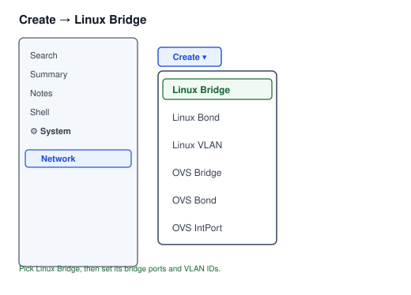
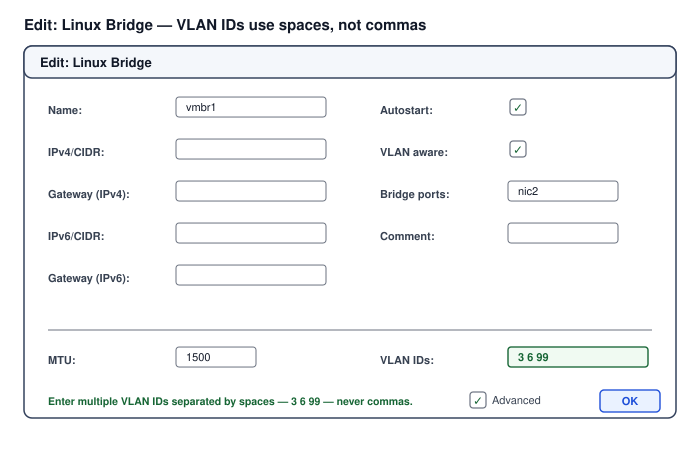
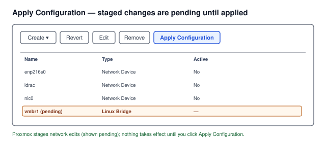
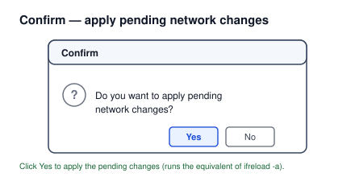
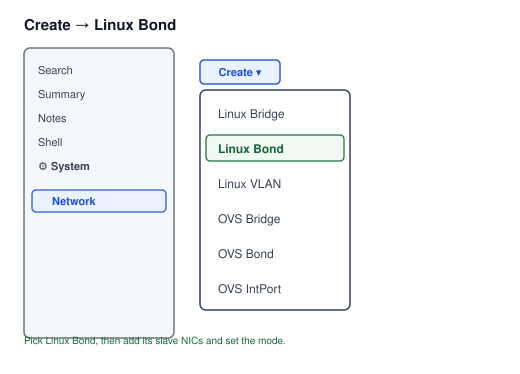
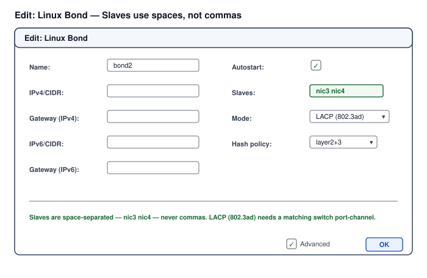

# Chapter 05: Network Architecture — Management NIC, VLAN Trunk, and Bridges

## Learning Objectives

- Separate management traffic from virtual-machine traffic across two NICs.
- Configure the management NIC (port 0) with the host address
  10.30.161.10/24.
- Configure the VM NIC (port 1) as an 802.1Q trunk carrying VLANs 3, 6, 10,
  200, and 202.
- Build a VLAN-aware Linux bridge so VMs can be placed on tagged VLANs.
- Verify management reachability and trunk operation.

## Theory and Architecture

### Two NICs, two roles

This build divides the host's networking cleanly:

- **Management — dedicated NIC, port 0** — carries the Proxmox host's own
  management traffic at **10.30.161.10/24**, gateway 10.30.161.1, on the
  same subnet as the iDRAC. This is how administrators reach the web
  interface and SSH.
- **Virtual-machine traffic — dedicated NIC, port 1** — an **802.1Q trunk**
  carrying multiple VLANs, feeding a VLAN-aware bridge that every virtual
  machine attaches to. No host management rides this NIC.

Keeping them separate matters for the same reason the iDRAC is on its own
port: the management plane should not share a link with untrusted VM
traffic. An administrator's path to the hypervisor stays isolated from the
workloads it hosts.

### The trunk and its VLANs

Port 1 is a **trunk** — a single physical link that carries traffic for
several VLANs, each tagged with its VLAN ID so the switch and the host agree
which frame belongs to which VLAN. This build's trunk carries:

| VLAN | Subnet | Role |
| --- | --- | --- |
| 3 | 10.30.10.0/24 | Server virtual machines |
| 6 | 10.30.12.0/24 | Desktop virtual machines |
| 10 | — | Carried for future use |
| 200 | — | Carried for future use |
| 202 | — | Carried for future use |

**A correction from the original specification is applied here.** The source
specification tagged the server VMs on VLAN 3 but listed the trunk's allowed
VLANs as 6, 10, 200, 202 — omitting VLAN 3, which would have blocked every
server VM. **VLAN 3 has been added to the allowed list**, so the trunk
carries 3, 6, 10, 200, and 202. Without this, the servers on 10.30.10.0/24
would authenticate to no network path at all.

VLANs 10, 200, and 202 are carried on the trunk but host no VM in this
build; they are provisioned for future workloads. The switchport on the
other end of port 1 must be configured as a matching trunk allowing the same
VLANs — the trunk is an agreement between two ends, and both must permit the
same tags.

### VLAN-aware bridges in Proxmox

Proxmox attaches VMs to the network through a **Linux bridge**. A
**VLAN-aware bridge** lets the bridge pass tagged traffic, so a VM can be
placed on a specific VLAN simply by setting a VLAN tag on its virtual NIC —
the bridge and the trunk carry the tag out to the switch. This is cleaner
than creating a separate bridge per VLAN: one VLAN-aware bridge on the trunk
NIC serves every VLAN the trunk carries, and each VM picks its VLAN by tag.

This is the same VLAN and trunking model
[Volume II, Chapter 03](../../volume-002-network-engineering-foundations/chapters/03-ethernet-switching-vlans-and-layer-2-resilience.md)
describes, realized in Proxmox's bridge configuration.

## Design Considerations

- **Keep management on its own NIC and off the VLAN trunk.** The management
  address belongs on the dedicated port 0, isolated from VM traffic on port
  1. Do not place the host's management interface on the trunk bridge.
- **Match the trunk allow-list on both ends.** The host trunk and the
  switchport must permit the same VLANs. A VLAN allowed on one end and not
  the other silently drops that VLAN's traffic — the exact failure mode the
  original VLAN-3 omission would have caused.
- **Use one VLAN-aware bridge rather than many per-VLAN bridges.** It is
  simpler to operate and lets each VM select its VLAN by tag, which is how
  the ten VMs in [Chapter 08](08-deploying-the-virtual-machines.md) are
  placed.
- **Make the network configuration persistent.** Set the addressing and
  bridge in Proxmox's network configuration (`/etc/network/interfaces` or the
  web UI) so it survives reboots, not just as runtime commands.
- **Provision the future VLANs on the trunk now.** Carrying 10, 200, and 202
  even though no VM uses them yet avoids reconfiguring the trunk later when a
  workload needs one.

## Implementation and Automation

Proxmox's network configuration lives in `/etc/network/interfaces` and is
best set through the web UI (System → Network) or edited and applied
carefully. The shape of the configuration:

### 1. Management interface on port 0

```text
# The dedicated management NIC (port 0) — host management address.
auto <port0-ifname>
iface <port0-ifname> inet static
    address 10.30.161.10/24
    gateway 10.30.161.1
# DNS via the gateway (Chapter 04); on ifupdown set dns-nameservers here.
    dns-nameservers 10.30.161.1
```

### 2. VLAN-aware bridge on the trunk NIC (port 1)

```text
# The trunk NIC (port 1) carries the VM VLANs; no IP on the raw port.
auto <port1-ifname>
iface <port1-ifname> inet manual

# VLAN-aware bridge over the trunk NIC. VMs attach here and select a VLAN
# by tag. The allowed VLANs include 3 (added — see the correction above).
auto vmbr1
iface vmbr1 inet manual
    bridge-ports <port1-ifname>
    bridge-vlan-aware yes
    bridge-vids 3 6 10 200 202
```

`bridge-vids 3 6 10 200 202` is where the corrected allow-list lives: VLAN 3
is present so the server VMs work. Apply the configuration (the web UI's
**Apply Configuration**, or `ifreload -a`), and management stays on the
separate `port0` interface throughout.

### 3. Confirming the interfaces and bridge

```bash
# Management address is on port 0 and reachable.
ip -br addr show <port0-ifname>
ping -c 3 10.30.161.1                 # the gateway answers

# The VLAN-aware bridge exists with the right VLANs.
bridge vlan show                       # lists VIDs on vmbr1, including 3
cat /sys/class/net/vmbr1/bridge/vlan_filtering   # 1 = VLAN-aware
```

### 4. The same bridge in the Proxmox web UI

The interactive path builds the identical configuration through the web UI,
which is often how it is done in practice:

1. Navigate to the node's network panel: **Server View → `proxmox-1` →
   System → Network**. This lists the interfaces, bridges, and any pending
   changes.

   

2. **Create the bridge.** Click **Create → Linux Bridge**, then configure the
   bridge's port settings in the dialog — set **Bridge ports** to the trunk
   NIC (`port1`), tick **VLAN aware**, and (for the trunk bridge) leave the
   bridge itself without an IP.

   

3. **Add the VLANs — with spaces, not commas.** In the bridge's **VLAN IDs**
   field, list the allowed VLANs **space-separated** (`3 6 10 200 202`) or as
   ranges (`2-4094`). Proxmox's VLAN-ID field parses **spaces**, not commas —
   a comma-separated list (`3,6,10`) is a common mistake that is rejected or
   misread. This is the GUI equivalent of `bridge-vids 3 6 10 200 202` above.

   

4. **Apply the pending change.** Proxmox **stages** network edits rather than
   applying them live — the panel shows them as *pending* until you click the
   **Apply Configuration** button. Nothing takes effect until you do.

   

5. **Confirm.** Click **Yes** in the confirmation prompt to apply the pending
   changes. (`Apply Configuration` runs the equivalent of `ifreload -a`.)

   

Because the change is only staged until applied, you can review a batch of
edits and commit them together — but remember to apply, or the new bridge and
VLANs will not be active despite appearing configured.

### 5. Bonding two NICs into a resilient bridge uplink (LACP)

A bridge on a single NIC is a single point of failure. Bonding two NICs with
**LACP (802.3ad)** gives the uplink link redundancy and aggregate throughput,
provided the switch presents the two ports as one port-channel. The web UI
builds the bond first; a bridge then uses the *bond* as its port instead of a
raw NIC.

1. On **System → Network**, click **Create → Linux Bond**.

   

2. **Configure the bond.** Set **Name** to `bond2`, list the **Slaves** as
   `nic3 nic4` — **space-separated, exactly like the VLAN IDs, not commas** —
   choose **Mode** `LACP (802.3ad)`, and a transmit hash policy such as
   `layer2+3`. Leave the bond without an IP; it is a bridge port, not an endpoint.

   

3. **Apply the pending change.** Click **Apply Configuration** — the bond is
   staged until you do.

   

4. **Confirm.** Click **Yes** to apply the pending changes.

   

5. **Put a bridge on the bond.** Run **Create → Linux Bridge** as in section 4,
   but set **Bridge ports** to `bond2` instead of a raw NIC (tick **VLAN aware**
   if it carries tagged VLANs), then **Apply Configuration** and **Yes** again.

The same result from the CLI — edit `/etc/network/interfaces`, then `ifreload -a`:

```text
auto bond2
iface bond2 inet manual
    bond-slaves nic3 nic4
    bond-miimon 100
    bond-mode 802.3ad
    bond-xmit-hash-policy layer2+3

auto vmbr2
iface vmbr2 inet manual
    bridge-ports bond2
    bridge-stp off
    bridge-fd 0
```

**Apply and test.** After applying, confirm the aggregation actually formed:

```text
cat /proc/net/bonding/bond2
```

Expect `Bonding Mode: IEEE 802.3ad Dynamic link aggregation` with both `nic3`
and `nic4` at `MII Status: up` under the same aggregator ID. If only one slave
comes up or the aggregator IDs differ, the **switch side is not in a matching
LACP port-channel** — on the Cisco Nexus the two ports need `channel-group N
mode active` with the same allowed VLANs, or LACP never negotiates and the bond
silently falls back to a single active link.

## Validation and Troubleshooting

### Confirming the network is correctly split and trunked

| Check | Expectation | Failure means |
| --- | --- | --- |
| Management reachable | Web UI/SSH on 10.30.161.10 | Address on the wrong NIC, or gateway unreachable |
| Bridge is VLAN-aware | `vlan_filtering` = 1 | Bridge created without VLAN awareness |
| VLAN 3 present on bridge | `bridge vlan show` lists 3 | The correction was not applied — servers will fail |
| Trunk carries frames | Tagged traffic passes to the switch | Switchport not trunking the same VLANs |

### The silent-VLAN-drop failure

The failure this chapter is written to prevent is a VLAN allowed on one end
of the trunk and not the other. Traffic on that VLAN simply disappears —
there is no error, the VM just cannot reach its gateway. This is exactly
what the original VLAN-3 omission would have produced for every server VM. To
diagnose it: confirm the VLAN is in `bridge-vids` on the host *and* in the
switchport's allowed list. Both must include the VLAN; either one missing
drops it silently.

### Management on the wrong NIC

If the web interface becomes unreachable after applying the network
configuration, the usual cause is the management address landing on the
trunk NIC or the bridge instead of port 0. Because this can lock you out of
the web UI, the iDRAC virtual console from
[Chapter 01](01-idrac-out-of-band-access-and-first-configuration.md) is the
recovery path — another reason the build establishes out-of-band access
first.

## Security and Best Practices

- **Isolate the management plane from VM traffic.** Management on port 0, VMs
  on the port 1 trunk — an administrator's path to the hypervisor never
  shares a link with the workloads.
- **Allow only the VLANs actually needed.** The trunk carries 3, 6, 10, 200,
  202; do not permit VLANs beyond what the design requires, as every allowed
  VLAN is a path frames can travel.
- **Keep the gateway and DNS on the management subnet.** Services the host
  depends on (gateway, DNS, NTP) are reached through the isolated management
  network, not the VM trunk.
- **Have an out-of-band recovery path before changing the network.** Network
  changes can lock out the web UI; the iDRAC console is the safety net, and
  it is why the build configured it first.

## References and Knowledge Checks

**References**

- [Volume II, Chapter 03](../../volume-002-network-engineering-foundations/chapters/03-ethernet-switching-vlans-and-layer-2-resilience.md)
  — VLANs, 802.1Q trunking, and layer-2 design.
- [Proxmox VE network configuration documentation](https://pve.proxmox.com/wiki/Network_Configuration)
  — bridges, VLAN-aware bridges, and interface configuration.
- [Chapter 08](08-deploying-the-virtual-machines.md)
  — where each VM selects its VLAN by tag on this bridge.

**Knowledge checks**

1. Why are management and VM traffic on separate NICs, and which port carries
   which?
2. What correction to the original trunk allow-list does this build apply,
   and what would have failed without it?
3. What is a VLAN-aware bridge, and why is one such bridge preferable to a
   separate bridge per VLAN?
4. What happens when a VLAN is allowed on one end of a trunk but not the
   other, and how do you diagnose it?
5. Why is the iDRAC out-of-band console the recovery path for a network
   misconfiguration?

## Hands-On Lab

This chapter carries a topic-level walkthrough lab for **each networking step** — the management
bridge, a VLAN-aware trunk, per-VLAN bridges, and verification. Proxmox networking is `ifupdown2`
config in `/etc/network/interfaces`. Each ends **`**Lab verified by:** *pending*`** until a human
runs it.

**Shared prerequisites for Labs 5.1–5.4** — a Proxmox node (Chapter 03) with its NIC(s) cabled to a
switch trunk carrying the lab VLANs, and root SSH. **Safety:** network edits can drop your session
— have iDRAC console as a fallback. **Cost:** none.

### Lab 5.1 — The management bridge vmbr0 (Topic: Management network)

**Objective:** Confirm/define the Linux bridge carrying management + VMs.

```bash
cat /etc/network/interfaces        # installer created vmbr0 on the mgmt NIC
ip -br addr show vmbr0
```

```text
# vmbr0 in /etc/network/interfaces (bridge over the management NIC):
auto vmbr0
iface vmbr0 inet static
    address 10.30.161.10/24
    gateway 10.30.161.1
    bridge-ports eno1
    bridge-stp off
    bridge-fd 0
```

**Expected result:** `vmbr0` is a Linux bridge holding the node's management IP with a physical NIC
enslaved — in Proxmox a **bridge** (`vmbrN`) is the virtual switch VMs attach to; `vmbr0` typically
carries both node management and VM traffic on the untagged/native VLAN.

**Negative test:** put the management IP directly on the physical NIC (`eno1`) instead of the bridge;
VMs then have no virtual switch to attach to — the bridge is what lets VMs share the physical uplink.

**Rollback:** none (vmbr0 is required).

### Lab 5.2 — VLAN-aware bridge and trunk (Topic: VLAN trunk)

**Objective:** Make one bridge carry many VLANs.

```text
# Make vmbr0 VLAN-aware so a VM's NIC can specify any VLAN tag on the trunk:
auto vmbr0
iface vmbr0 inet static
    address 10.30.161.10/24
    gateway 10.30.161.1
    bridge-ports eno1
    bridge-vlan-aware yes
    bridge-vids 2-4094
```

```bash
ifreload -a
bridge vlan show | head        # confirms VLANs allowed on the bridge/ports
```

**Expected result:** `vmbr0` is VLAN-aware and the switch-side trunk carries VIDs 2–4094, so a VM
NIC set to "VLAN tag 30" lands on VLAN 30 — a VLAN-aware bridge lets one physical trunk serve many
VLANs to VMs, set per-VM-NIC, instead of a separate bridge per VLAN.

**Negative test:** set a VM NIC to a VLAN tag while the bridge is not VLAN-aware and the switch port
is an access port; the tag is ignored or dropped — the bridge must be VLAN-aware and the switch port
a trunk carrying that VID.

**Rollback:** None — read-only; this lab changes no persistent state, so there is nothing to revert.

### Lab 5.3 — Per-VLAN bridges or subinterfaces (Topic: Network segmentation)

**Objective:** Give the node an IP on a second VLAN (e.g. storage/backup).

```text
# A VLAN subinterface on the trunk for node traffic on VLAN 20 (e.g. backup network):
auto vmbr0.20
iface vmbr0.20 inet static
    address 10.30.20.20/24
# (Alternatively, a dedicated bridge vmbr1 on a separate NIC for isolation.)
```

**Expected result:** the node gains an IP on VLAN 20 via a `vmbr0.20` subinterface — you segment
node/VM traffic across VLANs either with a VLAN-aware bridge (per-VM tags) or with VLAN
subinterfaces/dedicated bridges for the node's own traffic (management, storage, backup).

**Negative test:** run management, VM, storage, and backup traffic all untagged on one VLAN; a
broadcast storm or a noisy VM degrades management/storage — VLAN segmentation isolates these traffic
classes.

**Rollback:** remove the lab subinterface if added only for the exercise.

### Lab 5.4 — Verify networking (Topic: Verification)

**Objective:** Confirm bridges, VLANs, and reachability.

```bash
ip -br link show type bridge
bridge vlan show
ping -c2 10.30.161.1                       # gateway on mgmt VLAN
ping -c2 -I vmbr0.20 10.30.20.1 2>/dev/null   # gateway on VLAN 20 (if configured)
```

**Expected result:** the bridges are up, the expected VLANs are allowed, and gateways on each VLAN
respond — verifying connectivity per VLAN before deploying VMs ensures a VM placed on VLAN 30 will
actually reach its gateway, rather than discovering the trunk is misconfigured after the VM is built.

**Negative test:** deploy VMs onto a VLAN whose trunk was never verified; they have no gateway and
you debug the VM when the fault is the switch trunk — verify each VLAN's reachability from the node
first.

**Rollback:** none (read-only).

## Lab Verification

Complete this sign-off once the lab has been run end to end, including the
negative test. Until then, the lab is unverified.

- **Lab verified by:** *pending*
- **Date:** *pending*

## Summary and Completion Checklist

The network splits cleanly across two NICs: management on the dedicated port
0 at 10.30.161.10/24, isolated from virtual-machine traffic on the port 1
802.1Q trunk. The trunk carries VLANs 3, 6, 10, 200, and 202 — with **VLAN 3
added to the originally specified allow-list**, without which every server
VM on 10.30.10.0/24 would have been silently cut off. A single VLAN-aware
Linux bridge over the trunk lets each virtual machine select its VLAN by tag,
which is how the ten VMs are placed. Both ends of the trunk must permit the
same VLANs, or traffic on the mismatched VLAN disappears without an error —
and because a network change can lock out the web interface, the iDRAC
out-of-band console established in Chapter 01 is the recovery path.

- [ ] Management reachable on 10.30.161.10 on the dedicated port 0.
- [ ] VLAN-aware bridge `vmbr1` on the port 1 trunk.
- [ ] `bridge-vids` includes 3, 6, 10, 200, 202 — VLAN 3 present.
- [ ] Switchport trunks the same VLANs.
- [ ] Out-of-band recovery path confirmed working.
