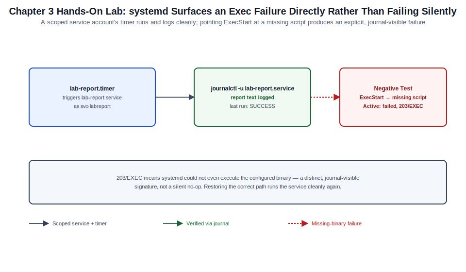

# Chapter 03: Boot, systemd, Processes, Logging, and Scheduled Work



*Figure 3-1. The systemd service and timer lifecycle, including the missing-binary negative test, exercised in this chapter's lab.*

## Learning Objectives

- Trace Ubuntu Server's boot sequence from firmware through GRUB,
  initramfs, and systemd to a running multi-user target.
- Author, enable, and troubleshoot systemd unit files (service, timer,
  socket, mount, target).
- Manage running processes, resource limits, and cgroups v2 slices.
- Query and manage logs through `journalctl`, understanding journald's
  relationship to rsyslog and log rotation.
- Choose correctly between cron, `at`, and systemd timers for scheduled
  work.

## Theory and Architecture

Ubuntu Server boots through the same broad stages as any modern Linux
distribution — firmware, bootloader, initramfs, init — but the specific
tooling at each stage (GRUB2, `initramfs-tools`, systemd) and the way
Ubuntu configures it are worth tracing explicitly, because every later
diagnostic (a service that won't start, a host that won't boot after a
kernel update) depends on knowing which stage owns which failure mode.

### Boot sequence

1. **Firmware (BIOS/UEFI)** initializes hardware and hands control to
   the bootloader found on the EFI System Partition (or MBR, for
   legacy BIOS boot).
2. **GRUB2** (`/boot/grub/grub.cfg`, generated by `update-grub` from
   `/etc/default/grub` and `/etc/grub.d/`) presents the boot menu,
   selects a kernel and initramfs image, and passes the kernel command
   line.
3. **The kernel** unpacks and mounts the **initramfs** — a minimal
   root filesystem built by `initramfs-tools` (`update-initramfs`)
   containing just enough drivers and tooling (LVM, RAID, network, TPM,
   encrypted-root unlock) to find and mount the real root filesystem.
4. **systemd (PID 1)** takes over once the real root is mounted,
   activating units in dependency order until it reaches the default
   target, normally `multi-user.target` (headless server) or
   `graphical.target` (desktop-adjacent builds).

`systemd-analyze` instruments every stage after firmware hand-off,
making boot performance and ordering a measurable, not anecdotal,
concern.

### systemd unit model

systemd's job is expressing "what should be running" as a dependency
graph of **units**, each a plain-text file with `[Section]` stanzas:

| Unit type | Suffix | Purpose |
| --- | --- | --- |
| Service | `.service` | A long-running or one-shot process |
| Timer | `.timer` | A schedule that activates a matching unit |
| Socket | `.socket` | Socket-activated service start (lazy startup) |
| Mount | `.mount` | A filesystem mount point, alternative to `/etc/fstab` |
| Target | `.target` | A named synchronization point/group of units (analogous to a runlevel) |

Units live in `/usr/lib/systemd/system` (packaged), `/etc/systemd/
system` (administrator overrides and custom units, highest precedence),
and `/run/systemd/system` (runtime-generated, transient). `systemctl
enable` creates the symlink that ties a unit into its target's
`.wants`/`.requires` directory; `enable` alone does not start a unit,
and `start` alone does not survive a reboot — production units almost
always need both, or `systemctl enable --now`.

### Processes and cgroups v2

Every process systemd starts is automatically placed into a **cgroup
v2** slice (`system.slice`, `user.slice`, or a per-unit sub-cgroup),
giving systemd (and the administrator) uniform CPU, memory, and I/O
accounting and limiting per unit — not just per process — without a
separate cgroup-management tool. `systemd-cgtop` shows live resource
consumption grouped exactly the way `systemctl status` groups service
membership, which is why cgroup-aware limits (`MemoryMax=`, `CPUQuota=`
in a unit file) are now the preferred way to bound a service's resource
use, ahead of legacy `ulimit`-style controls.

### Logging: journald and rsyslog

**systemd-journald** is the default log collector on Ubuntu Server: it
captures kernel messages, stdout/stderr from every systemd-managed
process, and structured metadata (unit name, PID, boot ID) into a
binary, indexed journal. By default the journal is **volatile**
(`/run/log/journal`, cleared on reboot) unless `/var/log/journal`
exists, which switches it to **persistent** storage automatically.
`rsyslog` remains installed on most Ubuntu Server images alongside
journald, subscribing to the journal and writing the traditional
plain-text files administrators and legacy tooling expect
(`/var/log/syslog`, `/var/log/auth.log`); `logrotate` then manages
those flat files' size and retention. journald itself has its own
retention controls (`SystemMaxUse=`, time-based vacuuming) independent
of `logrotate`.

### Scheduled work

Three mechanisms schedule future or recurring work, each with a
different fit:

- **cron** — the traditional `crontab`-driven scheduler; simple,
  well-understood, but has no built-in dependency tracking, no
  guaranteed catch-up after downtime (without `anacron`), and limited
  execution-context control.
- **`at`** — one-shot future execution (`at 22:00`), for a single
  scheduled job rather than a recurring one.
- **systemd timers** — the modern preferred mechanism on Ubuntu Server:
  a `.timer` unit activates a matching `.service` unit, inheriting
  every systemd feature (dependency ordering, resource limits,
  `journalctl` integration, `Persistent=` catch-up after downtime) that
  cron lacks.

## Design Considerations

- **cron vs. systemd timers for new work.** Prefer systemd timers for
  anything new: they log to the journal automatically, support
  `Persistent=true` to catch up a missed run after a reboot, and can
  express resource limits and dependency ordering cron cannot. Keep
  cron for simple, well-tested legacy jobs or where a tool's own
  documentation assumes a crontab entry.
- **Persistent vs. volatile journal.** Deciding to create
  `/var/log/journal` (persistent) trades disk space and an extra
  retention policy to manage for the ability to inspect logs from a
  previous boot — generally worth it on any server that isn't purely
  ephemeral/cloud-autoscaled.
- **Custom unit placement.** Administrator-authored units belong in
  `/etc/systemd/system/`, never inside `/usr/lib/systemd/system/`
  (package-owned and overwritten on upgrade); use a drop-in
  (`systemctl edit <unit>`, which creates
  `/etc/systemd/system/<unit>.d/override.conf`) to modify a
  package-shipped unit rather than copying and editing the whole file.
- **Resource limits: unit-level vs. application-level.** Setting
  `MemoryMax=`/`CPUQuota=` in the unit file is generally more reliable
  and observable than relying on an application's internal tuning,
  because systemd enforces it at the cgroup level regardless of what
  the application does internally.
- **Boot performance budget.** `systemd-analyze blame` and
  `critical-chain` should be part of any golden-image build review, not
  just incident response — a slow unit added silently by a new package
  degrades every future boot, including autoscaled cloud instances
  where boot time is directly billable.

## Implementation and Automation

### 1. Boot analysis

```bash
# Total boot time, split by firmware/loader/kernel/userspace
systemd-analyze

# Which units took the longest to initialize
systemd-analyze blame

# The critical path that determined total boot time
systemd-analyze critical-chain

# Regenerate GRUB configuration after editing /etc/default/grub
sudo update-grub

# Rebuild the initramfs for the running kernel (after driver/LVM changes)
sudo update-initramfs -u -k all
```

### 2. Managing units with systemctl

```bash
# Current status, recent log lines, and cgroup membership
systemctl status nginx

# Start/stop/restart/reload
sudo systemctl start nginx
sudo systemctl reload nginx
sudo systemctl restart nginx

# Enable at boot, and start now, in one step
sudo systemctl enable --now nginx

# Fully disable and prevent any activation, even as a dependency
sudo systemctl mask nginx

# List all failed units
systemctl --failed

# Safely edit an override without touching the packaged unit
sudo systemctl edit nginx
```

### 3. A custom systemd service and timer

```ini
# /etc/systemd/system/backup-report.service
[Unit]
Description=Generate nightly backup status report
Wants=network-online.target
After=network-online.target

[Service]
Type=oneshot
ExecStart=/usr/local/sbin/backup-report.sh
User=svc-backup
MemoryMax=256M
CPUQuota=25%
```

```ini
# /etc/systemd/system/backup-report.timer
[Unit]
Description=Run backup-report.service nightly at 02:15

[Timer]
OnCalendar=*-*-* 02:15:00
Persistent=true
RandomizedDelaySec=300

[Install]
WantedBy=timers.target
```

```bash
sudo systemctl daemon-reload
sudo systemctl enable --now backup-report.timer
systemctl list-timers backup-report.timer
```

`Persistent=true` means a timer that missed its window (host was
powered off at 02:15) runs as soon as possible after the next boot,
which is the behavior cron's `anacron` companion approximates far less
precisely.

### 4. Process and resource inspection

```bash
# Interactive process view
top
htop   # if installed; friendlier, color, per-core view

# Snapshot view sorted by memory
ps aux --sort=-%mem | head -10

# Live per-cgroup resource consumption
systemd-cgtop

# Adjust scheduling priority of a running process
sudo renice -n 5 -p 4821

# Send a graceful-then-forceful termination
kill -TERM 4821
sleep 5
kill -0 4821 2>/dev/null && kill -KILL 4821
```

### 5. journald and rsyslog

```bash
# Tail the live journal
journalctl -f

# Logs for a specific unit, this boot only
journalctl -u nginx -b

# Logs across all boots for a unit
journalctl -u nginx --no-pager

# Kernel ring buffer via the journal
journalctl -k -b

# Filter by priority (0=emerg .. 3=err)
journalctl -p err -b

# Make the journal persistent across reboots
sudo mkdir -p /var/log/journal
sudo systemd-tmpfiles --create --prefix /var/log/journal
sudo systemctl restart systemd-journald

# Cap journal disk usage
sudo sed -i 's/^#SystemMaxUse=.*/SystemMaxUse=1G/' /etc/systemd/journald.conf
sudo systemctl restart systemd-journald
```

### 6. Scheduled work with cron and at

```bash
# Edit the current user's crontab
crontab -e

# System-wide cron drop-in (includes the user field)
sudo tee /etc/cron.d/nightly-cleanup <<'EOF'
15 3 * * * root /usr/local/sbin/cleanup.sh >> /var/log/cleanup.log 2>&1
EOF

# One-shot future execution
echo "/usr/local/sbin/one-time-task.sh" | at 22:00

# List and remove pending at jobs
atq
atrm 3
```

## Validation and Troubleshooting

- **A unit fails to start.** `systemctl status <unit>` shows the last
  few log lines and the exact failure; `journalctl -xeu <unit>` gives
  full context and often an explanatory hint (`-x` expands catalog
  entries for common errors).
- **A unit is enabled but not running after boot.** Confirm it targets
  the right `WantedBy=` (`multi-user.target` for a headless server) and
  that `systemctl is-enabled <unit>` reports `enabled`, not
  `enabled-runtime` (which does not persist).
- **Boot is slow.** `systemd-analyze blame` isolates the slow unit;
  a unit waiting on `network-online.target` unnecessarily is one of the
  most common preventable delays — confirm the unit genuinely needs
  network availability before adding that dependency.
- **A timer never fires.** `systemctl list-timers` shows the next
  scheduled run and the last trigger time; if `NEXT` is empty, confirm
  the timer unit itself is both enabled and started
  (`systemctl status <name>.timer`), and that `OnCalendar=` syntax is
  valid (`systemd-analyze calendar "*-*-* 02:15:00"` validates and
  previews the next occurrences without waiting for it to fire).
- **Logs seem to disappear after reboot.** Confirm
  `/var/log/journal` exists (persistent) rather than only
  `/run/log/journal` (volatile); `journalctl --list-boots` shows every
  boot the current journal storage actually retains.
- **A cron job "works when I run it by hand" but not from cron.** cron
  runs with a minimal environment and no interactive shell profile;
  always use absolute paths in cron-invoked scripts and set `PATH`
  explicitly at the top of the crontab or script rather than relying on
  an interactive `PATH`.

## Security and Best Practices

- Run services as a dedicated, non-root system user (`User=` /
  `DynamicUser=yes` in the unit file) whenever the service does not
  require root, and pair it with `ProtectSystem=strict`,
  `NoNewPrivileges=yes`, and `PrivateTmp=yes` for defense in depth.
- Set explicit `MemoryMax=`/`CPUQuota=`/`TasksMax=` on any service that
  processes untrusted input or third-party data, so a resource-exhaustion
  bug in that service cannot starve the rest of the host.
- Make the journal persistent (`/var/log/journal`) and forward it to a
  remote log collector (rsyslog `omfwd`, or a journal-native shipper)
  on any host where local log tampering after a compromise is a
  realistic threat — local-only logs do not survive an attacker with
  root.
- Set `Storage=persistent` and a `SystemMaxUse=` bound deliberately;
  an unbounded journal on a busy host can fill `/var` and take down
  unrelated services.
- Restrict who can edit `/etc/crontab`, `/etc/cron.d/`, and per-user
  crontabs (`cron.allow`/`cron.deny`) to the administrators who actually
  need scheduling authority — a writable cron entry run as root is a
  direct privilege-escalation path.
- Prefer `systemctl edit` drop-ins over hand-editing packaged unit
  files, so a future package upgrade cannot silently revert (or worse,
  merge-conflict against) a security-relevant customization.

## References and Knowledge Checks

**References**

- [`systemd(1)`, `systemctl(1)`, `systemd.unit(5)`, `systemd.timer(5)`
  man pages.](https://man7.org/linux/man-pages/man1/systemctl.1.html)
- [`journalctl(1)`, `journald.conf(5)` man pages.](https://man7.org/linux/man-pages/man1/journalctl.1.html)
- [`crontab(5)`, `at(1)` man pages.](https://man7.org/linux/man-pages/man5/crontab.5.html)
- [Ubuntu Server Guide](https://ubuntu.com/server/docs/) — systemd essentials and log management.
- [SOFTWARE_VERSIONS.md](../../../SOFTWARE_VERSIONS.md) — Ubuntu Server
  26.04 baseline referenced throughout this chapter.

**Knowledge checks**

1. What is the practical difference between `systemctl enable` and
   `systemctl enable --now`?
2. Why does a persistent journal (`/var/log/journal` present) matter
   for post-incident investigation, and what determines whether the
   journal is persistent or volatile by default?
3. When should an administrator prefer a systemd timer over a cron
   entry for new scheduled work, and what specific capability does
   `Persistent=true` provide that cron lacks natively?
4. Why should administrator customizations to a packaged unit be made
   with `systemctl edit` rather than by editing the file in
   `/usr/lib/systemd/system/` directly?

## Hands-On Lab

**Objective:** Author a custom systemd service and timer, verify its
execution and logging through `journalctl`, and observe a deliberate
failure mode.

**Prerequisites**

- An Ubuntu Server 26.04 LTS host or VM with `sudo` access.
- A non-production system, since this lab creates and removes a
  systemd unit and a dedicated service account.

**Steps**

1. Create a dedicated service account and the target script:

   ```bash
   sudo useradd --system --no-create-home --shell /usr/sbin/nologin svc-labreport
   sudo mkdir -p /usr/local/sbin
   sudo tee /usr/local/sbin/lab-report.sh <<'EOF'
   #!/usr/bin/env bash
   set -euo pipefail
   echo "Lab report generated at $(date -Iseconds) by $(whoami)"
   EOF
   sudo chmod +x /usr/local/sbin/lab-report.sh
   ```

2. Create the service and timer units:

   ```bash
   sudo tee /etc/systemd/system/lab-report.service <<'EOF'
   [Unit]
   Description=Lab report generator (training exercise)

   [Service]
   Type=oneshot
   ExecStart=/usr/local/sbin/lab-report.sh
   User=svc-labreport
   EOF

   sudo tee /etc/systemd/system/lab-report.timer <<'EOF'
   [Unit]
   Description=Run lab-report.service every 2 minutes

   [Timer]
   OnBootSec=1min
   OnUnitActiveSec=2min
   Persistent=true

   [Install]
   WantedBy=timers.target
   EOF

   sudo systemctl daemon-reload
   sudo systemctl enable --now lab-report.timer
   ```

3. Confirm the timer is scheduled:

   ```bash
   systemctl list-timers lab-report.timer
   ```

   **Expected result:** a `NEXT` and `LEFT` column showing an upcoming
   run within about a minute.

4. Trigger the service manually and confirm success in the journal:

   ```bash
   sudo systemctl start lab-report.service
   journalctl -u lab-report.service --no-pager -n 10
   ```

   **Expected result:** a log line showing the report text, with
   `svc-labreport` as the reporting user, and
   `systemctl status lab-report.service` showing `Active: inactive
   (dead)` with the last run marked `SUCCESS`.

5. **Negative test:** break the service by pointing it at a
   non-existent script, and observe the failure mode:

   ```bash
   sudo systemctl edit lab-report.service --full
   ```

   Change `ExecStart=` to `/usr/local/sbin/lab-report-typo.sh`, save,
   then:

   ```bash
   sudo systemctl daemon-reload
   sudo systemctl start lab-report.service
   systemctl status lab-report.service
   journalctl -u lab-report.service -n 5 --no-pager
   ```

   **Expected result:** the unit reports `Active: failed`, and the
   journal shows an `status=203/EXEC` (or similar "No such file or
   directory") error — confirming systemd surfaces exec failures
   directly rather than failing silently.

6. Restore the working `ExecStart=` (repeat the `systemctl edit
   --full` step with the correct path) and confirm it runs cleanly
   again:

   ```bash
   sudo systemctl daemon-reload
   sudo systemctl start lab-report.service
   systemctl is-active lab-report.service || journalctl -u lab-report.service -n 5
   ```

7. **Cleanup:**

   ```bash
   sudo systemctl disable --now lab-report.timer
   sudo rm -f /etc/systemd/system/lab-report.timer /etc/systemd/system/lab-report.service
   sudo rm -f /usr/local/sbin/lab-report.sh
   sudo systemctl daemon-reload
   sudo userdel svc-labreport
   ```

## Lab Verification

Complete this sign-off once the lab has been run end to end, including the
negative test. Until then, the lab is unverified.

- **Lab verified by:** *pending*
- **Date:** *pending*

## Summary and Completion Checklist

systemd owns Ubuntu Server's boot sequence from the point the real root
filesystem is mounted, expressing every service, schedule, mount, and
grouping as a dependency graph of units. journald captures logs
centrally with rsyslog and logrotate providing the traditional
flat-file view most tooling still expects, and systemd timers now cover
the scheduled-work needs cron historically owned, with better logging,
catch-up, and resource-limit integration. Boot performance, service
health, and log retention are all directly measurable with
`systemd-analyze` and `journalctl` rather than inferred from anecdote.

- [ ] Can trace and measure Ubuntu Server's boot sequence with
      `systemd-analyze`.
- [ ] Can author, enable, and troubleshoot a custom systemd service and
      timer.
- [ ] Can inspect and bound process resource usage with `systemd-cgtop`
      and unit-level limits.
- [ ] Can query logs effectively with `journalctl` and explain
      persistent vs. volatile journal storage.
- [ ] Can choose correctly between cron, `at`, and systemd timers for a
      given scheduling need.
- [ ] Completed the hands-on lab, including the negative test and
      cleanup.
