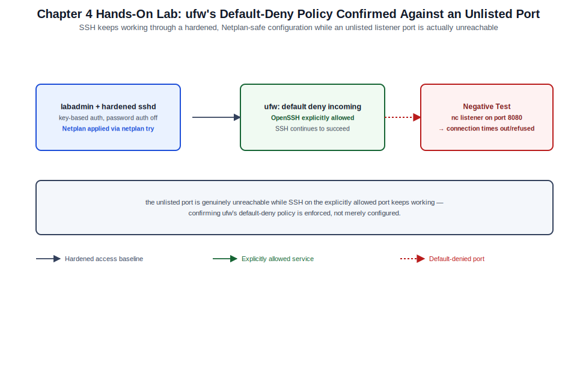

# Chapter 04: Identity, Privilege, SSH, Netplan, and Firewalling



*Figure 4-1. The identity, SSH hardening, Netplan, and ufw topology exercised in this chapter's lab, including the unlisted-port negative test.*

## Learning Objectives

- Create and manage local users and groups, and explain Ubuntu's
  `sudo`-group privilege model.
- Harden `sshd` for key-only, auditable remote administration.
- Configure network interfaces declaratively with Netplan, including
  static addressing, bonding, and VLANs.
- Manage host firewalling with `ufw` and understand its relationship to
  the underlying `nftables` backend.
- Diagnose common identity, SSH, network, and firewall failures.

## Theory and Architecture

Ubuntu Server's identity and access model is standard Debian-family
Linux: local accounts in `/etc/passwd`/`/etc/shadow`, group membership
in `/etc/group`, and privilege escalation through `sudo` rather than a
shared `root` password. What differs from other enterprise Linux
distributions is largely tooling and convention — `adduser` as the
interactive-friendly wrapper around `useradd`, the `sudo` group instead
of `wheel`, Netplan as the declarative network configuration layer, and
`ufw` as the approachable front end to `nftables`.

### Users, groups, and sudo

Ubuntu ships with no enabled `root` password by default on cloud and
server images; the first administrative account is a member of the
`sudo` group and escalates privilege per-command via `sudo`, with every
invocation logged. `/etc/sudoers` (edited only with `visudo`, which
validates syntax before saving) and `/etc/sudoers.d/` drop-ins define
who may run what as whom. PAM (Pluggable Authentication Modules)
mediates every authentication event — login, `sudo`, `su`, SSH password
auth — through a stack of modules configured in `/etc/pam.d/`,
including `pam_faillock` (account lockout after repeated failures) and
`pam_pwquality` (password complexity policy).

### SSH as the primary administrative channel

For a headless server, SSH is not just remote access — it is the
primary administrative control plane, which is why `sshd_config`
hardening sits in this chapter rather than being treated as an
afterthought. Key-based authentication, restrictive `AllowUsers`/
`AllowGroups`, and disabling root login over SSH are baseline
expectations for any server exposed to a network with untrusted hosts,
not advanced hardening.

### Netplan

**Netplan** is Ubuntu's declarative network configuration abstraction:
administrators write YAML under `/etc/netplan/*.yaml` describing the
desired interface state, and Netplan renders that YAML into the
configuration format actually consumed by one of two backends:

| Renderer | Backend | Typical use |
| --- | --- | --- |
| `networkd` | `systemd-networkd` | Default on Ubuntu Server; lightweight, no GUI dependency |
| `NetworkManager` | `NetworkManager` | Default on Ubuntu Desktop; used on servers needing NM-managed Wi-Fi or dynamic reconfiguration tooling |

`netplan apply` generates and activates the backend configuration
immediately; `netplan try` applies it with an automatic rollback timer
if the administrator does not confirm the change within a set window —
a critical safety net when reconfiguring the network interface a remote
session depends on. `netplan generate` renders the backend config
without applying it, useful for reviewing exactly what Netplan will do
before committing to it.

### ufw and nftables

Ubuntu's kernel firewall is implemented with **nftables** (which
replaced the legacy `iptables`/`ip6tables` framework as the default
packet-filtering backend). **ufw** (Uncomplicated Firewall) is a
policy-oriented front end that translates simple, readable rules
(`ufw allow 22/tcp`) into the underlying `nftables` ruleset, and is the
recommended tool for host-based filtering on Ubuntu Server. Application
profiles (`/etc/ufw/applications.d/`) let packages register named rule
sets (`ufw allow OpenSSH`) instead of requiring an administrator to
remember exact ports. Administrators who need rule expressiveness ufw
does not offer (complex NAT, rate limiting beyond ufw's `limit`
keyword, set-based matching) can still author `nftables` rules
directly, but mixing hand-written `nftables` rules with `ufw`-managed
ones requires care, since `ufw` assumes it owns the base ruleset
structure.

## Design Considerations

- **`adduser` vs. `useradd`.** `adduser` is the interactive,
  higher-level wrapper (creates a home directory, sets sane defaults,
  prompts for details) recommended for manual account creation; `useradd`
  is the lower-level primitive most automation (Ansible's `user`
  module, provisioning scripts) calls directly with explicit flags for
  reproducibility.
- **sudo scope discipline.** Blanket `ALL=(ALL) NOPASSWD:ALL` sudoers
  entries are convenient and dangerous; scope `sudoers.d` entries to
  the specific commands a role actually needs, and require a password
  (or MFA-backed `sudo` via PAM) for anything touching security
  controls.
- **networkd vs. NetworkManager on servers.** Default to `networkd` for
  headless servers with static or DHCP-assigned addressing; reserve
  `NetworkManager` for hosts that specifically need its dynamic
  reconfiguration or Wi-Fi management capabilities, since running both
  renderers' assumptions inconsistently across a fleet complicates
  troubleshooting.
- **`netplan try` as standard practice.** Any network change applied
  over a remote session (SSH) to a production host should use
  `netplan try`, not `netplan apply`, so a misconfiguration that drops
  connectivity rolls back automatically instead of requiring console
  access to recover.
- **ufw default policy.** Set an explicit default-deny inbound policy
  (`ufw default deny incoming`) and allow only what is needed, rather
  than starting from allow-all and trying to enumerate what to block.
- **Firewall layering.** Host-based `ufw`/`nftables` rules are a second
  layer of defense behind network-level controls (security groups,
  upstream firewalls covered in Volumes II, III, XVI, XIX); do not treat
  either layer as sufficient alone for an internet-facing host.

## Implementation and Automation

### 1. Users, groups, and sudo

```bash
# Interactive account creation (recommended for manual admin accounts)
sudo adduser jdoe

# Non-interactive, automation-friendly account creation
sudo useradd --create-home --shell /bin/bash --comment "Jane Doe" jdoe
sudo passwd --lock jdoe   # disable password auth; SSH key only

# Grant sudo by group membership
sudo usermod -aG sudo jdoe

# Create a scoped sudoers drop-in instead of editing /etc/sudoers directly
sudo visudo -f /etc/sudoers.d/jdoe-app-admin
# Contents:
#   jdoe ALL=(root) NOPASSWD: /usr/bin/systemctl restart myapp.service

# Validate all sudoers files without applying a broken change
sudo visudo -c

# List a user's group memberships and effective sudo rights
groups jdoe
sudo -l -U jdoe
```

### 2. PAM-backed password policy

```bash
sudo apt install -y libpam-pwquality

# /etc/security/pwquality.conf
sudo tee -a /etc/security/pwquality.conf <<'EOF'
minlen = 14
dcredit = -1
ucredit = -1
ocredit = -1
retry = 3
EOF

# Lock an account after repeated failed logins (pam_faillock)
sudo faillock --user jdoe        # show failure count
sudo faillock --user jdoe --reset
```

### 3. SSH hardening

```ini
# /etc/ssh/sshd_config.d/99-hardening.conf
PermitRootLogin no
PasswordAuthentication no
KbdInteractiveAuthentication no
X11Forwarding no
MaxAuthTries 3
AllowGroups sudo remote-admins
ClientAliveInterval 300
ClientAliveCountMax 2
```

```bash
# Generate a key pair on the client (Ed25519 recommended)
ssh-keygen -t ed25519 -C "jdoe@bastion" -f ~/.ssh/id_ed25519_ubuntu

# Deploy the public key to the target account
ssh-copy-id -i ~/.ssh/id_ed25519_ubuntu.pub jdoe@ubuntu-srv01

# Validate configuration syntax before reloading
sudo sshd -t

# Apply the hardened configuration
sudo systemctl reload ssh
```

### 4. Netplan network configuration

```yaml
# /etc/netplan/50-static.yaml — static addressing on networkd
network:
  version: 2
  renderer: networkd
  ethernets:
    ens160:
      dhcp4: false
      addresses:
        - 10.20.30.15/24
      routes:
        - to: default
          via: 10.20.30.1
      nameservers:
        addresses: [10.20.30.5, 10.20.30.6]
        search: [corp.example.com]
```

```yaml
# /etc/netplan/60-bond-vlan.yaml — a bonded uplink carrying tagged VLANs
network:
  version: 2
  renderer: networkd
  ethernets:
    eno1: {}
    eno2: {}
  bonds:
    bond0:
      interfaces: [eno1, eno2]
      parameters:
        mode: 802.3ad
        lacp-rate: fast
  vlans:
    vlan200:
      id: 200
      link: bond0
      addresses:
        - 10.200.0.15/24
```

```bash
# Review generated backend config without applying it
sudo netplan generate

# Apply with a safety rollback if the new config breaks connectivity
sudo netplan try

# Apply immediately (only when console access is available as a fallback)
sudo netplan apply

# Confirm applied state at the networkd level
networkctl status ens160
ip -br addr show
```

### 5. Firewalling with ufw

```bash
sudo apt install -y ufw

# Default-deny inbound, default-allow outbound
sudo ufw default deny incoming
sudo ufw default allow outgoing

# Allow SSH via the registered application profile
sudo ufw allow OpenSSH

# Allow specific ports/services, optionally scoped to a source
sudo ufw allow 443/tcp
sudo ufw allow from 10.20.30.0/24 to any port 5432 proto tcp

# Rate-limit SSH against brute-force attempts
sudo ufw limit OpenSSH

# Enable and check status with rule numbers (for later deletion)
sudo ufw enable
sudo ufw status numbered

# Delete a rule by number
sudo ufw delete 3

# Inspect the underlying nftables ruleset ufw generated
sudo nft list ruleset | less
```

## Validation and Troubleshooting

- **A new user can't `sudo`.** Confirm group membership took effect in
  the current session (`groups`; a user may need to log out/in, or run
  `newgrp sudo`), and check `sudo -l` for the exact command set the
  sudoers configuration grants.
- **`visudo` refuses to save.** That is the safety mechanism working —
  it caught a syntax error that would have locked out `sudo` entirely;
  fix the reported line rather than force-saving.
- **SSH key auth fails but password auth (if still enabled) works.**
  Check `~/.ssh/authorized_keys` permissions on the target
  (`700` for `~/.ssh`, `600` for `authorized_keys`, owned by the user —
  `sshd` silently ignores keys with overly permissive parent directory
  permissions) and confirm with `ssh -v` client-side verbose output.
- **`netplan apply` drops connectivity.** This is precisely the failure
  `netplan try` exists to prevent; if it happens anyway (via `apply`),
  recover through console/IPMI access, or wait out `netplan try`'s
  rollback timer on the next attempt. `journalctl -u systemd-networkd
  -b` shows why the renderer rejected or reinterpreted the config.
- **A bonded interface shows `degraded`.** `cat /proc/net/bonding/bond0`
  shows per-slave link state and LACP negotiation; a common cause is an
  upstream switch port not configured for the matching LACP mode.
- **A ufw rule doesn't seem to apply.** `sudo ufw status verbose`
  confirms the firewall is active and shows rule order (ufw evaluates
  top-to-bottom, first match wins for that rule type); `sudo nft list
  ruleset` confirms what actually loaded into the kernel, useful when
  ufw and manually added `nftables` rules interact unexpectedly.

## Security and Best Practices

- Disable `PermitRootLogin` and `PasswordAuthentication` in `sshd_config`
  on every server; key-based auth with a passphrase-protected private
  key (and, where available, hardware-backed keys via `ssh-keygen -t
  ed25519-sk`) is the baseline, not an enhancement.
- Scope `sudoers.d` entries to specific commands and require a password
  for anything beyond routine, low-risk operations; audit `sudo` usage
  through the journal (`journalctl _COMM=sudo`) as part of routine
  review.
- Enforce a password quality policy (`pam_pwquality`) and account
  lockout (`pam_faillock`) even though most administrative access is
  key-based, since local/console accounts and break-glass credentials
  still rely on passwords.
- Default `ufw` to deny-incoming and explicitly allow only required
  ports and sources; avoid `ufw allow` rules with no source restriction
  for anything beyond genuinely public services.
- Use `netplan try` for any remote network change; never apply an
  untested network change to a production host without either console
  access or an automatic rollback mechanism available.
- Segment administrative access with `AllowGroups`/`AllowUsers` in
  `sshd_config` and, where the environment supports it, front SSH with
  a bastion host or just-in-time access tool rather than exposing
  `sshd` directly to an untrusted network.

## References and Knowledge Checks

**References**

- [`useradd(8)`, `adduser(8)`, `sudoers(5)`, `visudo(8)` man pages.](https://man7.org/linux/man-pages/man8/useradd.8.html)
- [`sshd_config(5)` man page, OpenSSH hardening guidance.](https://man7.org/linux/man-pages/man5/sshd_config.5.html)
- [Netplan documentation](https://netplan.readthedocs.io/) — `netplan.io`, `netplan(5)`.
- [`ufw(8)` man page, Ubuntu Server Guide](https://ubuntu.com/server/docs/) — Firewall.
- [SOFTWARE_VERSIONS.md](../../../SOFTWARE_VERSIONS.md) — Ubuntu Server
  26.04 baseline referenced throughout this chapter.

**Knowledge checks**

1. Why does Ubuntu Server ship with no usable `root` password by
   default, and what mechanism replaces direct root login for
   administrative tasks?
2. What specific risk does `netplan try` mitigate that `netplan apply`
   does not?
3. What is the relationship between `ufw` and `nftables`, and why might
   an administrator still need to write `nftables` rules directly?
4. Why is `700`/`600` permissioning on `~/.ssh` and
   `~/.ssh/authorized_keys` a functional requirement, not just a
   best practice?

## Hands-On Lab

**Objective:** Create a scoped administrative account, harden SSH
access to it, apply a static Netplan configuration safely, and enforce
a default-deny `ufw` policy — with a negative test proving the deny
policy actually blocks unlisted traffic.

**Prerequisites**

- An Ubuntu Server 26.04 LTS VM with console access (required for the
  negative test and recovery) in addition to SSH, and `sudo` on an
  existing account.
- A second host or workstation able to attempt an SSH connection to the
  lab VM, for the connectivity tests.

**Steps**

1. Create a scoped administrative account with a dedicated SSH key:

   ```bash
   sudo adduser --disabled-password labadmin
   sudo usermod -aG sudo labadmin
   sudo mkdir -p /home/labadmin/.ssh
   ssh-keygen -t ed25519 -C "labadmin@lab" -f ~/lab-key -N ""
   sudo tee /home/labadmin/.ssh/authorized_keys < ~/lab-key.pub
   sudo chown -R labadmin:labadmin /home/labadmin/.ssh
   sudo chmod 700 /home/labadmin/.ssh
   sudo chmod 600 /home/labadmin/.ssh/authorized_keys
   ```

2. From the second host, confirm key-based login works:

   ```bash
   ssh -i lab-key labadmin@<lab-vm-address> 'whoami; sudo -n true && echo sudo-ok'
   ```

   **Expected result:** returns `labadmin`; `sudo-ok` prints only if a
   `NOPASSWD` sudoers entry exists (optional — otherwise expect a
   password prompt, which is also correct behavior).

3. Harden `sshd` and confirm the config is valid before reloading:

   ```bash
   sudo tee /etc/ssh/sshd_config.d/99-lab-hardening.conf <<'EOF'
   PermitRootLogin no
   PasswordAuthentication no
   EOF
   sudo sshd -t && sudo systemctl reload ssh
   ```

4. Apply a static Netplan configuration using the safe rollback path
   (adjust the address/gateway to match your lab network):

   ```bash
   sudo cp /etc/netplan/*.yaml ~/netplan-backup.yaml 2>/dev/null || true
   sudo tee /etc/netplan/90-lab-static.yaml <<'EOF'
   network:
     version: 2
     renderer: networkd
     ethernets:
       ens160:
         dhcp4: false
         addresses: [10.20.30.50/24]
         routes:
           - to: default
             via: 10.20.30.1
         nameservers:
           addresses: [10.20.30.5]
   EOF
   sudo netplan try
   ```

   **Expected result:** `netplan try` prompts to accept within a
   countdown; press Enter to accept once you confirm connectivity from
   the second host still works at the new address, or let it time out
   and roll back automatically if it does not.

5. Enable `ufw` with a default-deny inbound policy, allowing only SSH:

   ```bash
   sudo apt install -y ufw
   sudo ufw default deny incoming
   sudo ufw default allow outgoing
   sudo ufw allow OpenSSH
   sudo ufw --force enable
   sudo ufw status verbose
   ```

6. **Negative test:** from the second host, confirm an unlisted port is
   actually blocked:

   ```bash
   sudo nc -l -p 8080 &  # on the lab VM, start a listener on an unlisted port
   nc -vz -w 3 <lab-vm-address> 8080   # from the second host
   ```

   **Expected result:** the connection attempt from the second host
   times out or is refused, confirming `ufw`'s default-deny policy
   blocks traffic to ports with no explicit `allow` rule; SSH to the
   same host on port 22 continues to succeed.

7. **Cleanup:**

   ```bash
   sudo kill %1 2>/dev/null || true   # stop the nc listener
   sudo ufw disable
   sudo rm -f /etc/netplan/90-lab-static.yaml
   sudo netplan apply
   sudo rm -f /etc/ssh/sshd_config.d/99-lab-hardening.conf
   sudo systemctl reload ssh
   sudo deluser --remove-home labadmin
   rm -f ~/lab-key ~/lab-key.pub
   ```

## Summary and Completion Checklist

Ubuntu Server's identity model is standard `sudo`-mediated Linux
privilege escalation, made auditable through PAM and per-command
sudoers scoping. SSH is the primary administrative control plane for a
headless server and should be hardened to key-only, restricted-group
access as a baseline. Netplan provides declarative, renderer-backed
network configuration with a built-in safety rollback (`netplan try`)
that host-based `ufw`/`nftables` firewalling complements as a
default-deny second layer of defense.

- [ ] Can create scoped user accounts and sudoers entries following
      least-privilege principles.
- [ ] Can harden `sshd_config` for key-only, restricted-group access.
- [ ] Can write and safely apply Netplan configurations, including
      static addressing, bonding, and VLANs.
- [ ] Can configure `ufw` with a default-deny inbound policy and
      targeted allow rules.
- [ ] Can diagnose common sudo, SSH, Netplan, and ufw failures.
- [ ] Completed the hands-on lab, including the negative test and
      cleanup.
