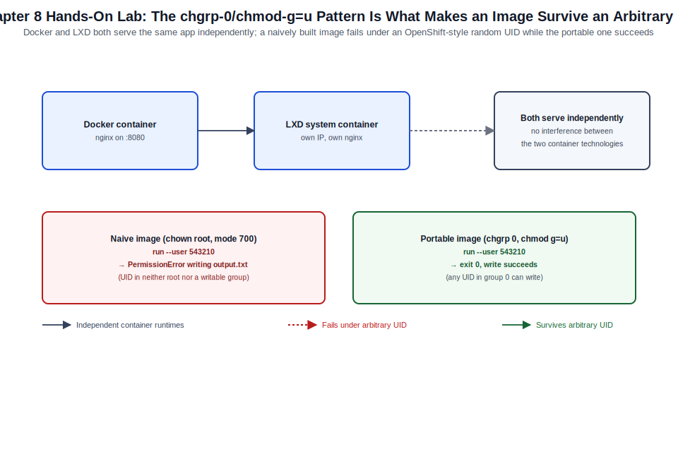

# Chapter 08: Docker, LXD, Canonical Kubernetes, and OpenShift Interoperability



*Figure 8-1. The Docker-and-LXD coexistence and OpenShift-compatible image pattern exercised in this chapter's lab, including the arbitrary-UID negative test.*

## Learning Objectives

- Install and operate Docker Engine on Ubuntu Server, including Compose
  workflows.
- Deploy and manage system containers with LXD, including profiles,
  storage pools, and clustering basics.
- Install Canonical Kubernetes and perform first-cluster operations.
- Build container images on Ubuntu that run correctly under OpenShift's
  restricted Security Context Constraints (SCCs), and use `oc` from an
  Ubuntu administrative workstation.
- Distinguish when Docker, LXD, or Canonical Kubernetes is the right
  tool for a given workload.

## Theory and Architecture

Ubuntu Server offers three distinct container/orchestration paths, each
solving a different problem, plus a practical need — covered here as
"interoperability" rather than a full OpenShift deployment guide — to
build workloads on Ubuntu that behave correctly when they land on a
Red Hat OpenShift cluster (documented in depth in [Volume XIV](../../volume-14-red-hat-enterprise-linux-10/README.md)).

### Docker: application containers

**Docker Engine** on Ubuntu runs as `dockerd`, managed by systemd,
providing the standard OCI-compatible application container runtime
most administrators already associate with "containers." Ubuntu
packages Docker both through Canonical's own `docker.io` package and
through Docker's official upstream APT repository (`docker-ce`); the
upstream repository generally tracks newer releases and is what Docker
Inc. itself supports, while `docker.io` is Ubuntu-maintained and tied
to the distribution's own update cadence. Docker Compose (the `docker
compose` plugin, not the legacy standalone `docker-compose` Python
tool) provides multi-container application definition and lifecycle
management from a single YAML file.

### LXD: system containers and lightweight VMs

**LXD** is Canonical's container and virtual-machine manager, distinct
from Docker in a fundamental way: where Docker containers are
purpose-built to run a single application process, **LXD system
containers** boot a full init system (systemd) and behave like a
lightweight virtual machine — multiple services, SSH access,
package management, the works — while still sharing the host kernel
for near-native performance. LXD also manages actual KVM-backed virtual
machines through the same `lxc`/`lxd` command surface, unifying
container and VM management under one tool. Concepts worth knowing:

- **Profiles** — reusable configuration (network, resource limits,
  device mounts) applied to one or more instances.
- **Storage pools** — backend storage (ZFS, Btrfs, LVM, or plain
  directory) instances draw their root disk from; ZFS-backed pools gain
  instant, space-efficient snapshots and clones.
- **Clustering** — multiple LXD servers joined into a single
  management domain, distributing instances across members.

LXD's project was forked by much of its original community as
**Incus** after a 2023 governance dispute; both remain actively
developed, and Canonical continues to ship and support LXD directly on
Ubuntu, distributed as a snap.

### Canonical Kubernetes

**Canonical Kubernetes** (`k8s`, distributed as a snap) is Canonical's
upstream-conformant Kubernetes distribution, positioned for production
clusters that want a CNCF-conformant Kubernetes with Canonical's
enterprise support and integration with the rest of the Ubuntu
ecosystem (Juju, Landscape — [Chapter 09](09-cloud-init-maas-juju-ansible-landscape-operations-and-capstone.md)). It installs as a single snap
per node, bundles a default CNI and DNS add-on, and clusters additional
nodes with a token-based join, deliberately minimizing the number of
separate components an administrator must assemble compared to a
from-scratch `kubeadm` build.

### OpenShift interoperability

Most enterprise environments running Red Hat OpenShift ([Volume XIV](../../volume-14-red-hat-enterprise-linux-10/README.md))
still rely on Ubuntu somewhere in the pipeline — developer
workstations, CI/CD runners, or hosts building the container images
OpenShift will run. Two things matter for that hand-off:

1. **`oc` (the OpenShift CLI) runs natively on Ubuntu** as a standalone
   binary, letting an Ubuntu-based CI runner or admin workstation manage
   OpenShift projects, builds, and deployments without needing RHEL
   anywhere in that toolchain.
2. **OpenShift enforces restricted Security Context Constraints (SCCs)
   by default**, meaning containers run with an arbitrarily assigned,
   non-root UID unless explicitly granted otherwise — a container image
   built on Ubuntu (or anywhere) that hard-codes a specific UID, writes
   to paths owned by `root`, or otherwise assumes it controls its own
   UID will fail under OpenShift even though it runs fine under plain
   Docker or Kubernetes elsewhere. Building images with group-writable,
   GID-0-owned application directories (the pattern Red Hat's own base
   images use) is what makes an Ubuntu-built image portable to
   OpenShift's default posture without a custom SCC.

## Design Considerations

- **Docker vs. LXD for a given workload.** Choose Docker for
  single-process, horizontally scalable application workloads that
  will eventually run under an orchestrator; choose LXD when the
  workload genuinely needs a full OS environment (legacy application
  migration, a workload that expects to manage its own services via
  systemd, or infrastructure that benefits from VM-like isolation
  without full virtualization overhead).
- **Docker Compose vs. Kubernetes for multi-container applications.**
  Compose is appropriate for single-host development and small,
  non-clustered production deployments; anything needing multi-host
  scheduling, self-healing, or rolling updates across nodes belongs on
  Canonical Kubernetes (or another Kubernetes distribution) instead.
- **LXD storage backend selection.** A ZFS-backed storage pool gives
  LXD instant snapshots and efficient clones (useful for golden-image
  workflows spinning up many similar containers); a plain directory
  backend is simpler but loses those capabilities — decide before
  significant instance population exists, since migrating a pool's
  backend later is disruptive.
- **Canonical Kubernetes vs. a hand-assembled `kubeadm` cluster.**
  Canonical Kubernetes trades some configuration flexibility for a
  dramatically simpler install and upgrade path and Canonical support;
  a hand-assembled cluster offers maximum control over every component
  version at the cost of the operational burden of tracking upstream
  compatibility yourself.
- **Building OpenShift-portable images from an Ubuntu build host.**
  Decide this at Dockerfile-authoring time, not deployment time — retrofitting
  arbitrary-UID compatibility into an image that assumed a fixed UID
  is a bigger change than designing for it from the start (`chgrp -R 0`
  and `chmod g=u` on writable paths, avoiding `USER <fixed-uid>` unless
  that UID is also `0`-group-writable-compatible).
- **Multi-tool sprawl.** Running Docker, LXD, and Canonical Kubernetes
  simultaneously on the same fleet without a clear rule for which tool
  owns which workload class creates real operational confusion; document
  the decision, not just the tools.

## Implementation and Automation

### 1. Docker Engine installation and basic operation

```bash
# Install from Docker's official upstream repository
sudo apt install -y ca-certificates curl gnupg
sudo install -m 0755 -d /etc/apt/keyrings
curl -fsSL https://download.docker.com/linux/ubuntu/gpg | \
  sudo gpg --dearmor -o /etc/apt/keyrings/docker.gpg
echo \
  "deb [arch=$(dpkg --print-architecture) signed-by=/etc/apt/keyrings/docker.gpg] \
  https://download.docker.com/linux/ubuntu $(. /etc/os-release && echo "$VERSION_CODENAME") stable" | \
  sudo tee /etc/apt/sources.list.d/docker.list > /dev/null
sudo apt update
sudo apt install -y docker-ce docker-ce-cli containerd.io docker-compose-plugin

# Allow a non-root administrator to use docker without sudo
sudo usermod -aG docker "$USER"

# Basic lifecycle
docker run --rm hello-world
docker ps -a
docker images

# Compose-based multi-container application
cat > compose.yaml <<'EOF'
services:
  web:
    image: nginx:latest
    ports:
      - "8080:80"
EOF
docker compose up -d
docker compose ps
docker compose down
```

### 2. LXD system containers

```bash
sudo snap install lxd
sudo lxd init --auto

# Launch a system container from an Ubuntu image
lxc launch ubuntu:24.04 web01

# Execute a command inside it, or get an interactive shell
lxc exec web01 -- apt update
lxc exec web01 -- bash

# Apply a reusable profile (resource limits, extra device)
lxc profile create constrained
lxc profile set constrained limits.cpu 2
lxc profile set constrained limits.memory 2GB
lxc profile add web01 constrained

# Snapshot and clone (fast, copy-on-write, on a ZFS storage pool)
lxc snapshot web01 pre-change
lxc copy web01 web02

# Inspect storage pools and profiles
lxc storage list
lxc profile list
lxc list
```

### 3. Canonical Kubernetes

```bash
# Install on the first (control-plane) node
sudo snap install k8s --classic

# Bootstrap the cluster
sudo k8s bootstrap

# Confirm cluster status and get a join token for additional nodes
sudo k8s status
sudo k8s get-join-token worker-node-01

# On a second node, install the snap and join using the token
sudo snap install k8s --classic
sudo k8s join-cluster <join-token>

# Standard kubectl workflow (bundled with the snap)
sudo k8s kubectl get nodes
sudo k8s kubectl get pods -A
sudo k8s kubectl create deployment demo --image=nginx --replicas=2
sudo k8s kubectl expose deployment demo --port=80 --type=NodePort
```

### 4. An OpenShift-portable Dockerfile built on Ubuntu

```dockerfile
FROM ubuntu:24.04

RUN apt-get update && apt-get install -y --no-install-recommends \
    python3 python3-pip && rm -rf /var/lib/apt/lists/*

WORKDIR /app
COPY app/ /app/

# Make application directories writable by any UID in the root group,
# not just a hard-coded owner — this is what makes the image run
# correctly under OpenShift's default arbitrary-UID SCC.
RUN chgrp -R 0 /app && chmod -R g=u /app

# Do not pin a specific non-root UID; let the runtime (Docker,
# Kubernetes, or OpenShift) assign one.
USER 1001

EXPOSE 8080
ENTRYPOINT ["python3", "app.py"]
```

### 5. Using `oc` from an Ubuntu administrative workstation

```bash
# Install the OpenShift CLI binary (no RHEL dependency)
curl -L https://mirror.openshift.com/pub/openshift-v4/clients/ocp/latest/openshift-client-linux.tar.gz \
  -o oc.tar.gz
tar xzf oc.tar.gz
sudo install -m 0755 oc /usr/local/bin/oc

oc login https://api.ocp-cluster.example.com:6443 --token=<sha256~token>
oc new-project lab-interop
oc apply -f deployment.yaml
oc get pods
oc logs deployment/demo
```

## Validation and Troubleshooting

- **Docker Compose service fails to start.** `docker compose logs
  <service>` shows the container's stdout/stderr directly; `docker
  compose config` renders the fully resolved configuration, useful for
  catching variable-substitution or override-file mistakes before they
  cause a confusing runtime failure.
- **An LXD container won't launch — `Failed to create instance`.**
  `lxc info --show-log web01` shows the console log from the failed
  launch; a common cause is insufficient storage pool space
  (`lxc storage info default`) or a kernel missing a required feature
  for the chosen storage backend.
- **Canonical Kubernetes node won't join.** `sudo k8s status` on the
  control-plane node confirms it's healthy and the join token hasn't
  expired; `journalctl -u snap.k8s.*` on the joining node surfaces
  network reachability or certificate errors.
- **A pod is `CrashLoopBackOff` under plain Kubernetes but the same
  image fails differently (`Permission denied`) under OpenShift.**
  This is almost always the arbitrary-UID SCC: `oc get pod <name> -o
  yaml | grep -A2 securityContext` shows the assigned UID, and
  `oc logs` typically shows a specific path write failure — the fix is
  the `chgrp 0`/`chmod g=u` pattern in the Dockerfile, not a custom SCC
  grant, in the general case.
- **`oc login` fails from an Ubuntu workstation but succeeds from a
  RHEL host.** This is essentially never distribution-specific;
  confirm system time is correct ([Chapter 07](07-dns-ntp-dhcp-web-database-and-common-server-services.md) — a skewed clock breaks
  TLS validation), and confirm the CA bundle the OpenShift API server's
  certificate chains to is trusted on the Ubuntu host
  (`update-ca-certificates` after adding an internal CA).

## Security and Best Practices

- Add administrators to the `docker` group deliberately and sparingly —
  membership is equivalent to root on the host, since the Docker
  daemon socket has no further access control layer by default.
- Prefer LXD's unprivileged containers (the default) over privileged
  containers; a privileged LXD container's root user maps to the
  host's real root, materially weakening the isolation LXD otherwise
  provides.
- Scan container images (Docker or LXD-hosted OCI images alike) for
  known vulnerabilities as part of the build pipeline, not only at
  deploy time, and keep base images (`ubuntu:24.04`, etc.) updated on a
  defined cadence rather than pinning indefinitely.
- Apply Canonical Kubernetes RBAC and network policy deliberately from
  the first workload deployed; a default-open cluster network is a
  common and avoidable finding in early-stage Kubernetes adoption.
- Build container images to run correctly as an arbitrary non-root UID
  by default (the `chgrp 0`/`chmod g=u` pattern), even for workloads
  not immediately destined for OpenShift — it is strictly more
  portable and more secure than assuming a fixed UID or root.
- Rotate and scope `oc` and `kubectl` credentials (service account
  tokens, `kubeconfig` contexts) the same way SSH keys are scoped
  ([Chapter 04](04-identity-privilege-ssh-netplan-and-firewalling.md)); do not share a single cluster-admin token across an
  entire team's workstations.

## References and Knowledge Checks

**References**

- [Docker Engine documentation, `docker.com`.](https://docs.docker.com/engine/)
- [LXD documentation, `documentation.ubuntu.com/lxd`.](https://documentation.ubuntu.com/lxd/latest/)
- [Canonical Kubernetes documentation, `documentation.ubuntu.com/canonical-kubernetes`.](https://documentation.ubuntu.com/canonical-kubernetes/latest/)
- OpenShift Security Context Constraints documentation, Red Hat
  (cross-referenced with [Volume XIV](../../volume-14-red-hat-enterprise-linux-10/README.md)).
- [SOFTWARE_VERSIONS.md](../../../SOFTWARE_VERSIONS.md) — Ubuntu Server
  26.04 and Kubernetes baselines referenced throughout this chapter.

**Knowledge checks**

1. What is the fundamental difference between an LXD system container
   and a Docker application container, and when does that difference
   matter for a workload decision?
2. Why does Canonical continue to ship and support LXD after the Incus
   community fork, and how does that affect an administrator's tool
   choice today?
3. Why does a container image that works under plain Docker or
   Kubernetes sometimes fail under OpenShift, and what Dockerfile
   pattern resolves it?
4. Why can `oc` be used effectively from an Ubuntu workstation with no
   RHEL host involved anywhere in the toolchain?

## Hands-On Lab

**Objective:** Run the same simple web application as a Docker
container and as an LXD system container, and build a container image
using the arbitrary-UID-compatible pattern, verifying it with a
negative test against a naively-built image.

**Prerequisites**

- An Ubuntu Server 26.04 LTS VM with `sudo` access and virtualization
  enabled (for LXD; nested virtualization if the lab itself runs in a
  VM).
- Internet access to pull the `ubuntu:24.04` Docker base image and the
  LXD `ubuntu:24.04` image.
- A non-production system, since this lab installs Docker and LXD.

**Steps**

1. Install Docker and run a simple web container:

   ```bash
   sudo apt install -y docker.io
   sudo systemctl enable --now docker
   sudo docker run -d --name lab-web -p 8080:80 nginx:latest
   curl -s http://localhost:8080 | head -3
   ```

   **Expected result:** the default Nginx welcome page's opening HTML
   lines print.

2. Install LXD and launch an equivalent system container:

   ```bash
   sudo snap install lxd
   sudo lxd init --auto
   lxc launch ubuntu:24.04 lab-lxd-web
   lxc exec lab-lxd-web -- bash -c "apt update && apt install -y nginx"
   lxc list lab-lxd-web
   ```

   **Expected result:** `lxc list` shows `lab-lxd-web` in state
   `RUNNING` with an assigned IPv4 address.

3. Confirm the LXD container serves its own Nginx over its own address:

   ```bash
   LXD_IP=$(lxc list lab-lxd-web -c 4 --format csv | cut -d' ' -f1)
   curl -s "http://${LXD_IP}" | head -3
   ```

   **Expected result:** the default Nginx welcome page prints, served
   from the LXD system container rather than the Docker container.

4. Build two versions of a minimal app image — one naive, one
   OpenShift-portable:

   ```bash
   mkdir -p ~/lab-oc-image/app && cd ~/lab-oc-image
   cat > app/app.py <<'EOF'
   print("writing to a fixed-owner directory")
   open("/app/output.txt", "w").write("ok\n")
   EOF

   cat > Dockerfile.naive <<'EOF'
   FROM ubuntu:24.04
   RUN apt-get update && apt-get install -y --no-install-recommends python3 \
       && rm -rf /var/lib/apt/lists/*
   WORKDIR /app
   COPY app/ /app/
   RUN chown -R root:root /app && chmod -R 700 /app
   USER 1001
   ENTRYPOINT ["python3", "app.py"]
   EOF

   cat > Dockerfile.portable <<'EOF'
   FROM ubuntu:24.04
   RUN apt-get update && apt-get install -y --no-install-recommends python3 \
       && rm -rf /var/lib/apt/lists/*
   WORKDIR /app
   COPY app/ /app/
   RUN chgrp -R 0 /app && chmod -R g=u /app
   USER 1001
   ENTRYPOINT ["python3", "app.py"]
   EOF

   docker build -t lab-app:naive -f Dockerfile.naive .
   docker build -t lab-app:portable -f Dockerfile.portable .
   ```

5. Run both images simulating an arbitrary, unpredictable UID the way
   OpenShift's default SCC assigns one:

   ```bash
   docker run --rm --user 543210 lab-app:naive
   ```

6. **Negative test:** confirm the naive image fails under an arbitrary
   UID it was not built for, then confirm the portable image succeeds
   under the same condition:

   ```bash
   echo "--- naive image (expect failure) ---"
   docker run --rm --user 543210 lab-app:naive; echo "exit code: $?"

   echo "--- portable image (expect success) ---"
   docker run --rm --user 543210 lab-app:portable; echo "exit code: $?"
   ```

   **Expected result:** the naive image exits non-zero with a
   `PermissionError`/`Permission denied` writing to `/app/output.txt`,
   because UID `543210` is neither `root` nor a member of a group with
   write access; the portable image exits `0`, because the
   `chgrp 0`/`chmod g=u` pattern grants write access to any UID as long
   as it belongs to the root (`0`) group — exactly how OpenShift runs
   containers by default.

7. **Cleanup:**

   ```bash
   docker rm -f lab-web
   docker rmi lab-app:naive lab-app:portable nginx:latest
   lxc delete lab-lxd-web --force
   cd ~ && rm -rf ~/lab-oc-image
   ```

## Lab Verification

Complete this sign-off once the lab has been run end to end, including the
negative test. Until then, the lab is unverified.

- **Lab verified by:** *pending*
- **Date:** *pending*

## Summary and Completion Checklist

Docker, LXD, and Canonical Kubernetes cover three distinct needs on
Ubuntu Server: single-process application containers, full-OS system
containers and lightweight VMs, and production Kubernetes
orchestration, respectively. LXD's continued Canonical support
alongside the community Incus fork means Ubuntu administrators have a
stable, supported system-container option regardless of that
governance split. Building images with the `chgrp 0`/`chmod g=u`
arbitrary-UID pattern makes Ubuntu-built container images portable to
OpenShift's default restricted SCC without custom security exceptions,
and the `oc` CLI runs natively on Ubuntu with no RHEL dependency
anywhere in the administrative toolchain.

- [ ] Can install and operate Docker Engine and Docker Compose on
      Ubuntu Server.
- [ ] Can launch, profile, snapshot, and clone LXD system containers.
- [ ] Can bootstrap and join nodes to a Canonical Kubernetes cluster.
- [ ] Can build a container image that runs correctly under OpenShift's
      default arbitrary-UID SCC.
- [ ] Can use `oc` from an Ubuntu workstation to manage OpenShift
      resources.
- [ ] Completed the hands-on lab, including the negative test and
      cleanup.
