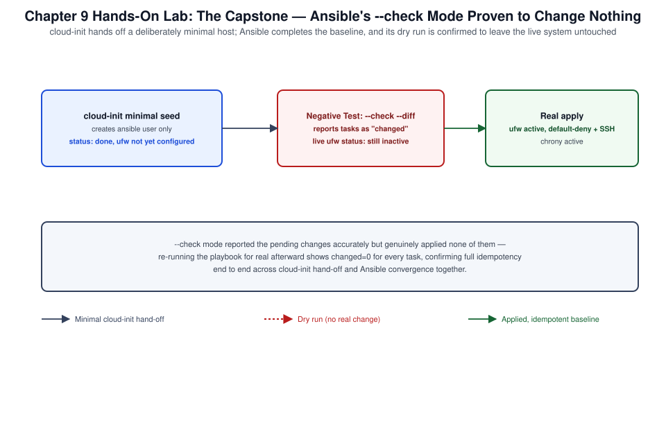

# Chapter 09: Cloud-init, MAAS, Juju, Ansible, Landscape, Operations, and Capstone



*Figure 9-1. The capstone cloud-init-to-Ansible provisioning chain exercised in this chapter's lab, including the check-mode negative test.*

## Learning Objectives

- Explain cloud-init's datasource, module, and stage architecture, and
  diagnose a first-boot configuration failure.
- Describe MAAS's region/rack controller architecture for bare-metal
  provisioning.
- Deploy and relate applications using Juju charms and bundles.
- Manage an Ubuntu fleet with Ansible using distribution-appropriate
  modules.
- Integrate Landscape for ongoing fleet patch and compliance operations.
- Complete a capstone lab combining autoinstall, cloud-init, Ansible,
  and fleet visibility into one coherent workflow.

## Theory and Architecture

This closing chapter ties the volume together: [Chapter 01](01-installation-autoinstall-ubuntu-pro-repositories-and-landscape.md) introduced
autoinstall as a cloud-init subset and Landscape as a registration
target; this chapter returns to both in operational depth and adds the
remaining Canonical automation stack — MAAS for bare metal and Juju for
application modeling — alongside Ansible, the vendor-neutral automation
tool most fleets actually run day to day.

### Cloud-init architecture

**cloud-init** is the industry-standard cross-distribution tool that
initializes a Linux instance's identity, network, storage, and
software state on first boot, driven entirely by data the instance
receives from its environment rather than a human at a console.
Understanding its architecture explains most of the "why didn't my
configuration apply" failures administrators hit:

- **Datasources** — where cloud-init gets its configuration:
  `NoCloud` (a locally attached ISO or HTTP source, used by the
  autoinstall lab in [Chapter 01](01-installation-autoinstall-ubuntu-pro-repositories-and-landscape.md)), `Ec2`/`Azure`/`GCE`/`OpenStack`
  (cloud-provider metadata services), and others. cloud-init probes a
  prioritized list of datasources at boot and uses the first one that
  responds.
- **Configuration inputs** — `user-data` (the primary
  administrator-authored configuration, `#cloud-config` YAML or a
  script), `meta-data` (instance identity supplied by the platform:
  hostname, instance ID), and `vendor-data` (platform- or
  image-builder-supplied configuration, layered underneath user-data).
- **Boot stages** — cloud-init runs across four systemd-integrated
  stages: **Generator** (very early, decides whether cloud-init should
  run at all), **Local** (`cloud-init-local.service`, network not yet
  up, local datasources only), **Network** (`cloud-init.service`,
  network available, most datasources and modules run here), and
  **Final** (`cloud-init-final.service`, runs after most of the system
  is up — package installs, user scripts).

Each `user-data` module (users, packages, write_files, runcmd, and
dozens more) is independently idempotent by design, and cloud-init
records what it has already done so a re-run (`cloud-init clean` +
reboot) reproduces the same end state — the same idempotency principle
[Chapter 02](02-essential-tools-shell-scripting-apt-and-snap-management.md)'s scripting guidance emphasizes, here enforced by the tool
itself.

### MAAS: Metal as a Service

**MAAS** turns physical servers into cloud-like, API-provisionable
resources. Its architecture separates two roles:

- **Region controller** — the API, database, and web UI; the
  source of truth for machine inventory and configuration.
- **Rack controller** — runs closer to the actual hardware on each L2
  segment, providing DHCP, PXE/TFTP boot services, and image caching
  for the commissioning and deployment process.

A machine's MAAS lifecycle moves through defined states:
**Enlistment** (MAAS discovers a new machine via PXE boot),
**Commissioning** (MAAS boots an ephemeral image to inventory the
hardware — CPU, RAM, disks, NICs), **Allocation** (a user or automation
claims the machine for a purpose), and **Deployment** (MAAS installs
the target OS — typically driving the exact autoinstall/cloud-init flow
from [Chapter 01](01-installation-autoinstall-ubuntu-pro-repositories-and-landscape.md) — and hands the running machine to its owner). MAAS is
what makes autoinstall practical at fleet scale: instead of hand-
building a seed ISO per host, MAAS serves the right `user-data` to the
right machine automatically as part of its normal PXE-boot-and-deploy
flow.

### Juju: application modeling

**Juju** models applications and their relationships as first-class,
declarative objects rather than a sequence of imperative configuration
steps. Its core concepts:

- **Charms** — reusable, versioned operator code for deploying and
  operating a specific application (PostgreSQL, Kubernetes, Landscape
  Server itself), packaging not just installation but full lifecycle
  operations (upgrade, backup, scaling) as callable actions.
- **Models** — an isolated workspace (typically mapped to a cloud
  project or a set of machines) that a set of deployed applications
  lives in.
- **Relations** — declared integrations between charms (a web
  application charm related to a database charm automatically
  exchanges connection credentials and configuration, no manual wiring)
  that the charms themselves implement.
- **Bundles** — a YAML document describing a complete set of
  applications and relations, deployed together in one operation — the
  Juju equivalent of a docker-compose file, but for a fleet of
  potentially many machines or containers rather than one host.

### Ansible for Ubuntu fleets

**Ansible** is not Ubuntu-specific, but its Ubuntu-facing module
surface deserves explicit treatment: the `ansible.builtin.apt` module
(not `yum`/`dnf`) is the package-management primitive, `ansible.
builtin.systemd_service` manages units the same way [Chapter 03](03-boot-systemd-processes-logging-and-scheduled-work.md) does
manually, and Ansible's own `gather_facts`/`ansible_facts.
os_family == "Debian"` conditionals let a mixed-OS playbook branch
correctly when it must also support non-Ubuntu hosts. For an
Ubuntu-only fleet, playbooks can assume APT and systemd directly
without the abstraction overhead a genuinely cross-distribution
playbook needs.

### Landscape operations

[Chapter 01](01-installation-autoinstall-ubuntu-pro-repositories-and-landscape.md) covered Landscape registration; in ongoing operations,
Landscape's real value is **fleet-scale patch management and
compliance reporting**: administrators define patch policies (which
package origins auto-update, on what schedule, with what maintenance
window), review a security-relevant-CVE dashboard across every
registered host, and push approved changes (package installs, script
execution) to defined machine groups rather than touching hosts
individually.

## Design Considerations

- **cloud-init vs. Ansible for first-boot configuration.** cloud-init
  owns the instance's very first boot (before it's reliably reachable
  over SSH by anything else); Ansible is the right tool for ongoing
  configuration management and drift correction after that first boot.
  Use cloud-init to get a host to a minimally manageable state (network,
  SSH keys, an Ansible-manageable user) and Ansible for everything
  after.
- **MAAS vs. cloud-provider-native provisioning.** MAAS earns its
  operational overhead specifically for bare-metal or private-cloud
  fleets; a workload already provisioning exclusively through a public
  cloud API generally doesn't need MAAS, since the cloud platform
  already plays MAAS's role.
- **Juju charms vs. Ansible playbooks for application deployment.**
  Juju's relation model is a genuine advantage when deploying
  charmed, Canonical-supported applications with complex inter-service
  wiring (a full OpenStack or Kubernetes-on-MAAS deployment); Ansible
  remains the broader, vendor-neutral choice for applications with no
  charm, or where the team's existing automation investment is already
  in Ansible.
- **Landscape SaaS vs. self-hosted, revisited.** With Juju now in
  scope, self-hosting Landscape Server via a Juju charm becomes a
  realistic option for regulated or air-gapped fleets that couldn't
  use Landscape SaaS at all — factor that into the [Chapter 01](01-installation-autoinstall-ubuntu-pro-repositories-and-landscape.md) decision
  once Juju is available as a deployment mechanism.
- **Automation layering discipline.** A fleet running autoinstall +
  cloud-init + Ansible + Landscape should have a clear, documented
  boundary for what each tool owns; overlapping ownership (cloud-init
  and Ansible both trying to manage the same package's version, for
  example) produces confusing, hard-to-audit drift.

## Implementation and Automation

### 1. Inspecting and debugging cloud-init

```bash
# Overall status and any errors from the last boot
cloud-init status --long

# Full boot-stage timing, useful for both debugging and boot-budget review
cloud-init analyze show

# Which datasource was actually used
cloud-init query -a | grep -i datasource

# Re-run cloud-init's full first-boot sequence against a cloned image
# (never on a live production host — this resets machine identity)
sudo cloud-init clean --logs
sudo cloud-init init
sudo cloud-init modules --mode=config
sudo cloud-init modules --mode=final

# Primary log locations
sudo less /var/log/cloud-init.log
sudo less /var/log/cloud-init-output.log
```

### 2. A representative cloud-config user-data document

```yaml
#cloud-config
hostname: app02
users:
  - name: opsadmin
    groups: sudo
    shell: /bin/bash
    sudo: ALL=(ALL) NOPASSWD:ALL
    ssh_authorized_keys:
      - ssh-ed25519 AAAAC3NzaC1lZDI1NTE5AAAAI... opsadmin@bastion
package_update: true
package_upgrade: true
packages:
  - chrony
  - ansible
write_files:
  - path: /etc/ansible-managed
    content: |
      This host is managed by Ansible after first boot.
    permissions: '0644'
runcmd:
  - [systemctl, enable, --now, chrony]
```

### 3. MAAS: commissioning and deploying a machine

```bash
# Log in to the MAAS CLI (API key from the MAAS web UI)
maas login admin http://maas.example.com:5240/MAAS <API_KEY>

# List machines and their current state
maas admin machines read | jq '.[] | {hostname, status_name}'

# Commission a newly enlisted machine
maas admin machine commission <system_id>

# Allocate and deploy Ubuntu Server 26.04 LTS to it,
# supplying the same style of cloud-init user-data as Chapter 01
maas admin machines allocate
maas admin machine deploy <system_id> \
  user_data="$(base64 -w0 user-data.yaml)"

# Poll deployment status
maas admin machine read <system_id> | jq '.status_name'
```

### 4. Juju: deploying a related application bundle

```bash
sudo snap install juju --classic

# Bootstrap a controller onto a cloud/substrate (MAAS, LXD, or a public cloud)
juju bootstrap localhost lxd-controller

# Create a model to deploy into
juju add-model production-app

# Deploy applications and relate them
juju deploy postgresql
juju deploy mattermost-k8s mattermost
juju relate mattermost postgresql

# Or deploy an entire pre-defined bundle in one step
juju deploy ./bundle.yaml

# Check status of the deployed model
juju status
```

### 5. Ansible against an Ubuntu fleet

```ini
# inventory.ini
[ubuntu_servers]
app01.lab.example.com
app02.lab.example.com

[ubuntu_servers:vars]
ansible_user=opsadmin
ansible_python_interpreter=/usr/bin/python3
```

```yaml
# site.yml
- name: Baseline configuration for Ubuntu fleet
  hosts: ubuntu_servers
  become: true
  tasks:
    - name: Update apt cache
      ansible.builtin.apt:
        update_cache: true
        cache_valid_time: 3600

    - name: Ensure baseline packages are present
      ansible.builtin.apt:
        name:
          - chrony
          - ufw
          - unattended-upgrades
        state: present

    - name: Ensure chrony is enabled and running
      ansible.builtin.systemd_service:
        name: chrony
        enabled: true
        state: started

    - name: Enforce default-deny inbound firewall policy
      community.general.ufw:
        policy: deny
        direction: incoming
```

```bash
ansible-playbook -i inventory.ini site.yml --check   # dry run first
ansible-playbook -i inventory.ini site.yml
```

### 6. Landscape fleet operations

```bash
# List registered machines and their pending security updates
landscape-api get-computers --query 'alert:security-upgrades'

# Push a package upgrade to a defined machine group, via a scripted activity
landscape-api apply-package-upgrades \
  --query "tag:app-servers" \
  --security-only

# Retrieve the CIS/compliance summary for a computer
landscape-api get-computers --with-annotations --query "hostname:app01*"
```

## Validation and Troubleshooting

- **cloud-init reports `status: done` but expected configuration never
  applied.** Check which datasource was actually used
  (`cloud-init query -a`); a datasource mismatch (the instance found a
  different datasource than the one the administrator seeded) means the
  intended `user-data` was never read at all.
- **A MAAS machine fails commissioning.** The MAAS UI's machine detail
  page and `maas admin machine read <system_id>` expose the
  commissioning script output; a common cause is a NIC or disk the
  commissioning scripts couldn't enumerate due to a firmware/driver gap
  — check the hardware against MAAS's certified hardware list.
- **A Juju relation doesn't establish.** `juju status` shows relation
  state per application, and `juju debug-log` streams the unit agent
  logs live; most relation failures trace back to a charm-specific
  configuration option that must be set before the relation can
  complete, visible in the charm's own documentation.
- **An Ansible playbook run partially fails across a fleet.** Always
  run with `--check` (dry run) before a real run against unfamiliar
  playbooks, and `--limit <host>` to isolate a single failing host;
  `ansible-playbook -vvv` gives full module invocation detail for
  a task that fails only on some hosts.
- **Landscape shows a host as "insecure" long after patching.**
  Confirm the Landscape client actually reported back after the patch
  (`sudo landscape-config --is-registered` and checking the client's
  last exchange time); a client whose scheduled check-in interval is
  longer than the patch-then-verify window will show stale status
  until its next exchange.

## Security and Best Practices

- Never embed long-lived secrets directly in `user-data`; use a secret
  manager reference, a short-lived bootstrap token exchanged for real
  credentials on first boot, or Landscape/Juju's own credential
  handling instead of a plaintext password or API key in cloud-init
  YAML.
- Scope MAAS API keys and Juju controller credentials narrowly per
  automation identity, the same least-privilege principle [Chapter 04](04-identity-privilege-ssh-netplan-and-firewalling.md)
  applies to `sudo`; a MAAS API key with full admin rights embedded in
  a CI pipeline is a significant blast-radius risk if that pipeline is
  compromised.
- Store Ansible inventories, playbooks, and any `vault`-encrypted
  secrets in version control with the same review discipline as
  application code; treat `ansible-vault` (or an external secrets
  backend) as mandatory for any variable holding a credential.
- Run Ansible playbooks with `--check` against production, and require
  a passing dry run in CI before an unattended apply, for any playbook
  capable of a destructive or service-impacting change.
- Use Landscape's patch policies to enforce, not just report, a maximum
  allowable exposure window for critical CVEs across the fleet, and
  alert when a host falls outside that window rather than relying on
  manual dashboard review.
- Treat the entire autoinstall → cloud-init → Ansible → Landscape chain
  as one audited pipeline: know, for any given host, exactly which
  stage last touched a given piece of configuration, so drift has a
  traceable origin.

## References and Knowledge Checks

**References**

- [cloud-init documentation, `cloudinit.readthedocs.io`.](https://cloudinit.readthedocs.io/)
- [MAAS documentation, `maas.io/docs`.](https://maas.io/docs)
- [Juju documentation, `juju.is/docs`.](https://canonical-juju.readthedocs-hosted.com/en/latest/)
- [Ansible documentation](https://docs.ansible.com/) — `ansible.builtin.apt`,
  `ansible.builtin.systemd_service` module references.
- [Landscape documentation and API reference, `ubuntu.com/landscape`.](https://documentation.ubuntu.com/landscape/)
- [SOFTWARE_VERSIONS.md](../../../SOFTWARE_VERSIONS.md) — Ubuntu Server
  26.04 LTS and Ansible baselines referenced throughout this volume.

**Knowledge checks**

1. What are cloud-init's four boot stages, and why does the
   distinction between the Local and Network stages matter for which
   modules can run at each?
2. What role does a MAAS rack controller play that the region
   controller does not, and why does that split matter for a
   multi-site deployment?
3. What problem does a Juju relation solve that a plain Ansible
   playbook deploying the same two applications would have to handle
   manually?
4. Why should cloud-init and Ansible generally not both try to manage
   the same piece of ongoing configuration on a host?

## Hands-On Lab

This chapter closes the volume with **Canonical's automation stack** — cloud-init, MAAS, Juju,
Ansible, and Landscape — mapping to the "Tools for Automation and System Updating" competency,
and a **Design Exercise** capstone. Every operational step is runnable; the capstone is a written
design. Each ends **`**Lab verified by:** *pending*`** until a human runs it.

**Shared prerequisites for Labs 9.1–9.4** — an Ubuntu 26.04 system with `sudo`, `snap`, and (for
Juju) enough resources for LXD. **Cost:** none.

### Lab 9.1 — cloud-init instance configuration (Topic: Automated provisioning)

**Objective:** Configure a machine declaratively at first boot.

```bash
cloud-init status --long
cat > user-data.yaml <<'EOF'
#cloud-config
package_update: true
packages: [nginx]
write_files:
  - path: /var/www/html/index.html
    content: "Provisioned by cloud-init\n"
runcmd:
  - [systemctl, enable, --now, nginx]
EOF
cloud-init schema --config-file user-data.yaml && echo "cloud-config valid"
```

**Expected result:** `cloud-init status` shows it ran at boot, and the user-data validates —
cloud-init is the cross-cloud first-boot provisioner: it applies packages, files, users, and
commands from declarative user-data, so every cloud/VM/MAAS instance configures itself
identically on launch.

**Negative test:** bake configuration into a golden image instead of cloud-init user-data; the
image must be rebuilt for every change and cannot adapt per-instance — cloud-init parameterizes a
single image at boot.

**Cleanup:** `rm -f user-data.yaml`.

### Lab 9.2 — Model-driven operations with Juju (Topic: Deployment technologies)

**Objective:** Deploy an application with an operator charm.

```bash
sudo snap install juju
juju bootstrap localhost lxd-controller
juju add-model lab
juju deploy postgresql
juju status
```

**Expected result:** Juju bootstraps a controller on LXD and deploys PostgreSQL via its charm,
with `juju status` showing the application converging — Juju is model-driven operations: charms
encode an application's operational knowledge (deploy, configure, scale, integrate), so you
`deploy` and `relate` applications rather than scripting each step.

**Negative test:** script postgres install/config/backup by hand across environments; each drifts
and reinvents the operations — a charm packages that operational logic once, applied consistently.

**Cleanup:** `juju destroy-model lab --no-prompt; juju destroy-controller lxd-controller
--no-prompt` if lab-only.

### Lab 9.3 — Configuration management with Ansible (Topic: Automation and updating)

**Objective:** Converge an Ubuntu host with an idempotent playbook.

```bash
sudo apt install -y ansible
cat > site.yml <<'EOF'
---
- hosts: localhost
  connection: local
  become: true
  tasks:
    - name: Ensure nginx present
      ansible.builtin.apt: { name: nginx, state: present, update_cache: true }
    - name: Deploy index page
      ansible.builtin.copy: { content: "Managed by Ansible\n", dest: /var/www/html/index.html }
      notify: restart nginx
  handlers:
    - name: restart nginx
      ansible.builtin.service: { name: nginx, state: restarted }
EOF
ansible-playbook site.yml | grep -E "changed=|ok="
ansible-playbook site.yml | grep -E "changed=|ok="     # second run: changed=0
```

**Expected result:** the first run changes state and the **second reports `changed=0`** — Ansible
is the vendor-neutral configuration manager (the `apt`/`service` modules are idempotent), useful
alongside Canonical's stack for cross-distro automation and updating.

**Negative test:** use `command: apt install` instead of the `apt` module; it reports `changed`
every run and is not idempotent — prefer state-based modules.

**Cleanup:** `rm -f site.yml`.

### Lab 9.4 — Capstone Design Exercise: an Ubuntu fleet from metal to apps (Topic: Synthesis)

**Objective:** Produce a defensible end-to-end operations design across Canonical's stack.

> **Scenario.** Stand up and operate 200 Ubuntu servers across a data center and two clouds: bare
> metal provisioned automatically, identical configuration, application deployment, ongoing
> patching/compliance, and security maintenance — with minimal manual touch.

Work through and **write down**:

1. **Provision** — MAAS for bare-metal (PXE/IPMI) and cloud images; cloud-init/autoinstall for
   first-boot configuration (Ch01, Ch09).
2. **Configure** — netplan networking, ufw, AppArmor enforcing, and users/SSH baselines applied by
   cloud-init + Ansible/charms (Ch04, Ch06, Ch09).
3. **Deploy apps** — Juju charms and/or Kubernetes (the `k8s` snap) for workloads; LXD for
   system-container services (Ch08, Ch09).
4. **Operate & patch** — Landscape for fleet-wide patching, script execution, and monitoring;
   Ubuntu Pro for ESM security maintenance and USG hardening (Ch01, Ch06).
5. **Storage & services** — LVM and persistent mounts, database/web services with correct firewall
   and AppArmor (Ch05, Ch07).
6. **Assure** — USG CIS audits, drift control, and a tested update/rollback path.

**Expected result:** a written design where metal-to-apps is automated (MAAS → cloud-init → Juju/
Ansible), governed (Landscape + Pro/USG), and secured (netplan/ufw/AppArmor), with minimal manual
intervention — the deliverable that Canonical's SysAdmin/DevOps competencies build toward.

**Negative test:** hand-install and hand-configure each of the 200 servers; it does not scale,
drifts immediately, and cannot be patched or audited consistently — the automation stack (MAAS,
cloud-init, Juju/Ansible, Landscape) is what makes the fleet operable.

**Cleanup:** none (design artifact).

## Lab Verification

Complete this sign-off once the lab has been run end to end, including the
negative test. Until then, the lab is unverified.

- **Lab verified by:** *pending*
- **Date:** *pending*

## Summary and Completion Checklist

cloud-init's datasource/module/stage architecture governs every
instance's first boot across every Ubuntu deployment path this volume
covers — autoinstall, MAAS, and plain cloud provisioning alike. MAAS
extends that same model to bare metal at fleet scale; Juju adds a
relation-aware application deployment model most useful for charmed,
multi-service applications; Ansible remains the vendor-neutral choice
for ongoing configuration management after first boot; and Landscape
closes the loop with fleet-wide patch and compliance visibility. Taken
together, these tools form a single, layered automation pipeline in
which each stage has a distinct, non-overlapping responsibility — the
principle this capstone lab exercised end to end.

- [ ] Can explain cloud-init's datasource, module, and boot-stage
      architecture and diagnose a first-boot failure.
- [ ] Can describe MAAS's region/rack controller split and the
      machine lifecycle it drives.
- [ ] Can deploy related applications with a Juju bundle.
- [ ] Can write and dry-run an Ansible playbook targeting an Ubuntu
      fleet using distribution-appropriate modules.
- [ ] Can perform a fleet-wide patch operation through Landscape.
- [ ] Completed the capstone hands-on lab end to end, including the
      negative test and cleanup.
