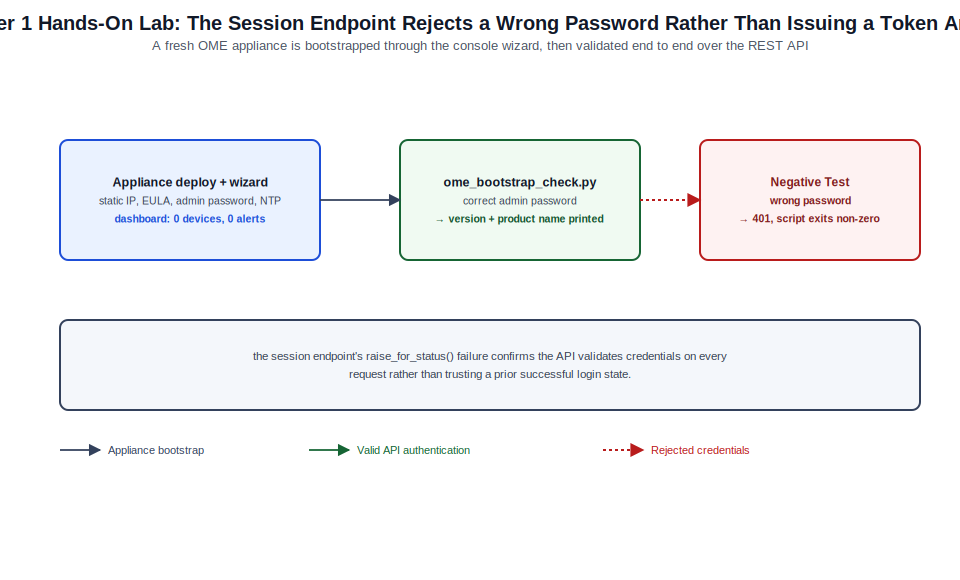

# Chapter 01: Architecture, Requirements, Deployment, and First Configuration



*Figure 1-1. The appliance bootstrap and API validation flow exercised in this chapter's lab, including the wrong-password negative test.*

## Learning Objectives

- Explain where Dell OpenManage Enterprise (OME) fits in Dell's systems
  management portfolio relative to iDRAC, OpenManage Enterprise-Modular
  (OME-M), and SupportAssist Enterprise.
- Describe the OME appliance's internal architecture: the hypervisor-hosted
  virtual appliance, its embedded database and job engine, and the
  console/API surfaces it exposes.
- Size an OME deployment against the documented sizing profiles and plan
  network placement, name resolution, and time-source prerequisites before
  deployment.
- Deploy the OME virtual appliance on a supported hypervisor and complete
  the text-console network bootstrap.
- Complete the browser-based first-run setup wizard and validate appliance
  health through both the GUI and the REST API.

## Theory and Architecture

### Where OME fits

Dell OpenManage Enterprise is a one-to-many systems management console for
Dell PowerEdge rack, tower, and (to a more limited extent) modular servers.
It is the aggregation point that turns per-server, out-of-band management —
delivered by each server's integrated Dell Remote Access Controller
(iDRAC), covered in depth in [Volume XXIII](../../volume-23-dell-idrac-9-10-administration/README.md) — into fleet-scale discovery,
inventory, monitoring, firmware/driver lifecycle management, configuration
templating, and compliance reporting. OME does not replace iDRAC; it
orchestrates against the iDRAC (and, for a narrower set of operations,
against in-band OS agents and Redfish-compliant third-party targets) at
scale.

Three related products are frequently confused with OME and are worth
distinguishing up front:

- **OpenManage Enterprise (OME)** — the subject of this volume: a
  standalone virtual appliance that manages a fleet of independent rack and
  tower PowerEdge servers (and, with reduced functionality, third-party
  Redfish-compliant and network/storage devices) across a data center or
  multiple sites.
- **OpenManage Enterprise-Modular (OME-M)** — a lighter management
  application that runs directly on the Chassis Management Controller of a
  PowerEdge MX7000 modular chassis, managing the sleds, I/O modules, and
  fabric within that chassis (and a small federation of chassis groups). A
  data center commonly runs OME-M at the chassis level and OME at the
  fleet level, with OME onboarding each chassis's compute sleds as managed
  devices.
- **SupportAssist Enterprise** — Dell's automated support-case and
  telemetry-to-Dell pipeline, which OME can integrate with ([Chapter 4](04-monitoring-alerts-reports-jobs-and-operational-integrations.md)) but
  which is a distinct service with its own lifecycle.

### Appliance architecture

OME ships exclusively as a preconfigured virtual appliance image — Dell
does not publish an installable package for a general-purpose OS. The
appliance bundles:

- A hardened Linux base OS, patched and released as a unit with each OME
  version; administrators do not manage the underlying OS package set
  directly.
- An embedded PostgreSQL database holding device inventory, job history,
  alerts, templates, and configuration state. This database is internal to
  the appliance; there is no supported path to query it directly, and all
  interaction happens through the console or REST API.
- A **job engine** that queues, schedules, retries, and tracks every
  asynchronous operation the console performs — discovery runs, inventory
  refreshes, firmware update orchestration, template deployments, and
  report generation are all represented as jobs with their own execution
  history.
- A web application tier serving both the HTML5 console and the REST API
  from the same HTTPS endpoint (TCP 443 by default).
- A **plugin framework** that allows optional capability modules (for
  example, Power Manager for rack/row power monitoring and capping, or the
  SupportAssist integration plugin) to be installed and licensed
  independently of the base appliance, without a full appliance upgrade.

Because the entire management plane lives inside one virtual machine, OME's
own availability is a single point of failure for *management and
automation* — it is not in the data path for anything the fleet does, so a
down appliance does not take down managed servers, but it does blind you to
alerts and pause any in-flight orchestration until it is restored. Chapter
9 covers backup, restore, and upgrade procedures that exist specifically to
manage this risk.

### Supported deployment platforms

At the 4.7.x baseline, OME is distributed as appliance images for:

- VMware vSphere/ESXi (OVF/OVA)
- Microsoft Hyper-V (VHD)
- KVM (QCOW2)

All three images are functionally identical; the only difference is the
virtualization-platform-specific packaging. Nested or cloud-hosted
hypervisors (for example, a vSphere or KVM host running inside a public
cloud VM) are commonly used for lab and training environments such as the
one in this chapter's Hands-On Lab, though production deployments are
almost always on-premises alongside the managed fleet's out-of-band
network.

### Communication model

OME reaches into the managed fleet almost entirely over HTTPS. iDRAC
discovery, inventory, and update orchestration use WS-Management and
Redfish over TCP 443 to each server's iDRAC; SNMP (UDP 161/162), IPMI
(UDP 623), and SSH (TCP 22) are used for third-party network, storage, and
Linux in-band targets respectively ([Chapter 3](03-discovery-onboarding-inventory-groups-and-device-control.md) covers protocol selection per
device class in detail). Outbound, the appliance reaches `downloads.dell.com`
over HTTPS to retrieve the online firmware/driver catalog and, if
SupportAssist integration is enabled, to submit telemetry and open support
cases. Inbound, administrators and API clients reach the appliance over
HTTPS 443; SNMP trap (UDP 162) and syslog (UDP/TCP 514) listeners are also
exposed if you choose to forward alerts from other systems into OME rather
than only out of it.

## Design Considerations

- **Sizing profile.** Dell's deployment guidance for OME has historically
  offered a smaller appliance profile (on the order of 4 vCPUs and 16 GB
  RAM) suited to a few thousand managed devices, and a larger profile (on
  the order of 8 vCPUs and 32 GB RAM) suited to tens of thousands. Treat
  these as directional: confirm the exact vCPU, memory, and disk figures
  for 4.7.x against the current OpenManage Enterprise deployment guide
  before sizing a production appliance, since sizing tables are revised
  between releases as feature scope changes.
- **Network placement.** Place the OME appliance's management interface on
  the same out-of-band/management network segment as the iDRACs it will
  discover, or ensure routed connectivity with no blocking firewall between
  them. Running OME on a production/data VLAN with only routed access to
  an isolated out-of-band network is common and generally preferable to
  dual-homing the appliance across trust zones.
- **Single appliance vs. multiple appliances.** OME does not natively
  cluster or federate the way OME-M can federate chassis groups. Large or
  multi-site enterprises typically choose between one large central
  appliance (simpler operations, single pane of glass, but a bigger blast
  radius if it needs restoration) and multiple regional appliances aligned
  to sites or security zones (smaller blast radius, but reporting and
  templates must be reconciled across appliances since there is no built-in
  cross-appliance rollup). Decide this before onboarding devices; migrating
  a large fleet between appliances later is disruptive.
- **Name resolution and time source.** The appliance must resolve
  `downloads.dell.com` (directly or via an explicitly configured proxy,
  [Chapter 6](06-connected-online-repositories-and-update-workflows.md)) for online catalog updates, and should resolve forward and
  reverse DNS for every managed device to avoid inventory and alert records
  falling back to IP addresses. NTP is not optional: TLS certificate
  validation, job scheduling, and alert timestamp correlation with SIEM
  systems all depend on accurate appliance time. Configure NTP during
  first-run setup rather than after devices are onboarded.
- **Proxy and firewall planning.** If the appliance requires a web proxy to
  reach `downloads.dell.com`, gather the proxy address, port, and (if
  required) service account credentials before deployment — proxy
  configuration is part of the first-run wizard and reconfiguring it later
  under load is disruptive to scheduled catalog refreshes.
- **Licensing runway.** The base OME console is usable immediately after
  deployment, but configuration compliance/deployment templates and some
  advanced integrations require an OpenManage Enterprise Advanced or
  Advanced Plus entitlement ([Chapter 2](02-identity-licensing-security-and-administrative-control.md)). Decide before deployment whether
  the environment needs Advanced-tier features so the license can be
  imported during initial setup rather than as a follow-up change.

## Implementation and Automation

### Deploying the virtual appliance

The deployment mechanics differ by hypervisor, but the pattern is the
same: import the vendor-specific appliance image, attach it to the
management network port group, allocate the sized vCPU/RAM/disk, and power
on. On vSphere, this can be scripted with PowerCLI:

```powershell
# Deploy the OME OVA to a vSphere cluster and place it on the mgmt port group.
Connect-VIServer -Server vcenter.lab.example -User administrator@vsphere.local

$ovfConfig = Get-OvfConfiguration -Ovf "C:\images\OME-4.7.x.ova"
$ovfConfig.NetworkMapping.Network_1.Value = "MGMT-VLAN100"

Import-VApp -Source "C:\images\OME-4.7.x.ova" `
  -OvfConfiguration $ovfConfig `
  -Name "ome-prod-01" `
  -VMHost (Get-VMHost -Name esxi-mgmt-01.lab.example) `
  -Datastore (Get-Datastore -Name mgmt-datastore-01)

Start-VM -VM "ome-prod-01"
```

Equivalent deployments are performed with `govc import.ova` for
vSphere/vCenter via the CLI, `New-VHD` plus `New-VM` for Hyper-V, or
`virt-install` referencing the QCOW2 image for KVM.

### Text-console network bootstrap

On first boot, the appliance presents a text-based console menu (reachable
through the hypervisor console, not over the network, since the appliance
has no IP address yet). Use it to set:

- A static IPv4 (and, if required, IPv6) address, subnet mask, and gateway
  for the management interface — DHCP is supported for initial bring-up
  but a static assignment is strongly recommended before onboarding any
  devices, since the appliance's own address is embedded in every
  discovery credential profile and alert forwarding rule.
- Hostname and DNS search domain.
- Primary and secondary DNS servers.

Once network settings are applied, the appliance's HTTPS console becomes
reachable at `https://<appliance-ip-or-hostname>/`.

### First-run setup wizard

The browser-based first-run wizard walks through the remaining initial
configuration:

1. Accept the End User License Agreement.
2. Change the default local `admin` account password — the appliance will
   not proceed past this step with the factory default password in place.
3. Configure the appliance's time zone and NTP server(s).
4. Optionally configure an outbound web proxy for reaching
   `downloads.dell.com`.
5. Optionally import an OpenManage Enterprise Advanced/Advanced Plus
   license file.
6. Optionally register the appliance for Dell SupportAssist Enterprise
   telemetry.

Exact wizard screen order and labels can shift slightly between minor
releases; treat the sequence above as the functional checklist rather than
a literal screen-by-screen script, and confirm current wording against the
in-product help for your build.

### Automating post-deployment configuration with the REST API

Once the wizard's mandatory steps are complete, remaining application
settings — including NTP, time zone, and proxy — are also exposed through
the REST API, which makes repeatable, scripted appliance bring-up
practical for multi-appliance estates. Authentication is session-token
based: a `POST` to `SessionService/Sessions` returns an `X-Auth-Token`
header that must accompany every subsequent request until the session
expires or is explicitly deleted.

```python
#!/usr/bin/env python3
"""ome_bootstrap_check.py — authenticate to a freshly deployed OME
appliance and confirm it reports healthy after first-run setup.

Usage: python3 ome_bootstrap_check.py <ome-host> <username> <password>
"""
import sys
import requests

requests.packages.urllib3.disable_warnings()  # lab appliance uses a self-signed cert


def get_session(host: str, user: str, password: str) -> tuple[str, requests.Session]:
    session = requests.Session()
    resp = session.post(
        f"https://{host}/api/SessionService/Sessions",
        json={"UserName": user, "Password": password, "SessionType": "API"},
        verify=False,
        timeout=30,
    )
    resp.raise_for_status()
    return resp.headers["X-Auth-Token"], session


def main() -> None:
    host, user, password = sys.argv[1], sys.argv[2], sys.argv[3]
    token, session = get_session(host, user, password)
    session.headers.update({"X-Auth-Token": token})

    info = session.get(f"https://{host}/api/ApplicationService/Info", verify=False)
    info.raise_for_status()
    payload = info.json()
    print(f"Appliance version : {payload.get('Version')}")
    print(f"Product name      : {payload.get('ProductName')}")

    # Clean up the session explicitly rather than letting it idle out.
    session.delete(f"https://{host}/api/SessionService/Sessions('{token}')", verify=False)


if __name__ == "__main__":
    main()
```

Confirm exact resource and field names for your specific 4.7.x build
against the appliance's built-in API reference (typically reachable from
`https://<appliance>/api` in a running instance) — attribute names have
shifted slightly across OME releases as the API surface has grown.

## Validation and Troubleshooting

- **Confirm the console is reachable and the certificate warning is
  expected.** A freshly deployed appliance presents a self-signed
  certificate; a browser TLS warning at this stage is normal and is
  resolved in [Chapter 2](02-identity-licensing-security-and-administrative-control.md). An *unreachable* console after network bootstrap
  usually indicates a port-group/VLAN mismatch on the VM's virtual NIC
  or a gateway/subnet mask typo entered at the text console.
- **Verify NTP sync before onboarding devices.** Time drift between the
  appliance and managed iDRACs causes TLS handshake failures during
  discovery that present as generic "connection failed" errors rather
  than an explicit time-related message — check appliance time sync
  first when discovery fails uniformly across an otherwise healthy
  network segment.
- **Validate outbound catalog reachability early.** From the appliance's
  application settings (or via the REST API bootstrap script above,
  extended to query the update service), confirm the appliance can reach
  `downloads.dell.com`. A DNS resolution failure or proxy misconfiguration
  here will not block initial setup but will silently block every
  firmware workflow in Chapters 5–6 until corrected.
- **Collect a support bundle for anything that doesn't self-explain.** The
  application settings area includes a log/diagnostics export function
  that produces a bundle suitable for Dell support escalation ([Chapter 9](09-backup-restore-upgrade-troubleshooting-and-capstone-operations.md))
  — collect it while the failure state is current rather than after a
  remediation attempt has already changed appliance state.
- **Common first-boot failure: default-gateway unreachable from the port
  group.** If the text console accepts the network configuration but the
  web console never becomes reachable, verify the VM's virtual switch
  port group actually carries the intended VLAN tag; this is the most
  common root cause of "correctly configured but unreachable" appliances
  in new deployments.

## Security and Best Practices

- Change the default `admin` password during first-run setup and do not
  reuse it across appliances — the wizard enforces this on first login,
  but scripted or templated deployments have been known to leave it
  unchanged if automation is written to skip interactive prompts.
- Place the appliance's management interface behind the same access
  controls as the out-of-band network it manages; OME holds discovery
  credentials for the entire fleet and is a high-value target.
  Replace the appliance's self-signed TLS certificate with one issued by
  an internal or public CA as soon as practical ([Chapter 2](02-identity-licensing-security-and-administrative-control.md)) rather than
  training administrators and API clients to click through certificate
  warnings.
- Restrict outbound internet access from the appliance to the specific
  endpoints required (`downloads.dell.com` and, if used, SupportAssist
  submission endpoints) rather than granting unrestricted egress, and
  route that access through an explicit, logged proxy where enterprise
  policy requires it.
- Snapshot the appliance VM (or take an application-level backup, Chapter
  9) immediately after first-run configuration completes, before
  onboarding any devices — this gives you a clean rollback point if
  early discovery or licensing configuration needs to be redone.
- Treat the appliance's patch/upgrade cadence as part of your regular
  patch management program, not as an afterthought; OME itself is
  infrastructure software with the same exposure profile as any other
  internet-adjacent management plane.

## References and Knowledge Checks

**References**

- [Dell Technologies, *OpenManage Enterprise Installation and Deployment
  Guide* (version-specific, aligned to the 4.7.x baseline)](https://www.dell.com/support/manuals/en-us/dell-openmanage-enterprise/ome_4_1_online_help_and_user_guide/deployment)
- [Dell Technologies, *OpenManage Enterprise Support Matrix*](https://www.dell.com/support/manuals/en-us/dell-openmanage-enterprise/ome_4.x.x_support_matrix/openmanage-enterprise-4xx-support-matrix)
- [Dell Technologies, *OpenManage Enterprise RESTful API Guide*](https://www.dell.com/support/manuals/en-us/dell-openmanage-enterprise/ome_p_3.10_api_guide/preface)
- [`SOFTWARE_VERSIONS.md`](../../../SOFTWARE_VERSIONS.md) in this repository for the dated 4.7.x baseline

**Knowledge Checks**

1. What is the functional difference between OME and OME-Modular, and why
   might a single data center run both?
2. Why does OME's own downtime not affect the availability of the managed
   server fleet, and what does it affect instead?
3. Why is accurate NTP configuration a prerequisite for successful device
   discovery rather than a purely cosmetic setting?
4. What two hypervisor-independent facts should you gather before choosing
   between a single central appliance and multiple regional appliances?
5. Why is the `X-Auth-Token` session pattern used by the REST API relevant
   to writing idempotent bootstrap automation?

## Hands-On Lab

**Objective:** Deploy the OME virtual appliance in a lab hypervisor
environment, complete text-console network bootstrap and the browser-based
first-run wizard, and validate appliance health from both the GUI and the
REST API.

**Prerequisites**

- A lab hypervisor (VMware Workstation/ESXi, Hyper-V, or KVM) with at
  least 4 vCPUs, 16 GB RAM, and 200 GB of datastore free, and a virtual
  network/port group the lab VM can reach.
- The OME 4.7.x appliance image for your hypervisor, downloaded from a
  Dell-authorized source.
- A workstation on the same network as the lab port group, with a modern
  browser and Python 3.11+ with the `requests` package installed
  (`pip install requests`).
- No production credentials or production network connectivity are
  required for this lab.

**Steps**

1. Import the appliance image into your hypervisor and attach its virtual
   NIC to the lab network/port group. Allocate at least the minimum sized
   profile (4 vCPU / 16 GB RAM) and power on the VM.
2. Open the VM's console and complete the text-based network bootstrap:
   assign a static IPv4 address, subnet mask, gateway, hostname, and DNS
   server reachable from your lab network.
3. From your workstation browser, navigate to
   `https://<appliance-ip>/`. **Expected result:** a certificate warning
   (self-signed certificate) followed by the OME first-run setup wizard.
4. Complete the wizard: accept the EULA, set a new `admin` password
   meeting the complexity requirements shown, configure your lab's time
   zone and an NTP server reachable from the appliance (a public NTP pool
   address is sufficient in a lab with internet egress). Skip proxy and
   license import for this lab.
5. Log in to the console with the new `admin` password. **Expected
   result:** the OME home dashboard loads with zero managed devices and no
   active alerts.
6. From your workstation, save the `ome_bootstrap_check.py` script from
   the Implementation and Automation section and run it:

   ```bash
   python3 ome_bootstrap_check.py <appliance-ip> admin '<your-new-password>'
   ```

   **Expected result:** the script prints the appliance version and
   product name, confirming the REST API is reachable and the session
   token workflow succeeds.
7. **Negative test:** re-run the script with an intentionally wrong
   password:

   ```bash
   python3 ome_bootstrap_check.py <appliance-ip> admin 'WrongPassword123!'
   ```

   **Expected result:** the script raises an HTTP error from
   `resp.raise_for_status()` (typically a 401) and exits non-zero,
   demonstrating that the session endpoint correctly rejects invalid
   credentials rather than silently issuing a token.
8. In the GUI, confirm the appliance's reported time matches your
   workstation's time within a few seconds — this validates the NTP
   configuration from step 4 took effect.

**Cleanup**

- If this appliance will be reused for later chapters' labs in this
  volume, leave it running and skip the steps below.
- Otherwise, power off and delete the lab VM from the hypervisor, and
  remove the downloaded appliance image if disk space is constrained:

  ```bash
  rm -f ~/Downloads/OME-4.7.x.ova
  ```

## Summary and Completion Checklist

This chapter established the architectural foundation for the rest of the
volume: OME is a self-contained virtual appliance — not an installable
package — that aggregates discovery, inventory, firmware, template, and
monitoring operations across a fleet of servers whose out-of-band
management is delivered individually by iDRAC. It distinguished OME from
OME-Modular and SupportAssist Enterprise, walked through the appliance's
internal architecture (embedded database, job engine, plugin framework),
covered sizing and network placement decisions that are expensive to
change after devices are onboarded, and produced a running, validated
appliance ready for the identity, licensing, and security configuration in
[Chapter 2](02-identity-licensing-security-and-administrative-control.md).

- [ ] I can explain the relationship between OME, OME-Modular, and iDRAC.
- [ ] I can describe the appliance's internal components and why its own
      downtime does not affect the managed fleet's data-plane availability.
- [ ] I can list the network, DNS, and NTP prerequisites that must be
      settled before deployment.
- [ ] I deployed the appliance image, completed text-console network
      bootstrap, and completed the first-run setup wizard.
- [ ] I authenticated to the REST API using the session-token pattern and
      validated appliance health programmatically, including a negative
      test for invalid credentials.
