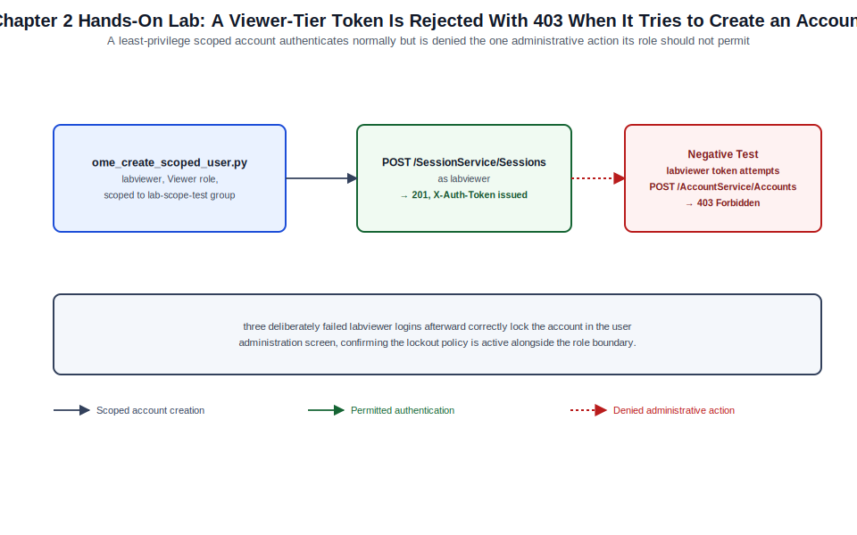

# Chapter 02: Identity, Licensing, Security, and Administrative Control



*Figure 2-1. The scoped-account creation and role-based access control flow exercised in this chapter's lab, including the denied-administrative-action negative test.*

## Learning Objectives

- Describe OpenManage Enterprise's local and directory-integrated identity
  model and how roles combine with device-group scope to bound what an
  authenticated user or API client can do.
- Explain the OME licensing tiers (base, Advanced, Advanced Plus) and which
  capabilities covered later in this volume depend on which tier.
- Replace the appliance's default self-signed TLS certificate with one
  issued by a trusted certificate authority, and configure login-security
  controls: password policy, account lockout, and session timeout.
- Create and manage local user accounts, role assignments, and device-group
  scopes through both the console and the REST API.
- Configure directory-service authentication so enterprise identities, not
  appliance-local accounts, govern day-to-day console access.
- Validate an identity and access configuration and diagnose the most
  common authentication and authorization failures.

## Theory and Architecture

### Identity sources

OME authenticates users from three categories of identity source, all of
which can coexist on the same appliance:

- **Local accounts** — stored in the appliance's embedded database. The
  `admin` superuser account created during first-run setup ([Chapter 1](01-architecture-requirements-deployment-and-first-configuration.md)) is
  the only account guaranteed to exist on a fresh appliance; every other
  local account is created deliberately by an administrator.
- **Directory service accounts** — OME can bind to Microsoft Active
  Directory (and, in supported releases, generic LDAP directories) and
  authenticate console logins against directory credentials, mapping
  directory security groups to OME roles rather than requiring an
  appliance-local account per user.
- **External identity provider (SSO)** — supported OME releases can
  delegate browser-based console authentication to an external SAML
  identity provider (for example, Active Directory Federation Services,
  Okta, or Microsoft Entra ID), centralizing authentication policy — MFA,
  conditional access, session lifetime — in the enterprise IdP rather than
  in OME itself. SSO governs interactive console logins; REST API clients
  still authenticate directly against OME's session endpoint (or a local/
  directory account behind it) regardless of whether SSO is enabled for
  browser logins, so a service account strategy is still required for
  automation even in an SSO-first environment.

### Role-based access control and scope

Every OME identity — local, directory-mapped, or federated — is granted
access through one or more **roles**. A role is a named bundle of
permissions (device management, template and configuration operations,
user administration, and so on). OME ships a small set of built-in roles
that typically include an unrestricted Administrator role, a Device
Manager-style operational role scoped to day-to-day device operations
without user-administration rights, and a read-only Viewer role; exact
role names, the full permission matrix, and whether custom roles are
supported have shifted between OME releases, so confirm the current role
set in your build's user-management screen rather than assuming the exact
labels above.

Roles combine with **scope** — an assignment restricting a role to one or
more device groups ([Chapter 3](03-discovery-onboarding-inventory-groups-and-device-control.md)) — to support delegated administration. A
regional operations team can hold a Device Manager role scoped only to
that region's device group, so their account can power-cycle, update
firmware on, and view alerts for devices in their region while remaining
unable to see or act on devices belonging to another region. The `admin`
superuser and any account holding an unrestricted Administrator role
bypass scoping and act across the entire managed fleet. Design scope
boundaries deliberately: they are the primary mechanism for enforcing
least privilege across a multi-team or multi-tenant OME deployment.

### Licensing tiers

OME's feature set is gated by a licensing tier tracked against the
appliance itself:

| Tier | Representative capabilities |
| --- | --- |
| Base (included) | Discovery, inventory, monitoring, alerting, reporting, and manual/scheduled firmware and driver updates. |
| OpenManage Enterprise Advanced | Adds deployment and configuration templates, configuration compliance baselines, and related automation surfaces ([Chapter 8](08-templates-configuration-compliance-automation-and-apis.md)). |
| OpenManage Enterprise Advanced Plus | Adds further orchestration and automation capabilities layered on top of Advanced. |

Treat this table as directional rather than a literal, version-locked
feature list — Dell has re-packaged tier boundaries between OME releases,
and the authoritative mapping for the 4.7.x baseline is the current
OpenManage Enterprise licensing guide. Optional plugins (Power Manager,
the SupportAssist Enterprise integration) carry their own entitlement on
top of the base appliance tier and are licensed and enabled independently
of the console tier described above.

### Certificate architecture

The appliance presents a self-signed HTTPS certificate immediately after
deployment ([Chapter 1](01-architecture-requirements-deployment-and-first-configuration.md)). OME's certificate handling has two independent
surfaces: the appliance's own **server certificate**, presented to
browsers and API clients connecting to the console, and a **trusted
certificate store**, used when OME needs to validate certificates
presented by *other* systems it connects to (managed device certificates,
an external identity provider, or an SMTP/syslog relay configured with
TLS). Replacing the server certificate does not automatically populate the
trusted store, and vice versa — the two are configured and reasoned about
separately.

### Audit and login security

The appliance maintains a login/audit history distinct from the alert and
job history covered in [Chapter 4](04-monitoring-alerts-reports-jobs-and-operational-integrations.md), recording console and API
authentication events and administrative actions. Login-security policy —
account lockout threshold, password complexity, and session idle
timeout — is configured centrally in application settings and applies to
local accounts; directory-authenticated accounts inherit the directory's
own password policy but are still subject to OME's session timeout and
role/scope authorization.

## Design Considerations

- **Directory integration model.** Decide between binding directly to
  Active Directory (the common path for Windows-centric enterprises) and a
  generic LDAP configuration for other directory services. Map directory
  security groups to OME roles rather than provisioning individual local
  accounts for every administrator — this keeps user lifecycle management
  in the directory, where it is already governed, instead of duplicating
  it in OME.
- **Scope design before scale.** Decide the shape of delegated
  administration — by region, business unit, or environment tier — before
  onboarding a large device fleet in [Chapter 3](03-discovery-onboarding-inventory-groups-and-device-control.md). Retrofitting scope
  boundaries after devices are already grouped and roles are already
  assigned is a larger, more error-prone change than designing the group
  hierarchy to match your intended scope model from the start.
- **Dedicated automation identity.** Provision a distinct, least-privilege
  account (local or directory-backed) for API automation rather than
  embedding a human administrator's credentials or the `admin` superuser
  password in scripts and pipelines. Scope this account's role to exactly
  what your automation needs — a reporting pipeline needs read access, not
  device-control rights.
- **Break-glass access.** If console authentication is delegated to an
  external SSO identity provider, retain at least one local Administrator
  account with a strong, separately stored credential for use if the IdP
  is unreachable. Losing both directory/SSO authentication and the ability
  to reach a local fallback account turns an IdP outage into an OME outage.
- **Certificate lifecycle ownership.** Decide who owns renewal of the
  appliance's CA-issued certificate before it expires — an expired server
  certificate breaks both browser console access and REST API TLS
  validation for every automation client that verifies the chain, and
  unlike a self-signed certificate warning, this is not something a user
  can click through.
- **License procurement timing.** If [Chapter 8](08-templates-configuration-compliance-automation-and-apis.md)'s configuration templates
  and compliance features are part of your operational plan, confirm and
  import the required Advanced or Advanced Plus entitlement now. Features
  gated behind an unimported license appear visible-but-disabled in the
  console, which is a common source of confusion during later chapters if
  licensing is deferred.

## Implementation and Automation

### Creating a local user and assigning role and scope

Local user and role management is available both from the console's user
administration screen and through the REST API's account service, which
makes it practical to provision automation identities and delegated-admin
accounts consistently across multiple appliances.

```python
#!/usr/bin/env python3
"""ome_create_scoped_user.py — create a local OME account, assign a
built-in role, and scope it to a named device group.

Usage: python3 ome_create_scoped_user.py <ome-host> <admin-user> \
    <admin-password> <new-username> <new-password> <role-name> <group-name>
"""
import sys
import requests

requests.packages.urllib3.disable_warnings()


def get_session(host, user, password):
    session = requests.Session()
    resp = session.post(
        f"https://{host}/api/SessionService/Sessions",
        json={"UserName": user, "Password": password, "SessionType": "API"},
        verify=False,
        timeout=30,
    )
    resp.raise_for_status()
    session.headers.update({"X-Auth-Token": resp.headers["X-Auth-Token"]})
    return session


def find_role_id(session, host, role_name):
    resp = session.get(f"https://{host}/api/AccountService/Roles", verify=False)
    resp.raise_for_status()
    for role in resp.json().get("value", []):
        if role.get("Name", "").lower() == role_name.lower():
            return role["Id"]
    raise SystemExit(f"Role '{role_name}' not found on this appliance")


def find_group_id(session, host, group_name):
    resp = session.get(
        f"https://{host}/api/GroupService/Groups",
        params={"$filter": f"Name eq '{group_name}'"},
        verify=False,
    )
    resp.raise_for_status()
    groups = resp.json().get("value", [])
    if not groups:
        raise SystemExit(f"Group '{group_name}' not found on this appliance")
    return groups[0]["Id"]


def main():
    host, admin_user, admin_pass, new_user, new_pass, role_name, group_name = sys.argv[1:8]
    session = get_session(host, admin_user, admin_pass)

    role_id = find_role_id(session, host, role_name)
    group_id = find_group_id(session, host, group_name)

    body = {
        "UserName": new_user,
        "Password": new_pass,
        "RoleId": role_id,
        "Enabled": True,
        "UserTypeId": 1,  # local account
        "DirectoryGroup": [],
        "Locked": False,
    }
    resp = session.post(f"https://{host}/api/AccountService/Accounts", json=body, verify=False)
    resp.raise_for_status()
    account = resp.json()
    print(f"Created account '{new_user}' (Id={account.get('Id')}) with role '{role_name}'")

    # Scope association is exposed under the account or group resource
    # depending on build; confirm the exact scope-assignment resource
    # against your appliance's API reference before scripting it into
    # a repeatable pipeline.
    print(f"Assign scope to group '{group_name}' (Id={group_id}) via the console "
          "or the scope-assignment endpoint documented for your build.")


if __name__ == "__main__":
    main()
```

Field names such as `UserTypeId` and the exact scope-assignment resource
have varied across OME releases as account management has been extended;
validate the current schema against your appliance's live API reference
(`https://<appliance>/api`) before relying on this script unmodified in
production automation.

### Configuring directory service authentication

Directory integration is configured from the console's user
administration area: register the directory server (or servers, for
redundancy), the bind account and search base, and then map one or more
directory security groups to an OME role. Once mapped, any member of that
directory group can authenticate to OME using their existing directory
credentials without a corresponding local account ever being created.
Directory configuration is also exposed through the REST API for
appliances that manage this as code across multiple OME instances;
confirm the current directory-configuration resource path for your build,
since it has moved between API versions as native AD and generic LDAP
support were unified.

### Replacing the default TLS certificate

1. From the console's security settings, generate a certificate signing
   request (CSR), supplying the appliance's fully qualified domain name
   and organizational details.
2. Submit the CSR to your internal or public certificate authority.
3. Upload the signed certificate, along with the complete intermediate
   chain, back into the appliance through the same security settings
   screen.
4. Restart the web application service (or the appliance, depending on
   your build's guidance) for the new certificate to take effect.

### Configuring login security policy

Password complexity, account lockout threshold, and session idle timeout
are configured together in application security settings and apply
appliance-wide to local accounts. Set a lockout threshold high enough to
tolerate normal typing mistakes but low enough to resist online
brute-force attempts (a common starting point is 3–5 failed attempts
before a timed lockout), and set session idle timeout to match your
organization's workstation lock policy rather than leaving an
indefinitely long default.

## Validation and Troubleshooting

- **Directory logins fail while local accounts work.** Confirm the bind
  account credentials configured in OME have not expired or been locked
  in the directory itself, and confirm appliance-to-directory-server
  network reachability and port access (typically TCP 389/636 for LDAP/
  LDAPS, or TCP 3268/3269 for a Global Catalog lookup). A directory group
  mapped to a role but with no matching group membership on the
  authenticating user also presents as a login failure, not a permission
  error, which can be mistaken for a connectivity problem.
- **A scoped account can log in but sees no devices.** This is expected
  behavior, not a fault, when the account's role is correctly scoped to a
  device group that is currently empty or that the account's group
  assignment does not actually match. Verify the group membership and
  scope assignment rather than the login path.
- **License-gated features appear grayed out.** Check the license status
  under application settings (or the corresponding REST resource) to
  confirm an Advanced or Advanced Plus entitlement was actually imported
  and is not expired — a visible-but-disabled menu item is the expected
  presentation for a feature outside the current license tier, not a bug.
- **Browser certificate warnings persist after uploading a CA-signed
  certificate.** This almost always means the intermediate certificate
  chain was not uploaded along with the leaf certificate; browsers and
  API clients that do not already trust the intermediate will continue to
  flag the connection until the full chain is present.
- **An account is locked out and needs recovery.** Only an account holding
  an unrestricted Administrator role can unlock another local account
  before its lockout timer expires; this is the practical reason a
  break-glass Administrator account is worth maintaining even in a
  directory- or SSO-first environment.

## Security and Best Practices

- Provision named, individual accounts for every human administrator
  instead of sharing the `admin` credential, so administrative actions in
  the audit log are attributable to a person.
- Enforce least privilege through role and scope assignment; grant
  unrestricted Administrator rights only to the small set of accounts that
  genuinely need fleet-wide control.
- Use a dedicated, least-privilege service account for REST API
  automation, store its credential in a secrets manager rather than in
  source-controlled scripts, and rotate it on a defined schedule.
- Replace the appliance's self-signed certificate with a CA-issued one as
  early as practical, and track its expiration date in whatever
  certificate-lifecycle process your organization already uses for other
  infrastructure endpoints.
- Set an explicit password complexity policy, a reasonable lockout
  threshold, and a session idle timeout aligned to your organization's
  baseline rather than leaving factory defaults in place.
- Forward the appliance's login/audit history to a central SIEM (Chapter
  4 covers syslog and alert forwarding mechanics) so authentication
  anomalies are visible outside the appliance itself.
- Review role and scope assignments periodically as part of a standard
  access review, and remove accounts for personnel who have changed roles
  or left the organization promptly rather than relying on directory
  deprovisioning alone to cut off OME access.

## References and Knowledge Checks

**References**

- [Dell Technologies, *OpenManage Enterprise User's Guide*](https://www.dell.com/support/manuals/en-us/dell-openmanage-enterprise/ome_4_5_online_help_user_guide/overview) — user, role,
  and directory service administration
- [Dell Technologies, *OpenManage Enterprise Licensing Guide*
  (version-specific, aligned to the 4.7.x baseline)](https://www.delltechnologies.com/asset/en-us/products/servers/industry-market/openmanage-portfolio-software-licensing-guide.pdf)
- [Dell Technologies, *OpenManage Enterprise RESTful API Guide*](https://www.dell.com/support/manuals/en-us/dell-openmanage-enterprise/ome_p_3.10_api_guide/preface)
- [`SOFTWARE_VERSIONS.md`](../../../SOFTWARE_VERSIONS.md) in this repository for the dated 4.7.x baseline

**Knowledge Checks**

1. What is the difference between a role and a scope, and why does
   delegated regional administration require both?
2. Why should a dedicated automation account be provisioned instead of
   using the `admin` superuser or a human administrator's credentials in
   scripts?
3. Why might a directory-authenticated login fail even though the bind
   account and network path to the directory server are both healthy?
4. Why is uploading only the leaf certificate, without its intermediate
   chain, a common cause of persistent browser certificate warnings after
   a CA-signed certificate has been installed?
5. Why is a local break-glass Administrator account still recommended in
   an environment where interactive console logins are delegated to an
   external SSO identity provider?

## Hands-On Lab

**Objective:** Create a least-privilege, scoped local account through the
REST API, confirm it can authenticate, and confirm through a negative test
that its restricted role correctly denies an administrative action.

**Prerequisites**

- The OME appliance deployed and configured in [Chapter 1](01-architecture-requirements-deployment-and-first-configuration.md)'s lab, reachable
  from your workstation, with the `admin` account and its password.
- Python 3.11+ with `requests` installed on your workstation.
- No production directory service or CA is required; this lab uses local
  accounts and a lab-generated certificate only.

**Steps**

1. Log in to the console as `admin` and open the security settings
   screen. Note the current certificate is still the appliance's factory
   self-signed certificate.
2. Generate a lab-only CA-signed certificate to practice the replacement
   workflow without needing an enterprise CA:

   ```bash
   # Create a minimal local CA and issue a certificate for the appliance.
   openssl req -x509 -newkey rsa:2048 -keyout lab-ca.key -out lab-ca.crt \
     -days 365 -nodes -subj "/CN=Lab-OME-CA"
   openssl req -newkey rsa:2048 -keyout ome-appliance.key -out ome-appliance.csr \
     -nodes -subj "/CN=ome-lab.example.local"
   openssl x509 -req -in ome-appliance.csr -CA lab-ca.crt -CAkey lab-ca.key \
     -CAcreateserial -out ome-appliance.crt -days 365
   ```

   **Expected result:** three files are produced —
   `ome-appliance.crt`, `ome-appliance.key`, and `lab-ca.crt` — suitable
   for upload as the appliance's server certificate and trust anchor in a
   non-production lab.
3. From the console, create an empty static device group named
   `lab-scope-test` (device group creation is covered in depth in Chapter
   3; for this lab, an empty group is sufficient).
4. Confirm the built-in role names available on your appliance from
   **Application Settings → Users → Roles** (or the equivalent screen for
   your build), and note the name of the least-privileged non-Viewer
   operational role.
5. Run the account-creation script from the Implementation and Automation
   section, targeting the `lab-scope-test` group and a Viewer-tier role:

   ```bash
   python3 ome_create_scoped_user.py <appliance-ip> admin '<admin-password>' \
     labviewer 'LabViewer#2026' Viewer lab-scope-test
   ```

   **Expected result:** the script reports a created account with the
   assigned role.
6. Authenticate as the new account directly against the session endpoint
   and confirm it receives a valid token:

   ```bash
   curl -sk -X POST https://<appliance-ip>/api/SessionService/Sessions \
     -H "Content-Type: application/json" \
     -d '{"UserName":"labviewer","Password":"LabViewer#2026","SessionType":"API"}' \
     -D -
   ```

   **Expected result:** an HTTP 201 response with an `X-Auth-Token`
   header present.
7. **Negative test:** using the `labviewer` account's token, attempt to
   create a second local account — an action a Viewer-tier role should not
   be permitted to perform:

   ```bash
   curl -sk -X POST https://<appliance-ip>/api/AccountService/Accounts \
     -H "X-Auth-Token: <token-from-step-6>" \
     -H "Content-Type: application/json" \
     -d '{"UserName":"shouldfail","Password":"NoAccess#2026","RoleId":"1"}'
   ```

   **Expected result:** an HTTP 403 (Forbidden) response, confirming the
   Viewer-tier role is correctly denied user-administration rights rather
   than silently succeeding.
8. In the console, intentionally fail the `labviewer` login three times
   with a wrong password, then confirm the account shows a locked state
   in the user administration screen, validating the lockout policy is
   active.

**Cleanup**

- Log in as `admin`, unlock and then delete the `labviewer` account.
- Delete the `lab-scope-test` device group.
- Remove the lab certificate material from your workstation:

  ```bash
  rm -f lab-ca.key lab-ca.crt lab-ca.srl ome-appliance.key ome-appliance.csr ome-appliance.crt
  ```

- If you uploaded the lab certificate to the appliance's console for
  practice, restore the factory self-signed certificate or plan to
  replace it with a real CA-issued certificate before any further use of
  this appliance.

## Summary and Completion Checklist

This chapter built the identity, licensing, and security foundation that
every later chapter's automation and delegated-administration examples
depend on. It covered how local accounts, directory service integration,
and external SSO combine with OME's role-and-scope model to enforce least
privilege, walked through the licensing tiers that gate configuration
templates and other Advanced-tier capabilities used starting in Chapter
8, and produced a validated, least-privilege scoped account confirmed
through both a positive authentication test and a negative authorization
test. With identity and security controls in place, the volume now turns
to bringing the managed fleet itself under OME's control.

- [ ] I can explain how roles and device-group scope combine to bound an
      account's permissions.
- [ ] I can describe the three OME licensing tiers and identify which
      later-chapter capabilities require Advanced or Advanced Plus.
- [ ] I replaced (or practiced replacing) the appliance's default
      self-signed certificate with a CA-issued certificate and full chain.
- [ ] I created a scoped local account via the REST API and confirmed its
      restricted role correctly denied an administrative action.
- [ ] I configured and validated an account lockout policy.
