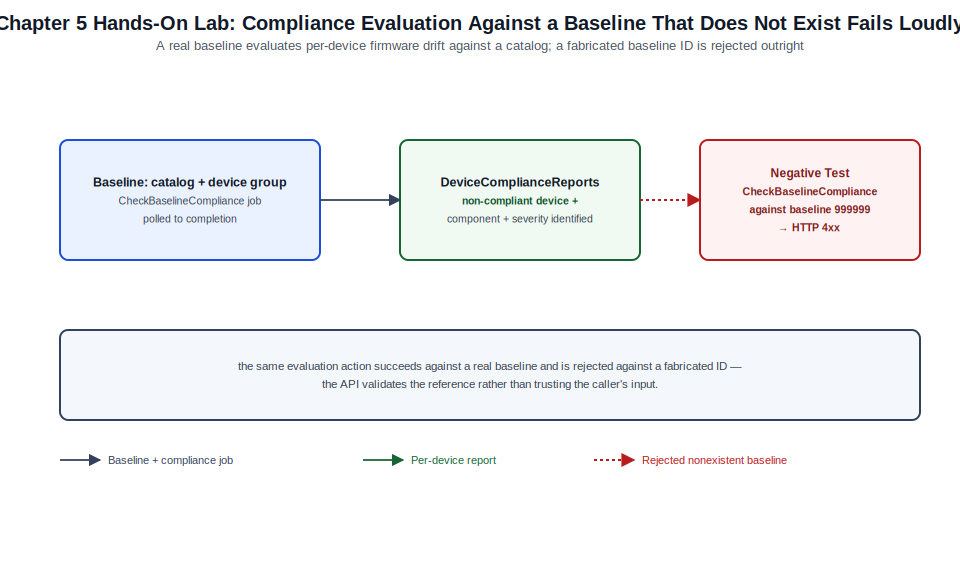

# Chapter 05: Firmware and Driver Catalogs, Baselines, Compliance, and Updates



*Figure 5-1. The firmware baseline creation and compliance evaluation flow exercised in this chapter's lab, including the nonexistent-baseline negative test.*

## Learning Objectives

- Explain the relationship between catalogs, baselines, compliance
  reports, and update jobs in OME's firmware and driver lifecycle model.
- Distinguish Dell Update Packages (DUPs), component bundles, and the
  catalog metadata that maps them to specific PowerEdge models and
  components.
- Design a baseline strategy that balances currency, stability, and
  maintenance-window discipline across a heterogeneous fleet.
- Create baselines, run compliance reports, and orchestrate update jobs
  through both the console and the REST API.
- Interpret compliance report severities and choose an appropriate update
  execution strategy (immediate vs. scheduled, staged vs. all-at-once).
- Diagnose common firmware update failures and validate a completed
  update.

## Theory and Architecture

### The four-stage lifecycle

OME's firmware and driver management is built around four connected
concepts, each covered in more implementation depth later in this
chapter and the two that follow it:

1. **Catalog** — a versioned metadata index describing which firmware and
   driver packages exist, which PowerEdge models and components they
   apply to, their severity/urgency classification, and where to retrieve
   the actual update package. [Chapter 6](06-connected-online-repositories-and-update-workflows.md) covers Dell's connected online
   catalog in depth; [Chapter 7](07-isolated-offline-repositories-and-air-gapped-updates.md) covers building and consuming offline,
   air-gapped catalogs with the same structure.
2. **Baseline** — a named association between a catalog (or a specific
   catalog version) and a target scope of devices or a device group. A
   baseline is the object OME evaluates compliance against; creating a
   baseline does not by itself change anything on a device.
3. **Compliance report** — the result of evaluating a baseline: for every
   in-scope device and component, whether its currently inventoried
   firmware/driver version matches, exceeds, or falls behind what the
   catalog specifies, expressed with a severity (commonly Critical,
   Recommended, and Optional/informational depending on how Dell
   classified that specific update in the catalog).
4. **Update job** — the orchestrated operation that actually applies one
   or more non-compliant packages to target devices, using iDRAC's
   Lifecycle Controller as the execution engine on each managed server.

### Dell Update Packages and component bundles

Individual updates are packaged as **Dell Update Packages (DUPs)** —
self-contained, model- and component-aware installers. A catalog
references DUPs by component: BIOS, iDRAC firmware itself, RAID
controller firmware, NIC firmware, backplane/expander firmware, power
supply firmware, and relevant OS drivers where in-band driver management
is in scope. Because DUPs are component- and model-specific, the same
catalog can correctly target a mixed fleet of PowerEdge generations
without an administrator having to hand-map packages to hardware — the
catalog metadata and each device's inventory ([Chapter 3](03-discovery-onboarding-inventory-groups-and-device-control.md)) do that matching
automatically when a baseline is evaluated.

### How compliance evaluation works

When a baseline is run (on demand or on its configured schedule), OME
compares each in-scope device's current component inventory against the
versions the associated catalog specifies for that device's exact model
and configuration. The result is not a single pass/fail per device but a
per-component result: a single server can be simultaneously compliant on
its BIOS, non-compliant (behind) on its RAID controller firmware, and
non-compliant in the *other* direction — ahead of the catalog's specified
version — if someone applied a newer firmware version outside of OME's
orchestration. OME reports this "ahead of baseline" state distinctly from
"behind baseline," since forcing a downgrade is a materially different
and riskier operation than applying a forward update, and not every
update job is configured to allow it.

### Update execution model

An update job targets one or more non-compliant components on one or more
devices and orchestrates the actual installation through each device's
iDRAC. Depending on the component, an update may apply immediately, may
stage for application at the next reboot, or may require an
administrator-initiated or job-scheduled reboot to complete — BIOS and
many firmware updates require a reboot to activate, while some components
apply live. OME's update job scheduling exists specifically to let an
administrator decide *when* that reboot-dependent activation happens
rather than forcing it at job-submission time.

## Design Considerations

- **Baseline scope granularity.** Decide whether baselines are built
  around device groups that mirror your [Chapter 3](03-discovery-onboarding-inventory-groups-and-device-control.md) group taxonomy (by
  site, by role, by hardware generation) or around narrower, purpose-built
  groups specific to firmware governance. A baseline scoped too broadly
  across a heterogeneous fleet makes a single compliance report harder to
  act on; scoping baselines to homogeneous hardware/role populations
  usually produces more actionable compliance output.
- **Currency vs. stability tradeoff.** A baseline can be pinned to a
  specific, tested catalog version or configured to track the latest
  available catalog. Pinning gives predictable, change-controlled
  compliance targets appropriate for production; tracking latest is
  reasonable for lab/non-production fleets where currency matters more
  than change control. Decide this per baseline, not as a blanket
  organizational policy, since different fleets warrant different
  tradeoffs.
- **Severity-driven remediation policy.** Treat Critical-severity
  non-compliance (commonly security-relevant firmware fixes) with a
  materially faster remediation SLA than Optional-severity drift. Define
  this policy explicitly rather than treating every compliance report
  line item as equally urgent, which either causes update fatigue or
  under-reacts to genuinely urgent items.
- **Maintenance window alignment.** Update jobs that require a reboot are
  disruptive to a running workload; align scheduled update jobs to
  established maintenance windows and coordinate with whatever workload
  orchestration (cluster maintenance mode, load-balancer drain) protects
  the application layer during the reboot, which is outside OME's scope
  to manage on its own.
- **Concurrency and staging strategy.** For large device counts, decide
  between applying an update job to the entire in-scope population at
  once and a staged rollout (a small canary batch first, broader waves
  after validation). OME supports scheduling and can be orchestrated in
  batches through the API even where the console's own workflow favors an
  all-at-once selection.
- **Downgrade policy.** Decide organizationally whether downgrades
  (returning a component to an older version than currently installed)
  are permitted through OME at all, and if so, under what change-control
  conditions — this is a materially higher-risk operation than a forward
  update and should not be enabled by default automation.

## Implementation and Automation

### Creating a baseline via the REST API

```python
#!/usr/bin/env python3
"""ome_create_baseline.py — create a firmware compliance baseline against
an existing catalog for a target device group.

Usage: python3 ome_create_baseline.py <ome-host> <user> <password> \
    <catalog-id> <group-id> <baseline-name>
"""
import sys
import requests

requests.packages.urllib3.disable_warnings()


def get_session(host, user, password):
    session = requests.Session()
    resp = session.post(
        f"https://{host}/api/SessionService/Sessions",
        json={"UserName": user, "Password": password, "SessionType": "API"},
        verify=False,
        timeout=30,
    )
    resp.raise_for_status()
    session.headers.update({"X-Auth-Token": resp.headers["X-Auth-Token"]})
    return session


def create_baseline(session, host, catalog_id, group_id, name):
    body = {
        "Name": name,
        "Description": "API-created baseline",
        "CatalogId": catalog_id,
        "RepositoryId": catalog_id,
        "Targets": [
            {"Id": group_id, "Type": {"Id": 6000, "Name": "GROUP"}}
        ],
        "DowngradeEnabled": False,
        "Is64Bit": True,
    }
    resp = session.post(
        f"https://{host}/api/UpdateService/Baselines", json=body, verify=False
    )
    resp.raise_for_status()
    return resp.json()


def main():
    host, user, password, catalog_id, group_id, name = sys.argv[1:7]
    session = get_session(host, user, password)
    baseline = create_baseline(session, host, int(catalog_id), int(group_id), name)
    print(f"Created baseline '{name}' (Id={baseline.get('Id', 'pending')})")


if __name__ == "__main__":
    main()
```

`DowngradeEnabled: False` is a deliberate default in this example,
consistent with the design guidance above — leave downgrade orchestration
as an explicit, reviewed exception rather than a default automation
behavior.

### Running a compliance report and reading results

```bash
# Trigger (or re-run) compliance evaluation for a baseline.
curl -sk -X POST "https://<appliance>/api/UpdateService/Baselines(<baseline-id>)/Actions/UpdateService.CheckBaselineCompliance" \
  -H "X-Auth-Token: <token>" -H "Content-Type: application/json" -d '{}'

# Retrieve per-device compliance detail.
curl -sk "https://<appliance>/api/UpdateService/Baselines(<baseline-id>)/DeviceComplianceReports" \
  -H "X-Auth-Token: <token>" | jq '.value[] | {DeviceId, ComplianceStatus: .ComplianceStatus.Name}'
```

```python
def summarize_compliance(session, host, baseline_id):
    resp = session.get(
        f"https://{host}/api/UpdateService/Baselines({baseline_id})/DeviceComplianceReports",
        verify=False,
    )
    resp.raise_for_status()
    reports = resp.json().get("value", [])
    counts = {}
    for r in reports:
        status = r.get("ComplianceStatus", {}).get("Name", "Unknown")
        counts[status] = counts.get(status, 0) + 1
    return counts
```

### Orchestrating an update job

```python
def run_update(session, host, baseline_id, device_ids, schedule="RunNow"):
    """schedule: 'RunNow' or a future ISO8601 timestamp for staged rollout."""
    body = {
        "Id": 0,
        "JobName": f"firmware-update-baseline-{baseline_id}",
        "JobDescription": "API-orchestrated firmware update",
        "Schedule": schedule,
        "State": "Enabled",
        "Targets": [{"Id": d, "TargetType": {"Id": 1000, "Name": "DEVICE"}} for d in device_ids],
        "Params": [
            {"Key": "complianceReportId", "Value": str(baseline_id)},
            {"Key": "stagingValue", "Value": "false"},
            {"Key": "signVerify", "Value": "true"},
        ],
        "JobType": {"Id": 5, "Name": "Update_Task"},
    }
    resp = session.post(f"https://{host}/api/JobService/Jobs", json=body, verify=False)
    resp.raise_for_status()
    return resp.json()
```

Confirm exact `JobType`, `Params` keys, and target-type identifiers
against your build — the update job payload shape is one of the more
version-sensitive parts of the OME API surface because it must express
both which components to apply and how to sequence reboots, and Dell has
refined this schema across releases. Build any production automation
against a validated payload captured from your specific appliance rather
than the illustrative example above.

### Staged canary rollout pattern

For large fleets, a practical automation pattern is to select a small
canary subset of a baseline's non-compliant devices, run the update job
against only that subset, validate (Validation and Troubleshooting,
below), and only then submit a second job against the remaining
population — scripted as two calls to the `run_update` function above
with different `device_ids` lists and a validation gate between them.

## Validation and Troubleshooting

- **Compliance report shows a device as non-compliant immediately after a
  successful update.** Force an inventory refresh ([Chapter 3](03-discovery-onboarding-inventory-groups-and-device-control.md)) before
  re-checking compliance — the compliance report reflects the device's
  *last inventoried* state, and an update job completing does not by
  itself refresh inventory in every build.
- **Update job fails on a subset of devices in a batch.** Check the
  per-device job execution history ([Chapter 4](04-monitoring-alerts-reports-jobs-and-operational-integrations.md)) rather than the job's
  overall status; a common cause of a partial failure is a device that
  lost iDRAC network reachability mid-job or one running a Lifecycle
  Controller version too old to accept the update format — both surface
  as a per-device failure reason in execution history.
- **A component shows "ahead of baseline" instead of compliant.** This is
  expected, not an error, when a firmware version newer than the
  catalog's specified version was applied outside of OME (directly
  through iDRAC, for example). Decide whether to update the baseline's
  target catalog version or leave it as an intentional, tracked
  divergence.
- **An update requiring a reboot appears stuck in "staged."** Confirm
  whether the job's schedule was configured for immediate application or
  deferred to a future maintenance window — a staged update deliberately
  waits for its scheduled activation and is not evidence of a hung job by
  itself.
- **Update job fails appliance-wide with a catalog error.** Verify catalog
  reachability and freshness first ([Chapter 6](06-connected-online-repositories-and-update-workflows.md) for connected catalogs,
  [Chapter 7](07-isolated-offline-repositories-and-air-gapped-updates.md) for offline catalogs) — a stale or unreachable catalog
  reference is a more common root cause than a defect in the update job
  logic itself.

## Security and Best Practices

- Verify update package signature checking is enabled (`signVerify` in
  the job payload pattern above) so OME rejects tampered or corrupted
  update packages rather than applying them.
- Restrict who can create baselines and submit update jobs through role
  and scope ([Chapter 2](02-identity-licensing-security-and-administrative-control.md)) — firmware update is a high-impact, fleet-wide
  capability that warrants tighter access than read-only inventory
  viewing.
- Treat Critical-severity compliance findings as a security-relevant
  backlog, not only an operational one; many Critical firmware updates
  address disclosed vulnerabilities, and delayed remediation has the same
  risk profile as delayed OS patching.
- Keep downgrade orchestration disabled by default and require explicit,
  reviewed justification (a regression discovered in a newer firmware
  version, for example) before enabling it for a specific baseline.
- Maintain baseline-to-catalog-version pinning discipline for production
  fleets so a compliance report's meaning is stable and auditable over
  time, rather than silently shifting target versions on every catalog
  refresh.
- Retain update job execution history for audit purposes consistent with
  your organization's change-management record-keeping requirements —
  the job history is the definitive record of what firmware version was
  applied, when, and to which devices.

## References and Knowledge Checks

**References**

- [Dell Technologies, *OpenManage Enterprise User's Guide*](https://www.dell.com/support/manuals/en-us/dell-openmanage-enterprise/ome_4_5_online_help_user_guide/overview) — firmware and
  driver update management
- [Dell Technologies, *OpenManage Enterprise RESTful API Guide*](https://www.dell.com/support/manuals/en-us/dell-openmanage-enterprise/ome_p_3.10_api_guide/preface) —
  UpdateService resources (Catalogs, Baselines, DeviceComplianceReports)
- [Dell Technologies, *Dell Update Package (DUP) reference documentation*](https://www.dell.com/support/kbdoc/en-us/000127316/dell-update-package)
- [`SOFTWARE_VERSIONS.md`](../../../SOFTWARE_VERSIONS.md) in this repository for the dated 4.7.x baseline

**Knowledge Checks**

1. What is the functional difference between a catalog, a baseline, and a
   compliance report, and why does creating a baseline not itself change
   any device?
2. Why can a single device be simultaneously compliant on one component
   and non-compliant on another?
3. Why does OME distinguish "behind baseline" from "ahead of baseline"
   rather than reporting both simply as non-compliant?
4. Why should downgrade orchestration remain disabled by default in most
   production baselines?
5. Why might a device show as non-compliant immediately after a
   successful update job completes, and what corrects it?

## Hands-On Lab

**Objective:** Create a baseline against a catalog, run a compliance
report, and walk through the update-job submission and validation
workflow, using the read-only compliance evaluation path so the lab is
safe to run against any onboarded device without applying an actual
firmware change.

**Prerequisites**

- The OME appliance with at least one onboarded, iDRAC-managed device
  (this lab requires a real or virtual PowerEdge/iDRAC target, since
  firmware compliance evaluation depends on iDRAC-sourced component
  inventory that the SNMP-based lab target from [Chapter 3](03-discovery-onboarding-inventory-groups-and-device-control.md) cannot supply;
  if no PowerEdge hardware is available, read through the steps and
  substitute the sample JSON response shown in step 4 to complete the
  exercise conceptually).
- A reachable Dell online catalog ([Chapter 6](06-connected-online-repositories-and-update-workflows.md)) or a previously imported
  catalog reference.
- Python 3.11+ with `requests` installed.

**Steps**

1. Confirm at least one catalog is present on the appliance
   (`GET /api/UpdateService/Catalogs`); if none exists, complete Chapter
   6's connected-catalog setup first.
2. Create a baseline using the `ome_create_baseline.py` script from
   Implementation and Automation, targeting your device group from
   [Chapter 3](03-discovery-onboarding-inventory-groups-and-device-control.md) and the catalog identified in step 1:

   ```bash
   python3 ome_create_baseline.py <appliance-ip> admin '<password>' \
     <catalog-id> <group-id> lab-firmware-baseline
   ```

   **Expected result:** the script reports a created baseline.
3. Trigger compliance evaluation using the `CheckBaselineCompliance`
   action shown in Implementation and Automation, then poll the
   associated job ([Chapter 4](04-monitoring-alerts-reports-jobs-and-operational-integrations.md)'s job-query pattern) until it completes.
4. Retrieve and review the per-device compliance report:

   ```bash
   curl -sk "https://<appliance-ip>/api/UpdateService/Baselines(<baseline-id>)/DeviceComplianceReports" \
     -H "X-Auth-Token: <token>" | jq .
   ```

   **Expected result:** a JSON payload listing each in-scope device's
   overall and per-component compliance status.
5. Identify one non-compliant device and one specific non-compliant
   component from the report output, and record its severity
   classification (Critical, Recommended, or Optional).
6. **Negative test:** attempt to run compliance evaluation against a
   baseline ID that does not exist:

   ```bash
   curl -sk -X POST "https://<appliance-ip>/api/UpdateService/Baselines(999999)/Actions/UpdateService.CheckBaselineCompliance" \
     -H "X-Auth-Token: <token>" -H "Content-Type: application/json" -d '{}'
   ```

   **Expected result:** an HTTP 4xx error response, confirming the API
   correctly rejects a request against a non-existent baseline rather
   than silently succeeding.
7. If you have an explicit, approved maintenance window and are working
   against a genuine lab device where a reboot is acceptable, submit an
   update job using the `run_update` function from Implementation and
   Automation against the single non-compliant device identified in
   step 5. Otherwise, skip execution and instead document the exact API call
   you would run, including its target device ID and baseline ID, as the
   deliverable for this step.
8. If you executed step 7, poll the job to completion, then force an
   inventory refresh and re-run compliance evaluation to confirm the
   previously non-compliant component now reports compliant.

**Cleanup**

- Delete the `lab-firmware-baseline` baseline created in step 2 if it is
  not needed for later chapters.
- If an update job was submitted in step 7, confirm the target device
  returned to a healthy, reachable state before continuing to other labs
  in this volume.

## Summary and Completion Checklist

This chapter established the catalog-baseline-compliance-update model
that underlies all of OME's firmware and driver lifecycle management: how
catalogs describe available updates, how baselines pin a device
population against a specific compliance target, how compliance reports
express per-component drift with a severity and direction, and how update
jobs orchestrate the actual, iDRAC-executed installation with
administrator control over timing and reboot activation. The lab walked
through baseline creation and compliance evaluation end to end, including
a negative test against an invalid baseline reference. Chapters 6 and 7
now go deeper on the two catalog sourcing models this chapter treated
generically — Dell's connected online catalog and fully offline,
air-gapped catalogs — before [Chapter 8](08-templates-configuration-compliance-automation-and-apis.md) extends the same baseline-and-
compliance pattern to configuration, not just firmware.

- [ ] I can explain the relationship between catalogs, baselines,
      compliance reports, and update jobs.
- [ ] I can distinguish "behind baseline" from "ahead of baseline" and
      explain why OME reports them separately.
- [ ] I created a baseline, ran compliance evaluation, and reviewed
      per-device, per-component compliance detail via the API.
- [ ] I can describe the maintenance-window and staging considerations
      that govern when and how an update job should be submitted.
- [ ] I performed a negative test against an invalid baseline reference
      and confirmed the API correctly rejected it.
