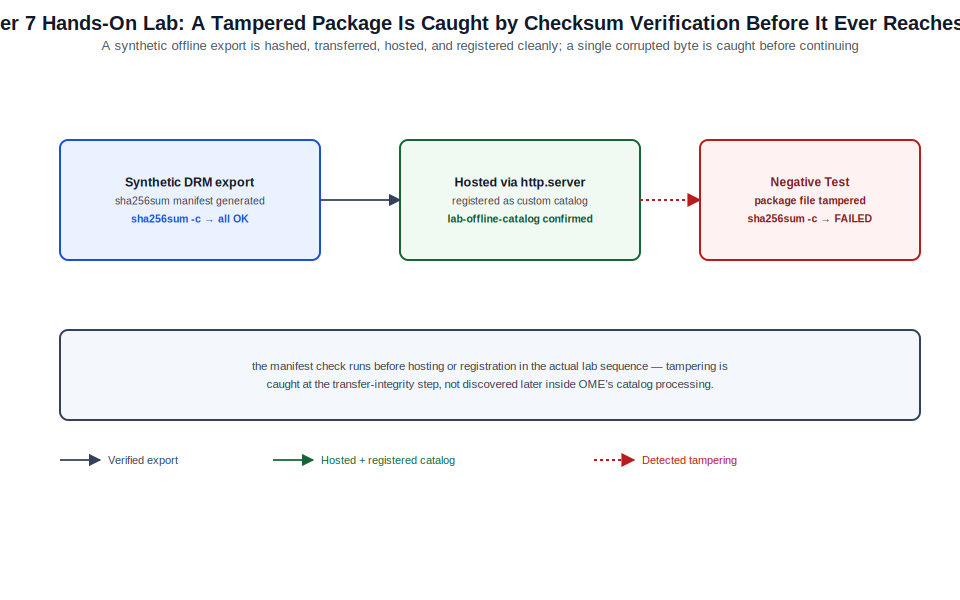

# Chapter 07: Isolated Offline Repositories and Air-Gapped Updates



*Figure 7-1. The offline catalog transfer-integrity and registration flow exercised in this chapter's lab, including the tampered-file negative test.*

## Learning Objectives

- Explain why and when an offline (disconnected) firmware repository
  model is required instead of [Chapter 6](06-connected-online-repositories-and-update-workflows.md)'s connected online catalog.
- Describe the role of Dell Repository Manager (DRM) in building custom
  and offline-exportable catalogs outside of a live OME appliance.
- Design a secure transfer and hosting process for moving catalog content
  into an air-gapped or otherwise network-isolated OME environment.
- Configure OME to consume a local or network-share-hosted custom catalog
  and validate it functions identically to a connected catalog for
  baseline and compliance purposes.
- Diagnose common failures specific to offline catalog hosting and
  transfer integrity.

## Theory and Architecture

### Why offline repositories exist

[Chapter 6](06-connected-online-repositories-and-update-workflows.md)'s connected catalog model assumes the OME appliance can reach
`downloads.dell.com` directly or through a permitted proxy. Many
enterprise environments — classified or regulated networks, industrial
control system enclaves, disconnected edge sites, or any environment
where policy simply prohibits management-plane internet egress — cannot
make that assumption. OME's **offline (isolated) repository** model
exists for exactly this case: it separates catalog *creation* (which
requires internet access, but not from the OME appliance itself) from
catalog *consumption* (which the appliance performs entirely against
locally or network-hosted content, with no outbound dependency).

### Dell Repository Manager

**Dell Repository Manager (DRM)** is a separate, Windows-based Dell tool
used to build both custom catalogs (a curated subset of available
firmware/driver packages, useful even in connected environments for
change-controlled currency) and fully offline-exportable repositories.
DRM itself typically runs on a workstation or jump host that *does* have
internet access to Dell's package sources, and its output — a catalog
file plus the referenced DUP packages, organized in the directory
structure OME expects — is what gets transferred into the isolated
environment. DRM is conceptually the offline equivalent of [Chapter 6](06-connected-online-repositories-and-update-workflows.md)'s
`downloads.dell.com` connected source: both ultimately produce the same
catalog-plus-packages structure that OME's UpdateService consumes; they
differ only in how that structure reaches the appliance.

### Repository structure and integrity

A DRM-exported offline repository is a self-contained set of files: a
catalog index (commonly XML-based) describing available packages, their
target models/components, versions, and severity — structurally
equivalent in purpose to the metadata [Chapter 5](05-firmware-and-driver-catalogs-baselines-compliance-and-updates.md) and 6 described for the
connected catalog — alongside the actual DUP binaries the catalog index
references. OME validates catalog and package integrity ([Chapter 5](05-firmware-and-driver-catalogs-baselines-compliance-and-updates.md)'s
signature verification) regardless of source, so a tampered or
incompletely transferred offline repository is rejected the same way a
corrupted connected-catalog download would be, rather than being trusted
implicitly because it arrived out-of-band.

### Hosting models for the isolated environment

Once transferred into the air-gapped network, the repository content
needs to be reachable by the OME appliance over a protocol it supports
for a "custom catalog" source — commonly a network file share (CIFS/SMB
or NFS) or an internal HTTP/HTTPS server hosting the exported directory
structure. OME references this location as a **custom repository** source
in its catalog configuration, functionally parallel to the connected
source from [Chapter 6](06-connected-online-repositories-and-update-workflows.md) but pointed at a location entirely inside the
isolated network rather than at Dell's hosted endpoint.

## Design Considerations

- **Transfer medium and chain of custody.** Decide how content crosses
  the air gap — removable media (with your organization's required
  scanning/sanitization process), a mediated one-way data diode, or a
  controlled file-transfer gateway — and document the chain of custody
  for what was transferred, when, and by whom, consistent with whatever
  change-control and media-handling policy governs the isolated
  environment. This is as much a compliance artifact as a technical step
  in many regulated environments.
- **Refresh cadence is a manual process now.** Unlike [Chapter 6](06-connected-online-repositories-and-update-workflows.md)'s
  scheduled automatic refresh, an offline repository's currency is
  gated entirely by how often someone runs DRM, exports new content, and
  repeats the transfer process. Define an explicit cadence (monthly or
  quarterly is common for disconnected environments prioritizing
  stability) rather than leaving it ad hoc, and track the offline
  repository's effective "as-of" date the same way you would track any
  other point-in-time compliance artifact.
- **Custom catalog scope.** DRM lets you curate exactly which
  models/components/versions are included rather than exporting Dell's
  entire hosted catalog. For a disconnected environment with a known,
  fixed hardware population, scoping the export to only the relevant
  PowerEdge models materially reduces transfer size and simplifies
  validation versus exporting the full catalog.
- **Hosting location redundancy.** Decide whether the internal
  file-share or HTTP host serving the repository to OME is itself a
  single point of failure for firmware operations in the isolated
  environment, and whether that risk warrants a redundant or
  backed-up hosting location, particularly if the isolated environment
  has its own high-availability expectations independent of OME.
- **Verification before trust.** Establish a documented checksum or
  signature verification step performed on the transferred content
  *before* pointing OME at it, not relying solely on OME's own
  package-level signature verification as the only integrity gate for
  content that crossed a security boundary.

## Implementation and Automation

### Building an offline repository with Dell Repository Manager

DRM's export workflow (run from a connected workstation, not the OME
appliance) typically follows this pattern:

1. Install DRM on a Windows workstation or jump host with internet access
   to Dell's package sources.
2. Create a new repository, selecting the target PowerEdge models and
   component categories relevant to your isolated environment's actual
   hardware inventory.
3. Choose the **Deployment Type: Repository Manager Repository** (or the
   equivalent offline/custom-catalog export option in your DRM version)
   rather than a format intended for direct DRM-to-appliance connected
   use.
4. Export the repository to a local directory. DRM produces a catalog
   file and a structured set of downloaded DUP packages.
5. Package the exported directory for transfer (a checksummed archive is
   a reasonable practice) and move it across the air gap through your
   organization's approved transfer process.

Exact menu labels and export format names have varied across DRM
versions; confirm the current workflow against the DRM documentation
matching the version in use, and validate the export against a non-
production OME instance before relying on it in the isolated production
environment for the first time.

### Verifying transferred content integrity

```bash
# On the source (connected) side, before transfer: generate a manifest.
find ./drm-export -type f -exec sha256sum {} \; > drm-export.sha256

# On the destination (isolated) side, after transfer: verify.
sha256sum -c drm-export.sha256
```

Only proceed with configuring OME against the transferred content after
this verification step passes cleanly — any mismatch indicates
corruption or tampering during transfer and should halt the process
pending investigation, not be silently ignored.

### Hosting the repository for OME consumption

A minimal, reproducible way to host the transferred content for OME
inside the isolated network is a simple internal HTTP server pointed at
the exported directory:

```bash
# Example: host the transferred DRM export over HTTP for OME to consume.
cd /srv/drm-export
python3 -m http.server 8080 --bind 0.0.0.0
```

A production isolated environment would typically use a persistent,
access-controlled web server (or an existing internal file share) rather
than an ad hoc `http.server` process; the command above is shown for its
clarity in a lab context and is revisited in the Hands-On Lab.

### Registering the offline repository as a custom catalog in OME

```python
#!/usr/bin/env python3
"""ome_add_custom_catalog.py — register a locally/network-hosted custom
catalog (an offline DRM export) as an OME catalog source.

Usage: python3 ome_add_custom_catalog.py <ome-host> <user> <password> \
    <catalog-name> <source-path>

<source-path> is the HTTP(S) URL, or the UNC/NFS path in the format your
OME build expects for a share-hosted custom catalog.
"""
import sys
import requests

requests.packages.urllib3.disable_warnings()


def get_session(host, user, password):
    session = requests.Session()
    resp = session.post(
        f"https://{host}/api/SessionService/Sessions",
        json={"UserName": user, "Password": password, "SessionType": "API"},
        verify=False,
        timeout=30,
    )
    resp.raise_for_status()
    session.headers.update({"X-Auth-Token": resp.headers["X-Auth-Token"]})
    return session


def add_custom_catalog(session, host, name, source_path):
    body = {
        "Filename": name,
        "SourcePath": source_path,
        "Repository": {
            "Name": name,
            "Description": "Offline/air-gapped custom catalog (DRM export)",
            "RepositoryType": "NFS_NETWORK_SHARE",  # or HTTP/CIFS depending on build
            "Source": source_path,
            "CheckCertificate": False,
        },
    }
    resp = session.post(
        f"https://{host}/api/UpdateService/Catalogs", json=body, verify=False
    )
    resp.raise_for_status()
    return resp.json()


def main():
    host, user, password, name, source_path = sys.argv[1:6]
    session = get_session(host, user, password)
    catalog = add_custom_catalog(session, host, name, source_path)
    print(f"Registered custom catalog '{name}' (Id={catalog.get('Id', 'pending')})")


if __name__ == "__main__":
    main()
```

`RepositoryType` values and the exact custom-catalog payload shape are
among the more build-specific parts of the UpdateService API, since OME
has supported an evolving set of custom-repository hosting types
(network share variants, HTTP/HTTPS, and direct file upload in some
releases). Validate the current schema against your appliance's live API
reference, and treat this script as a starting pattern rather than a
drop-in for every build.

## Validation and Troubleshooting

- **OME cannot reach the custom catalog source.** Confirm basic network
  reachability from the appliance to the hosting share or HTTP endpoint
  first (the isolated-network equivalent of [Chapter 6](06-connected-online-repositories-and-update-workflows.md)'s direct
  reachability check), including any authentication required by a CIFS
  share or HTTP basic-auth front end.
- **Catalog registers but shows zero packages.** This commonly indicates
  the source path points at the wrong directory level relative to what
  OME expects (for example, pointing at the export's parent directory
  instead of the directory containing the actual catalog index file);
  re-check the DRM export's directory structure against your custom
  catalog source path.
- **Checksum verification fails after transfer.** Treat this as a hard
  stop, not a warning — do not register a catalog whose transfer
  integrity could not be confirmed. Re-transfer from the verified source
  side rather than attempting to selectively repair the destination
  copy.
- **Compliance evaluation against the custom catalog reports
  unexpectedly few devices as needing updates.** Confirm the DRM export's
  scoped model/component selection actually covers your fleet's hardware
  population — a custom catalog scoped narrowly during export (Design
  Considerations, above) will legitimately show fewer applicable updates
  than the full connected catalog would, which is expected, not a fault.
- **Package retrieval fails during an update job even though the catalog
  index loaded successfully.** As in [Chapter 6](06-connected-online-repositories-and-update-workflows.md), catalog metadata and
  package retrieval are separate steps; confirm the actual DUP package
  files, not just the catalog index, were fully transferred and are
  present at the expected relative path under the hosting location.

## Security and Best Practices

- Treat the air-gap transfer process itself as a security control, not
  merely a logistics step — scan removable media per your organization's
  policy, and log every transfer with what was moved, by whom, and when.
- Verify content integrity (checksums, and package signatures once
  imported into OME) before trusting transferred content, and halt on any
  mismatch rather than proceeding with a "probably fine" assumption.
- Restrict who can build and export DRM repositories and who can
  register a custom catalog in the isolated OME appliance — this is a
  supply-chain control point for firmware entering a sensitive network,
  and should be scoped as tightly as any other change to that network's
  trusted software supply.
- Keep the DRM workstation itself appropriately hardened and monitored;
  it is the connected system with the most direct influence over what
  firmware content eventually reaches the isolated environment.
- Document and retain the offline repository's build provenance (DRM
  version, export date, source package versions) as part of your
  organization's software bill-of-materials or change-control record for
  the isolated environment, since this content did not arrive through an
  auditable, always-current connected path the way [Chapter 6](06-connected-online-repositories-and-update-workflows.md)'s catalog
  does.
- Do not disable OME's package signature verification to work around an
  offline-repository integration issue; resolve the underlying transfer
  or hosting problem instead.

## References and Knowledge Checks

**References**

- [Dell Technologies, *Dell Repository Manager User's Guide*](https://www.dell.com/support/manuals/en-us/repository-manager/drm_3.4.7_ug/about-dell-repository-manager)
- [Dell Technologies, *OpenManage Enterprise User's Guide*](https://www.dell.com/support/manuals/en-us/dell-openmanage-enterprise/ome_4_5_online_help_user_guide/overview) — custom/
  isolated repository configuration
- [Dell Technologies, *OpenManage Enterprise RESTful API Guide*](https://www.dell.com/support/manuals/en-us/dell-openmanage-enterprise/ome_p_3.10_api_guide/preface) —
  UpdateService/Catalogs custom repository resources
- [`SOFTWARE_VERSIONS.md`](../../../SOFTWARE_VERSIONS.md) in this repository for the dated 4.7.x baseline

**Knowledge Checks**

1. Why does Dell Repository Manager typically run on a separate,
   internet-connected workstation rather than on the OME appliance
   itself?
2. What is the practical tradeoff of scoping a DRM export to a curated
   subset of models/components rather than exporting Dell's full catalog?
3. Why should transfer integrity be verified with a checksum step before
   registering a custom catalog, even though OME independently verifies
   package signatures?
4. Why does an offline repository's currency require an explicit,
   organization-defined refresh cadence rather than relying on OME's
   scheduled refresh behavior from [Chapter 6](06-connected-online-repositories-and-update-workflows.md)?
5. Why might a custom catalog register successfully in OME but report
   unexpectedly few applicable updates for your fleet?

## Hands-On Lab

**Objective:** Simulate the offline-repository workflow end to end
without requiring an actual air-gapped network or a Windows DRM
installation, by building a minimal local "export," verifying its
transfer integrity, hosting it internally, and registering it in OME as a
custom catalog.

**Prerequisites**

- The OME appliance from earlier chapters' labs.
- A lab host (can be the same workstation used for other labs) with
  Python 3.11+ and `requests` installed.
- No internet access is required for this lab's core exercise, which is
  the point — it demonstrates the disconnected consumption path, using a
  synthetic catalog structure in place of a real DRM export so the
  exercise is reproducible without Dell tooling.

**Steps**

1. Build a minimal synthetic catalog directory standing in for a DRM
   export's structure:

   ```bash
   mkdir -p /tmp/drm-export/packages
   cat > /tmp/drm-export/Catalog.xml <<'EOF'
   <?xml version="1.0"?>
   <Catalog>
     <SoftwareComponent Component="BIOS" Model="Lab-PowerEdge-Simulated"
                         Version="2.15.0" Severity="Recommended"
                         Path="packages/BIOS_LAB_2.15.0.EXE"/>
   </Catalog>
   EOF
   echo "placeholder DUP content for lab purposes only" > \
     /tmp/drm-export/packages/BIOS_LAB_2.15.0.EXE
   ```

   **Expected result:** a directory tree with a catalog index file and
   one placeholder package file, structurally analogous to a real DRM
   export (a real export's `Catalog.xml` is far more detailed; this is a
   deliberately minimal stand-in for lab reproducibility).
2. Generate and verify a transfer-integrity manifest, simulating the
   source and destination sides of an air-gap transfer:

   ```bash
   cd /tmp/drm-export
   find . -type f -exec sha256sum {} \; > ../drm-export.sha256
   cd /tmp
   sha256sum -c drm-export.sha256
   ```

   **Expected result:** every file reports `OK`.
3. **Negative test:** corrupt one file and re-verify:

   ```bash
   echo "tampered" >> /tmp/drm-export/packages/BIOS_LAB_2.15.0.EXE
   cd /tmp && sha256sum -c drm-export.sha256
   ```

   **Expected result:** the checksum check reports a `FAILED` entry for
   the modified file, demonstrating that the verification step correctly
   detects transfer corruption or tampering. Restore the file before
   continuing:

   ```bash
   echo "placeholder DUP content for lab purposes only" > \
     /tmp/drm-export/packages/BIOS_LAB_2.15.0.EXE
   ```

4. Host the (now verified) export over HTTP from the lab host:

   ```bash
   cd /tmp/drm-export && python3 -m http.server 8080 --bind 0.0.0.0
   ```

   Leave this running in its own terminal for the remainder of the lab.
5. From another terminal, confirm the OME appliance's network can reach
   this host and port (adjust for any firewall between the appliance and
   your lab host):

   ```bash
   curl -sI http://<lab-host-ip>:8080/Catalog.xml
   ```

   **Expected result:** an HTTP 200 response.
6. Register the hosted export as a custom catalog using the
   `ome_add_custom_catalog.py` script from Implementation and Automation:

   ```bash
   python3 ome_add_custom_catalog.py <appliance-ip> admin '<password>' \
     lab-offline-catalog "http://<lab-host-ip>:8080/Catalog.xml"
   ```

   **Expected result:** the script reports a registered custom catalog.
   Because this lab uses a synthetic, minimal catalog rather than a real
   DRM export, OME may report parsing warnings or zero usable packages
   when it attempts to fully process the catalog — the objective of this
   lab is validating the registration and transfer-integrity workflow,
   not producing a usable compliance baseline from placeholder data.
7. In the OME console or via `GET /api/UpdateService/Catalogs`, confirm
   the `lab-offline-catalog` entry is present and its source correctly
   reflects the lab host's HTTP address.

**Cleanup**

- Stop the `http.server` process (Ctrl+C).
- Delete the `lab-offline-catalog` custom catalog from OME.
- Remove the lab files:

  ```bash
  rm -rf /tmp/drm-export /tmp/drm-export.sha256
  ```

## Summary and Completion Checklist

This chapter covered the offline, air-gapped alternative to [Chapter 6](06-connected-online-repositories-and-update-workflows.md)'s
connected catalog model: how Dell Repository Manager separates
internet-connected catalog *building* from disconnected OME catalog
*consumption*, how transferred content must be integrity-verified before
being trusted, and how a custom catalog source — hosted on an internal
file share or HTTP endpoint — lets an isolated OME appliance evaluate
firmware compliance with the same baseline and compliance mechanics from
[Chapter 5](05-firmware-and-driver-catalogs-baselines-compliance-and-updates.md), entirely without internet access. The lab exercised the full
transfer-verify-host-register workflow using a reproducible synthetic
export, including a deliberate integrity-failure negative test. With both
catalog sourcing models covered, the volume turns next to extending the
baseline-and-compliance pattern from firmware to configuration through
templates.

- [ ] I can explain why DRM runs separately from the OME appliance and
      what it produces for offline consumption.
- [ ] I can describe the transfer-integrity verification step and why it
      matters independently of OME's own package signature verification.
- [ ] I hosted a synthetic offline repository export and registered it in
      OME as a custom catalog.
- [ ] I performed a negative test demonstrating that transfer corruption
      is detected before content is trusted.
- [ ] I can explain why offline repository currency depends on an
      explicit, organization-defined refresh cadence.
