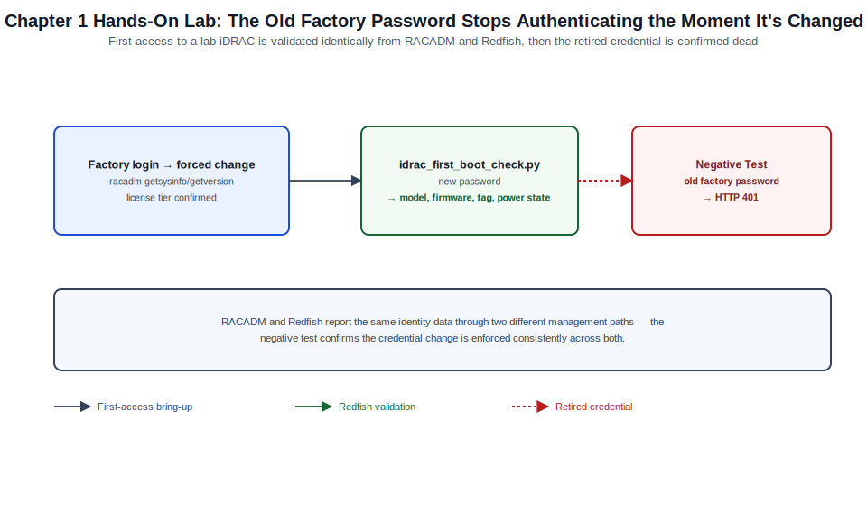

# Chapter 01: Architecture, Generations, Licensing, and First Access



*Figure 1-1. The first-access and dual-path identity validation flow exercised in this chapter's lab, including the retired-credential negative test.*

## Learning Objectives

- Explain what the integrated Dell Remote Access Controller (iDRAC) is, how
  it relates to BIOS, the Lifecycle Controller, and the iDRAC Service
  Module (iSM), and why it operates independently of the host operating
  system and (for most functions) of main system power.
- Distinguish iDRAC9 from iDRAC10 by supported PowerEdge generation and
  explain why this volume treats them as one administrative model with
  generation-specific notes rather than as two separate products.
- Compare iDRAC license tiers at a conceptual level and identify which
  capabilities used later in this volume are license-gated.
- Locate a specific server's unique factory-default iDRAC credentials and
  complete first login both over the network and through iDRAC Direct.
- Validate a freshly imaged or freshly racked server's iDRAC identity,
  firmware version, and license state before it is onboarded into any
  fleet-management workflow.

## Theory and Architecture

### What iDRAC is

The integrated Dell Remote Access Controller (iDRAC) is the baseboard
management controller (BMC) built into every Dell PowerEdge rack, tower,
and modular-sled server. It is a computer within the computer: its own
system-on-chip processor, its own memory, its own flash storage, and (on
rack and tower servers) its own dedicated network port, all drawing from
the chassis's standby power rail rather than main system power. As long as
the server has AC (or DC, on DC-input platforms) power connected to at
least one power supply, iDRAC is running — independent of whether the host
operating system is booted, independent of whether the host is even
powered on, and, for most functions, independent of whether the host CPUs
or DIMMs are even present and healthy.

This out-of-band design is what makes iDRAC useful for the operations this
volume covers: powering a server on or off remotely, viewing POST output
and installing an OS before any OS-level agent could possibly be running,
diagnosing a hardware fault that has crashed or hung the host OS, and
continuing to report health and accept commands during firmware updates
that would otherwise require someone physically present at the rack.

iDRAC does not work alone. Three companion components round out the
platform:

- **Lifecycle Controller (LC)** — embedded systems-management firmware,
  stored in dedicated flash separate from BIOS, that provides
  hardware-level configuration, firmware update orchestration, embedded
  diagnostics, and OS deployment capability without depending on any
  agent running inside a host OS. LC is reachable both through iDRAC
  (remotely) and locally at POST through the Unified Server Configurator
  (USC), invoked with F10.
- **iDRAC Service Module (iSM)** — a lightweight, optional agent installed
  inside the host OS that extends iDRAC's visibility into the OS itself:
  OS name/version reporting, in-band SSD/NVMe wear data the BMC cannot
  otherwise see cleanly, Windows Server failover cluster awareness, and a
  faster in-band channel for some operations than pure out-of-band
  polling allows. iSM is covered in depth in [Chapter 5](05-idrac-direct-virtual-console-virtual-media-and-local-service.md).
- **System Event Log (SEL) and Lifecycle Log** — persistent, iDRAC-resident
  event stores that outlive OS reinstalls and even most component
  replacements, covered in depth in [Chapter 6](06-hardware-health-power-thermal-logs-and-support.md).

### iDRAC9 and iDRAC10: one administrative model, two hardware generations

iDRAC9 is the BMC generation Dell shipped across the 14th, 15th, and 16th
generation (14G/15G/16G) PowerEdge platforms. iDRAC10 is the current
generation, introduced with 17th-generation (17G) PowerEdge platforms. The
two share the same architectural shape described above — BMC,
Lifecycle Controller, RACADM command set, Redfish-first API strategy — and
this volume treats them as a single administrative subject because nearly
every procedure, command, and API call in Chapters 2 through 9 is
identical or near-identical across both. Where a specific behavior,
default, or capability differs between the two generations, that
difference is called out explicitly in the relevant chapter rather than
maintained as two parallel tracks of instructions.

At a practical level, the most consequential iDRAC10 changes an
administrator coming from iDRAC9 should expect are a faster management
processor and web application stack (the HTML5 console and Redfish
responses feel noticeably snappier on comparable operations), an expanded
cyber-resiliency posture built further on the silicon root of trust model
introduced in iDRAC9 ([Chapter 4](04-identity-certificates-security-and-compliance.md)), and continued convergence toward Redfish
as the primary automation interface with RACADM increasingly implemented
as a client that itself calls Redfish under the hood. Confirm the exact
iDRAC generation shipped with any specific PowerEdge model against Dell's
current PowerEdge support matrix — generation-to-iDRAC mapping is a
platform decision made at product launch, not something an administrator
configures.

You can always determine which iDRAC generation a specific server is
running from the iDRAC GUI's system information panel, from
`racadm getversion`, or from the Redfish `Manager` resource's `Model` and
`FirmwareVersion` fields — never assume generation from chassis form
factor or generation nickname alone, since a rack and a matching tower SKU
released together always share the same iDRAC generation, but SKUs
released years apart under the same marketing generation number can
straddle a BMC generation boundary at the edges of a platform's
production run.

### Where iDRAC sits in Dell's management portfolio

iDRAC is the per-server, out-of-band management endpoint. It is what every
fleet-scale tool ultimately talks to. OpenManage Enterprise (OME, Volume
XXII) discovers, inventories, monitors, and orchestrates firmware and
configuration across many iDRACs at once, but every one of those
operations resolves down to iDRAC-level Redfish or WS-Management calls
against an individual server's BMC. Understanding iDRAC deeply — its
architecture, its CLI, its API, its recovery paths — is what makes fleet
automation in OME (or in your own scripts) debuggable when something goes
wrong for one server in an otherwise healthy fleet. This volume is
deliberately scoped to the single-server administrative model; where a
procedure is meaningfully different or more efficient at fleet scale, the
relevant chapter points to the corresponding OME chapter rather than
duplicating fleet-orchestration content here.

### License tiers

iDRAC ships with a base feature set on every PowerEdge server and gates
progressively more capability behind purchasable license tiers. The
historical iDRAC9 tier structure — Basic, Express, Enterprise, and
Datacenter — illustrates the shape of the model even where exact
feature-to-tier boundaries have shifted across firmware releases and
between iDRAC9 and iDRAC10:

| Tier (illustrative) | Representative capability added |
| --- | --- |
| Basic | Core out-of-band management: power control, sensor/health monitoring, SEL/Lifecycle Log, RACADM, basic web GUI, IPMI, SNMP alerting. |
| Express | Virtual Console and Virtual Media ([Chapter 5](05-idrac-direct-virtual-console-virtual-media-and-local-service.md)), embedded diagnostics, Quick Sync. |
| Enterprise | Directory services integration (Active Directory/LDAP, [Chapter 4](04-identity-certificates-security-and-compliance.md)), two-factor and smart-card authentication, group manager, OS-to-iDRAC Pass-through. |
| Datacenter | Telemetry streaming, expanded Redfish feature surface, System Lockdown Mode, advanced secure-erase capability. |

Treat this table as directional rather than authoritative for a specific
build: Dell has adjusted tier boundaries across iDRAC9 firmware releases,
and iDRAC10's tier naming and feature mapping should be confirmed against
the current Dell iDRAC licensing guide for the platform generation in
front of you before you plan a deployment around a specific capability.
The practical implication for this volume is that some procedures in
Chapters 4, 5, and 9 — directory integration, Virtual Console/Media, and
telemetry streaming in particular — require a license above Basic, and
the chapter text flags this at the point of use rather than assuming every
reader has every tier.

License state is visible in the GUI under iDRAC Settings > Licenses, via
`racadm get iDRAC.License` (attribute names vary slightly by firmware; use
`racadm get iDRAC.License -o` for the full object), and via the Redfish
`LicenseService` resource. Licenses can be applied at the factory,
imported later as a license file through the GUI or RACADM, or in some
fulfillment models activated against a Dell license server the iDRAC
reaches over HTTPS outbound.

## Design Considerations

- **Plan license tier by the operations you actually need.** A server that
  will only ever be power-cycled and monitored via IPMI/SNMP by an
  existing NOC tool can run on Basic. A server whose administrators need
  Virtual Console/Media for remote OS installation, or that must
  authenticate against Active Directory, needs at least Express or
  Enterprise respectively. Decide this before racking hardware at scale —
  retrofitting licenses across an existing fleet is an avoidable
  procurement cycle if sizing is done up front.
- **Decide dedicated NIC vs. shared LOM before cabling.** iDRAC on rack and
  tower servers can use a dedicated management port or share host LOM
  ports; this decision affects switch port planning and is detailed in
  [Chapter 3](03-management-network-ipv4-ipv6-dns-ntp-and-connectivity.md), but it must be made before the first network bootstrap
  described later in this chapter, since it determines which physical
  port to connect.
- **Decide the default-credential handling process up front.** Since
  approximately iDRAC9 firmware 3.30, every PowerEdge server ships with a
  unique, factory-generated default iDRAC password printed on a pull-out
  information tag on the server chassis — there is no shared
  `root`/`calvin` default to rely on (or to worry about as a shared
  fleet-wide secret) on current hardware. Build the unboxing/racking
  process around capturing that tag's credential into a password manager
  or secrets vault immediately, and changing it during first configuration
  per [Chapter 4](04-identity-certificates-security-and-compliance.md), rather than treating it as a throwaway value.
- **Decide how first access will happen at scale.** For a handful of
  servers, DHCP plus a discovered IP (or the front LCD panel, where
  present) is workable. For a rack or a data center's worth of new
  servers, plan either a static-IP-at-the-switch (via DHCP reservations
  keyed to iDRAC MAC addresses) approach or a documented iDRAC Direct
  procedure per server ([Chapter 5](05-idrac-direct-virtual-console-virtual-media-and-local-service.md)) so first access is not a hunt-and-peck
  exercise per unit.
- **Decide whether iDRAC10's faster refresh cycle changes your firmware
  cadence.** iDRAC10's management stack updates more frequently in early
  platform life than a mature iDRAC9 branch typically does. Factor this
  into the update cadence you establish in [Chapter 8](08-firmware-idrac-bios-lifecycle-controller-and-platform-updates.md) rather than assuming
  the same calendar cadence that worked for a stable iDRAC9 fleet.

## Implementation and Automation

### Locating factory-default credentials

On current PowerEdge hardware, the unique default iDRAC username
(typically `root`) and a unique, randomly generated default password are
printed on a slide-out information tag on the front of the chassis, and
are also present on the system information sticker inside the chassis.
Record this credential before racking the server in a location where the
tag will not remain conveniently accessible.

### First network access

1. Connect the iDRAC network port (dedicated NIC port, typically labeled
   with a wrench icon, or the designated shared LOM port per your NIC
   selection decision) to a switch port with DHCP or a known static
   subnet reachable from your workstation.
2. Power the server on to standby (connecting AC power is sufficient;
   iDRAC does not require the host to POST).
3. Determine the assigned address: from the front LCD panel where present
   (navigate to the network settings menu), from your DHCP server's lease
   table matched against the iDRAC MAC address (also on the info tag), or
   via iDRAC Direct if no network path is available yet (see [Chapter 5](05-idrac-direct-virtual-console-virtual-media-and-local-service.md) for
   the full iDRAC Direct procedure).
4. Browse to `https://<idrac-ip>/` and accept the self-signed certificate
   warning — this is expected on a factory-default iDRAC and is resolved
   with a proper certificate in [Chapter 4](04-identity-certificates-security-and-compliance.md).
5. Log in with the credentials from the information tag. iDRAC prompts for
   a password change on first login with the factory-default password
   still in place; complete this immediately per [Chapter 4](04-identity-certificates-security-and-compliance.md)'s identity
   guidance rather than deferring it.

### Validating identity and firmware from the CLI

Once you have network access and a changed password, confirm the unit's
identity before proceeding. Using RACADM over SSH:

```bash
ssh root@192.168.1.120
racadm getsysinfo
```

`getsysinfo` returns the service tag, host name, iDRAC firmware version,
BIOS version, and current power state in one call — useful as a fast
sanity check immediately after racking and again as the first step of any
troubleshooting session.

To check firmware and license state specifically:

```bash
racadm getversion
racadm get iDRAC.License
```

### Validating identity and firmware over Redfish

The same information is available over Redfish, which is the preferred
interface for scripted validation since it returns structured JSON rather
than text requiring parsing:

```bash
curl -s -k -u root:'<password>' \
  https://192.168.1.120/redfish/v1/Managers/iDRAC.Embedded.1 \
  | python3 -m json.tool
```

Key fields to check in the response: `FirmwareVersion` (the iDRAC firmware
build), `Model` (confirms iDRAC9 vs. iDRAC10), and
`Oem.Dell.DelliDRACCard` sub-fields where present, which carry additional
Dell-specific identity attributes. A minimal Python validation script that
a bring-up pipeline can call for every newly racked server:

```python
#!/usr/bin/env python3
"""idrac_first_boot_check.py — confirm a freshly racked iDRAC responds,
report its generation and firmware version, and flag a still-default
password condition.

Usage: python3 idrac_first_boot_check.py <idrac-ip> <username> <password>
"""
import sys
import requests

requests.packages.urllib3.disable_warnings()


def main() -> None:
    host, user, password = sys.argv[1], sys.argv[2], sys.argv[3]
    resp = requests.get(
        f"https://{host}/redfish/v1/Managers/iDRAC.Embedded.1",
        auth=(user, password),
        verify=False,
        timeout=20,
    )
    resp.raise_for_status()
    data = resp.json()
    print(f"Model            : {data.get('Model')}")
    print(f"FirmwareVersion  : {data.get('FirmwareVersion')}")

    sys_resp = requests.get(
        f"https://{host}/redfish/v1/Systems/System.Embedded.1",
        auth=(user, password),
        verify=False,
        timeout=20,
    )
    sys_resp.raise_for_status()
    sys_data = sys_resp.json()
    print(f"ServiceTag       : {sys_data.get('SKU')}")
    print(f"PowerState       : {sys_data.get('PowerState')}")


if __name__ == "__main__":
    main()
```

Confirm exact Redfish resource and property names for your specific
firmware build against the iDRAC's built-in Redfish schema (reachable at
`/redfish/v1/$metadata` and `/redfish/v1/Systems/System.Embedded.1` on a
running unit) — Dell's OEM property surface has grown across firmware
releases within both iDRAC9 and iDRAC10.

## Validation and Troubleshooting

- **No IP address obtained via DHCP.** Confirm the correct physical port
  is cabled for your NIC selection setting (dedicated vs. shared LOM,
  [Chapter 3](03-management-network-ipv4-ipv6-dns-ntp-and-connectivity.md)) — the single most common first-boot failure is cabling the
  wrong port for the currently configured NIC selection mode. Use iDRAC
  Direct ([Chapter 5](05-idrac-direct-virtual-console-virtual-media-and-local-service.md)) to check or correct NIC selection without depending
  on the very network path you're troubleshooting.
- **Certificate warning on first browse.** Expected behavior — a
  factory-default iDRAC presents a self-signed certificate. This is not a
  fault; proceed past the browser warning for initial access and replace
  the certificate per [Chapter 4](04-identity-certificates-security-and-compliance.md) before production use.
- **Login rejected with the information-tag credentials.** Confirm you are
  reading the correct tag for the specific chassis (easy to mismatch in a
  multi-server unboxing session) and that Caps Lock or a keyboard-layout
  mismatch has not altered a character in the generated password — these
  passwords intentionally include mixed case and symbols and are easy to
  mistype once.
- **`racadm getsysinfo` hangs or times out over SSH.** Confirm the iDRAC
  SSH service is enabled (it is by default on current firmware) and that
  no intermediate firewall is blocking TCP 22 to the iDRAC's dedicated or
  shared-LOM address — this is a common gap when the iDRAC network
  segment has different ACLs than the host OS's production network.
- **Redfish call returns HTTP 401 immediately after a password change.**
  Some firmware builds require a brief settle period, or an active
  browser session using the old password to be logged out, before the new
  credential is honored on every interface simultaneously. Retry after a
  short delay before assuming the change failed.

## Security and Best Practices

- Never leave a factory-default password in place past first login.
  Capture it into your organization's secrets management system as part
  of the unboxing/racking process, then rotate it immediately per Chapter
  4 — a unique per-unit default is a strong improvement over a shared
  fleet-wide default, but it is still a value that was briefly printed on
  a physical label and handled by whoever racked the hardware.
- Do not leave iDRAC reachable from an unrestricted network segment even
  temporarily during bring-up. Perform first access on an isolated
  bring-up VLAN or a segment with the same access controls the production
  out-of-band network will eventually have, rather than a flat network
  that happens to be convenient.
- Record the service tag, iDRAC MAC address, and firmware version for
  every unit as part of bring-up, before the physical information tag
  becomes inconvenient to access — this record is what later
  troubleshooting, warranty, and asset-management workflows depend on.
- Treat license files the same as any other entitlement record: track
  which service tags hold which tier, since a license is tied to the
  specific unit's service tag and is not fleet-transferable without a
  Dell-mediated reassignment process.
- Confirm firmware is at a currently supported baseline ([Chapter 8](08-firmware-idrac-bios-lifecycle-controller-and-platform-updates.md)) before
  placing a newly racked server into service — a unit that has been in a
  box for months may ship with firmware that predates security fixes
  available at deployment time.

## References and Knowledge Checks

**References**

- [Dell Technologies, *iDRAC9/iDRAC10 User's Guide* (version-specific,
  aligned to the current baseline)](https://www.dell.com/support/product-details/en-us/product/idrac10-lifecycle-controller-v1-xx-series/resources/manuals)
- [Dell Technologies, *iDRAC RACADM CLI Guide*](https://www.dell.com/support/manuals/en-us/idrac9-lifecycle-controller-v4.x-series/idrac_4.00.00.00_racadm/supported-racadm-interfaces?guid=guid-a5747353-fc88-4438-b617-c50ca260448e&lang=en-us)
- [Dell Technologies, *iDRAC Redfish API Guide*](https://www.dell.com/support/kbdoc/en-us/000178045/redfish-api-with-dell-integrated-remote-access-controller)
- [Dell Technologies, *PowerEdge Support Matrix* (for iDRAC-generation-to-
  platform mapping)](https://www.dell.com/support/kbdoc/en-us/000137343/how-to-identify-which-generation-your-dell-poweredge-server-belongs-to)
- [`SOFTWARE_VERSIONS.md`](../../../SOFTWARE_VERSIONS.md) in this repository for the dated iDRAC9/iDRAC10
  baseline

**Knowledge Checks**

1. Why does iDRAC remain reachable even when the host operating system is
   not running, and what powers it when the rest of the server is off?
2. What is the architectural relationship between iDRAC, the Lifecycle
   Controller, and the iDRAC Service Module?
3. Why does this volume treat iDRAC9 and iDRAC10 as a single
   administrative model rather than two separate topics?
4. Where can you find a specific server's unique factory-default iDRAC
   password, and why should it never be treated as a permanent credential?
5. Which iDRAC license tier is the minimum required for Virtual
   Console/Virtual Media, and why does that matter when planning a new
   deployment?

## Hands-On Lab

**Objective:** Perform first access to a PowerEdge server's iDRAC over the
network, validate its identity and firmware from both RACADM and Redfish,
and confirm license state — producing a documented, validated baseline
before any further configuration.

**Prerequisites**

- One PowerEdge server (physical, or an iDRAC-capable lab/virtual lab
  environment) with iDRAC9 or iDRAC10, connected to AC power and to a
  network segment reachable from your workstation.
- The server's information tag or system documentation recording the
  factory-default iDRAC username and password.
- A workstation with a modern browser, an SSH client, and Python 3.11+
  with the `requests` package installed (`pip install requests`).
- No production credentials or production network connectivity are
  required for this lab.

**Steps**

1. Record the service tag, iDRAC MAC address, and factory-default
   username/password from the information tag before racking or powering
   on the unit.
2. Power the server on to standby and determine the iDRAC's assigned IP
   address (LCD panel, DHCP lease table, or iDRAC Direct).
3. Browse to `https://<idrac-ip>/`, accept the certificate warning, and
   log in with the factory-default credentials. **Expected result:** the
   iDRAC prompts you to change the password before proceeding further.
4. Set a new password meeting the complexity requirements shown. **Expected
   result:** you land on the iDRAC dashboard showing system health,
   power state, and basic inventory.
5. From your workstation, SSH to the iDRAC and run:

   ```bash
   ssh root@<idrac-ip>
   racadm getsysinfo
   racadm getversion
   racadm get iDRAC.License
   ```

   **Expected result:** the service tag, iDRAC firmware version, and
   current license tier print without error.
6. Save the `idrac_first_boot_check.py` script from the Implementation and
   Automation section and run it with your new credentials:

   ```bash
   python3 idrac_first_boot_check.py <idrac-ip> root '<your-new-password>'
   ```

   **Expected result:** the script prints the iDRAC model, firmware
   version, service tag, and power state, confirming Redfish is reachable
   and authenticated correctly.
7. **Negative test:** re-run the script with the old factory-default
   password:

   ```bash
   python3 idrac_first_boot_check.py <idrac-ip> root '<old-default-password>'
   ```

   **Expected result:** the script raises an HTTP error from
   `resp.raise_for_status()` (HTTP 401), confirming the old credential no
   longer authenticates after the change in step 4.
8. Document the service tag, iDRAC MAC address, iDRAC generation
   (Model field), firmware version, and license tier in your bring-up
   record.

**Cleanup**

- If this server will be used for later chapters' labs in this volume,
  leave it racked, powered, and network-reachable, and retain the new
  password securely for reuse.
- Otherwise, no further cleanup is required — this lab makes no
  destructive configuration changes.

## Lab Verification

Complete this sign-off once the lab has been run end to end, including the
negative test. Until then, the lab is unverified.

- **Lab verified by:** *pending*
- **Date:** *pending*

## Summary and Completion Checklist

This chapter established the architectural foundation for the entire
volume: iDRAC is an independent, always-on (given power) out-of-band
management controller built around the Lifecycle Controller and
complemented by the optional in-OS iDRAC Service Module. It distinguished
iDRAC9 from iDRAC10 by supported PowerEdge generation while establishing
why the rest of this volume treats them as one administrative model,
walked through the license tier structure and its practical implications
for later chapters, and produced a validated first-access baseline —
network reachable, password rotated, identity and firmware confirmed via
both RACADM and Redfish — ready for the configuration, network, and
identity work in Chapters 2 through 4.

- [ ] I can explain why iDRAC remains reachable independent of host OS and
      power state, and how it relates to the Lifecycle Controller and iSM.
- [ ] I can distinguish iDRAC9 from iDRAC10 by PowerEdge generation and
      know where to confirm a specific server's generation.
- [ ] I can describe the shape of the iDRAC license tier structure and
      identify which later-chapter capabilities require an upgraded tier.
- [ ] I located a server's factory-default credentials, completed first
      login, and rotated the password.
- [ ] I validated iDRAC identity, firmware version, and license state
      using both RACADM and Redfish, including a negative test for a
      stale credential.
