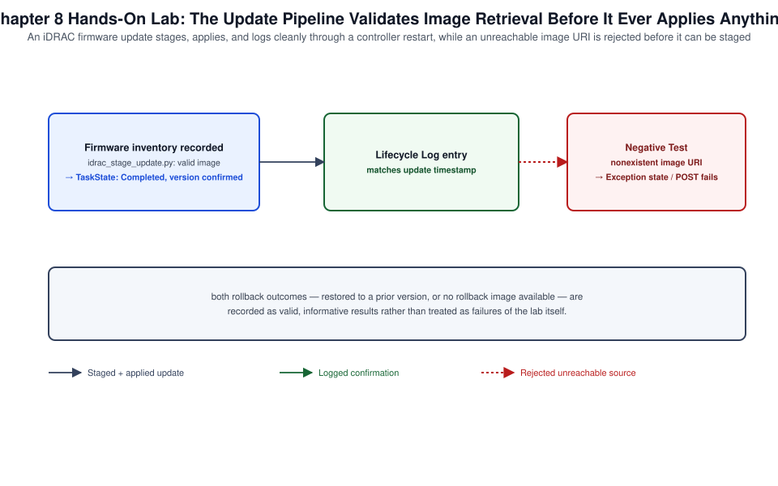

# Chapter 08: Firmware, iDRAC, BIOS, Lifecycle Controller, and Platform Updates



*Figure 8-1. The firmware update and rollback flow exercised in this chapter's lab, including the unreachable-image negative test.*

## Learning Objectives

- Explain how firmware update responsibility is divided between the
  Lifecycle Controller and iDRAC, and why updates can be staged and
  applied without a running host OS.
- Update iDRAC, BIOS, and component firmware (NIC, PERC, BOSS, PSU) using
  the GUI, RACADM, and Redfish `SimpleUpdate`.
- Use a firmware catalog for multi-component update planning, and
  distinguish online (Dell-hosted) from offline (local/repository-hosted)
  catalog sources.
- Sequence a multi-component update safely, including reboot planning and
  dependency ordering.
- Roll back a firmware update using the Lifecycle Controller's retained
  prior-version capability, and know when rollback is and isn't available.

## Theory and Architecture

### Firmware update responsibility: Lifecycle Controller and iDRAC together

Firmware update orchestration on a PowerEdge server is a Lifecycle
Controller function, exposed and triggered through iDRAC. This division
matters: iDRAC is the network-facing endpoint that receives an update
request and image, but LC is what actually stages, sequences, and applies
firmware to the target component, entirely independent of the host OS.
This is why a firmware update — including a BIOS update — can be applied
to a server with no OS installed at all, or with an OS installed but
powered off, which is routine in bare-metal provisioning pipelines where
firmware baselining happens before OS deployment.

### Staged vs. immediate application

Most firmware updates support staging: the new firmware image is uploaded
and verified by iDRAC/LC but not applied immediately, instead queued to
apply at the next server reboot (or, for iDRAC's own firmware, applied
without a host reboot at all, since updating iDRAC only restarts the BMC
itself). Staging matters operationally because it decouples "prepare the
update" from "take the outage" — you can stage a batch of updates during
business hours and let them apply automatically during an already-planned
maintenance window reboot, rather than needing the update and the reboot
to happen in the same operational action.

### The firmware catalog model

A firmware catalog is a structured manifest listing available firmware
versions, applicable components, and download locations for a given
platform generation. Two catalog sourcing models exist:

- **Online (Dell-hosted) catalog** — iDRAC or Lifecycle Controller
  reaches `downloads.dell.com` directly to retrieve the current catalog
  and firmware payloads, suitable for environments with internet egress
  from the management network.
- **Offline (local/repository-hosted) catalog** — a catalog and its
  associated firmware payloads are mirrored to internal infrastructure
  (a local HTTP(S)/CIFS/NFS repository, or delivered via OpenManage
  Enterprise's repository management, [Volume XXII Chapter 6](../../volume-22-dell-openmanage-enterprise/chapters/06-connected-online-repositories-and-update-workflows.md)/7) for
  air-gapped or egress-restricted environments, or simply to control
  exactly which firmware versions are approved for deployment rather than
  always pulling the latest available.

At fleet scale, catalog-driven updates and compliance reporting (comparing
current versions against a defined baseline) are OpenManage Enterprise's
job ([Volume XXII](../../volume-22-dell-openmanage-enterprise/README.md), Chapters 5 through 7); this chapter covers the
single-server mechanics that OME orchestrates underneath at scale, and
which remain essential to understand for a server managed outside OME or
for debugging an OME-driven update that failed on one specific unit.

### Update interfaces: GUI, RACADM, and Redfish SimpleUpdate

All three interfaces ultimately drive the same LC update job engine.
Redfish's `UpdateService` with the `SimpleUpdate` action is the DMTF
standard mechanism and the interface most suited to automation; RACADM's
`update` subcommands provide an equivalent scriptable CLI path; the GUI's
firmware update wizard is best suited to occasional, single-server,
interactively supervised updates.

### Rollback

Lifecycle Controller retains the previous firmware version for most
components after an update, making rollback to the immediately prior
version possible without needing to re-source and reapply an older
firmware image manually. Rollback availability has limits worth planning
around: only the immediately previous version is typically retained (not
an arbitrary version history), some update types are not reversible by
design (certain security-related firmware updates intentionally prevent
downgrade to close a vulnerability window permanently), and available
storage for retained images is finite. Treat rollback as a short-term
safety net for a bad update discovered quickly, not a substitute for
proper pre-update validation and staged rollout.

## Design Considerations

- **Sequence multi-component updates deliberately, not alphabetically or
  arbitrarily.** A common, defensible ordering is iDRAC first (since it's
  the orchestrator for everything that follows and updating it doesn't
  require a host reboot), then BIOS, then remaining components (NIC,
  PERC, BOSS, PSU) — consult Dell's current firmware dependency guidance
  for any known required ordering for your specific platform and firmware
  combination, since some component pairs do have documented
  interdependencies.
- **Decide online vs. offline catalog sourcing based on your network
  egress posture, not convenience alone.** An offline/local catalog adds
  operational overhead (someone must mirror and curate it) but is often
  mandatory for air-gapped or tightly egress-controlled environments, and
  gives you deliberate control over exactly which firmware versions are
  approved — a meaningful governance benefit even where internet egress
  is technically available.
- **Stage updates ahead of a maintenance window rather than combining
  staging and application into one action.** This reduces the actual
  maintenance-window duration to just the reboot and application time,
  rather than including image download and staging time inside the
  window.
- **Validate firmware compatibility against your specific platform and
  installed component mix before applying at scale.** A firmware version
  appropriate for one PowerEdge SKU or component configuration is not
  automatically appropriate for another, even within the same generation
  — always source updates from a catalog scoped to the actual target
  platform rather than assuming portability.
- **Plan your rollback window explicitly.** Decide how long after an
  update you consider rollback a viable option (informed by how quickly
  your monitoring would surface an update-induced regression) and
  document that decision, since rollback availability itself is
  time/version-limited as described above.
- **Treat iDRAC10's faster early-life update cadence ([Chapter 1](01-architecture-generations-licensing-and-first-access.md)) as a
  planning input here specifically.** A newer platform generation
  reasonably needs more frequent firmware attention in its first
  operational year than a mature, stable iDRAC9 fleet; build your update
  cadence and change-window frequency around the platform's actual
  maturity rather than a single fleet-wide calendar.

## Implementation and Automation

### Checking current firmware inventory

```bash
racadm swinventory
```

Over Redfish, the full firmware inventory is under `UpdateService`:

```bash
curl -s -k -u root:'<password>' \
  https://192.168.1.120/redfish/v1/UpdateService/FirmwareInventory \
  | python3 -m json.tool
```

### Updating iDRAC firmware from a local file

```bash
racadm update -f iDRAC-with-Lifecycle-Controller_Firmware.d9.EXE
```

### Updating from an online catalog

```bash
racadm update -f catalog.xml -e -a Applicable
```

The `-e` flag targets the Dell-hosted online catalog by default unless
`-l` specifies an alternate (offline/local) repository location; consult
`racadm update -h` for the full current flag set, since update command
syntax has accumulated options across firmware releases as catalog
sourcing flexibility has expanded.

### Updating from an offline/local catalog repository

```bash
racadm update -f catalog.xml -l //10.0.0.70/firmware-repo \
  -u svc-firmware -p '<password>' -a Applicable
```

### Applying an update over Redfish SimpleUpdate

```bash
curl -s -k -u root:'<password>' -X POST \
  -H "Content-Type: application/json" \
  -d '{
        "ImageURI": "https://10.0.0.70/firmware-repo/BIOS_XXXXX.EXE",
        "@Redfish.OperationApplyTime": "OnReset"
      }' \
  https://192.168.1.120/redfish/v1/UpdateService/Actions/UpdateService.SimpleUpdate
```

`@Redfish.OperationApplyTime: OnReset` stages the update to apply at the
next reboot rather than immediately, implementing the staging pattern
described in Theory and Architecture. Poll the returned job/task resource
for completion status:

```bash
curl -s -k -u root:'<password>' \
  https://192.168.1.120/redfish/v1/TaskService/Tasks/<task-id> \
  | python3 -m json.tool
```

A Python helper that stages a set of updates and reports job status,
suitable as a building block for a larger provisioning pipeline that
baselines firmware before OS deployment:

```python
#!/usr/bin/env python3
"""idrac_stage_update.py — submit a firmware image for staged (on-reset)
application via Redfish SimpleUpdate and poll the resulting task.

Usage: python3 idrac_stage_update.py <idrac-ip> <username> <password> \
    <image-uri>
"""
import sys
import time
import requests

requests.packages.urllib3.disable_warnings()


def main() -> None:
    host, user, password, image_uri = sys.argv[1:5]
    session = requests.Session()
    session.auth = (user, password)
    session.verify = False

    resp = session.post(
        f"https://{host}/redfish/v1/UpdateService/Actions/UpdateService.SimpleUpdate",
        json={"ImageURI": image_uri, "@Redfish.OperationApplyTime": "OnReset"},
        timeout=60,
    )
    resp.raise_for_status()
    task_uri = resp.headers.get("Location")
    print(f"Update staged. Task: {task_uri}")

    if task_uri:
        for _ in range(30):
            task = session.get(f"https://{host}{task_uri}", timeout=30)
            if task.status_code == 200:
                state = task.json().get("TaskState")
                print(f"  TaskState: {state}")
                if state in ("Completed", "Exception", "Cancelled"):
                    break
            time.sleep(10)


if __name__ == "__main__":
    main()
```

### Rolling back a firmware update

```bash
racadm rollback -t idrac
racadm rollback -t bios
```

Confirm a rollback target is available before relying on this path
(`racadm swinventory` shows both current and, where retained, previous
versions per component) — as noted in Theory and Architecture, not every
update retains a rollback image, and some security-related updates
intentionally block downgrade.

## Validation and Troubleshooting

- **Update job stays in a pending/queued state indefinitely.** Confirm
  whether the update was staged for `OnReset` application and the server
  simply hasn't rebooted yet — this is expected staging behavior, not a
  stalled job. If immediate application was requested and the job is
  still pending well past expected completion time, check
  `racadm jobqueue view -i <job-id>` for a specific failure reason rather
  than assuming generic "stuck."
- **Update fails with a compatibility or validation error.** Confirm the
  firmware image or catalog entry is actually scoped to your specific
  platform and installed component (Design Considerations) — this is the
  most common cause of an update rejected before it even begins applying.
- **Online catalog retrieval fails.** Confirm outbound HTTPS reachability
  from iDRAC's management network to `downloads.dell.com` ([Chapter 3](03-management-network-ipv4-ipv6-dns-ntp-and-connectivity.md)'s
  network and firewall guidance applies directly here) — this failure
  mode is identical in shape to the OME appliance's catalog-reachability
  issue described in [Volume XXII, Chapter 1](../../volume-22-dell-openmanage-enterprise/chapters/01-architecture-requirements-deployment-and-first-configuration.md), since both depend on the
  same underlying connectivity.
- **BIOS update applies but expected new settings/options don't appear.**
  Confirm the update actually completed and the subsequent reboot ran to
  completion — a BIOS update's new configuration options are visible only
  after the update has fully applied and the system has POSTed at least
  once on the new version.
- **Rollback command fails with "no previous version available."** This
  confirms the limits described in Theory and Architecture rather than
  indicating a fault — either no prior version was retained, or the
  specific update type does not support downgrade. Recovery in this case
  requires re-sourcing and forward-applying a specific known-good version
  rather than a simple rollback.

## Security and Best Practices

- Validate firmware image integrity (checksum/signature, where the
  distribution mechanism provides one) before applying, especially for
  images sourced from an offline repository rather than directly from
  Dell — an offline repository is an additional trust boundary worth
  protecting deliberately.
- Keep iDRAC firmware itself current as a security priority independent
  of other components — iDRAC is the management plane's own attack
  surface, and delaying its updates while patching everything else
  underneath it is a common, avoidable gap.
- Restrict write access to any internal/offline firmware repository to a
  small, audited set of service accounts, since a compromised or
  tampered firmware repository is a severe supply-chain risk for every
  server that pulls from it.
- Test firmware updates on a representative non-production server or
  canary group before fleet-wide rollout, particularly for BIOS and
  storage controller firmware, where a regression can affect boot
  reliability or data availability rather than only a management-plane
  feature.
- Record every applied firmware version per server as part of your
  configuration baseline (SCP export captures some but not all firmware
  version detail; `racadm swinventory` output is the authoritative
  source) so firmware state is auditable independent of Lifecycle Log
  retention limits ([Chapter 6](06-hardware-health-power-thermal-logs-and-support.md)).

## References and Knowledge Checks

**References**

- [Dell Technologies, *iDRAC9/iDRAC10 User's Guide*](https://www.dell.com/support/product-details/en-us/product/idrac10-lifecycle-controller-v1-xx-series/resources/manuals) — Firmware Update
  chapter
- [Dell Technologies, *iDRAC RACADM CLI Guide*](https://www.dell.com/support/manuals/en-us/idrac9-lifecycle-controller-v4.x-series/idrac_4.00.00.00_racadm/supported-racadm-interfaces?guid=guid-a5747353-fc88-4438-b617-c50ca260448e&lang=en-us) — `update`, `rollback`, and
  `swinventory` command reference
- [Dell Technologies, *iDRAC Redfish API Guide*](https://www.dell.com/support/kbdoc/en-us/000178045/redfish-api-with-dell-integrated-remote-access-controller) — `UpdateService` and
  `SimpleUpdate` action
- Dell Technologies, *OpenManage Enterprise* Chapters 5–7 ([Volume XXII](../../volume-22-dell-openmanage-enterprise/README.md))
  for fleet-scale catalog and compliance management
- [`SOFTWARE_VERSIONS.md`](../../../SOFTWARE_VERSIONS.md) in this repository for the dated iDRAC9/iDRAC10
  baseline

**Knowledge Checks**

1. Why can a BIOS update be applied to a server with no OS installed, and
   which component is actually orchestrating that update?
2. What is the operational benefit of staging an update for `OnReset`
   application rather than applying it immediately?
3. When would an environment choose an offline/local firmware catalog
   over the Dell-hosted online catalog, beyond pure air-gap necessity?
4. What are the two main limits on firmware rollback availability
   described in this chapter?
5. Why should iDRAC's own firmware be kept current as a security
   priority independent of other component firmware?

## Hands-On Lab

This chapter carries a topic-level walkthrough lab for **each task under the "Server Maintenance"
domain** — firmware inventory, component updates, Lifecycle Controller rollback, and staged update
jobs. Every step is a runnable RACADM/Redfish action. Each ends **`**Lab verified by:** *pending*`**
until a human runs it.

**Shared prerequisites for Labs 8.1–8.4** — a PowerEdge iDRAC 9/10 with admin access, Dell Update
Packages (DUPs) or a catalog share, and RACADM/`curl`. **Safety:** firmware updates can reboot the
host — use a lab server. **Cost:** none.

### Lab 8.1 — Firmware inventory (Topic: Firmware currency)

**Objective:** Read installed firmware across components.

```bash
racadm update viewinventory | head -30
curl -sk -u root:<password> https://<idrac-ip>/redfish/v1/UpdateService/FirmwareInventory | \
  python3 -c "import json,sys; print('components:', len(json.load(sys.stdin)['Members']))"
```

**Expected result:** installed versions for iDRAC, BIOS, PERC, NICs, PSUs, and more — the Lifecycle
Controller maintains a complete firmware inventory, so you can compare every component against a
catalog (Volume XXII) and know exactly what is behind.

**Negative test:** track only the iDRAC/BIOS versions and ignore NIC/PERC/PSU firmware; a known
firmware bug in an unpatched component causes intermittent faults — the full inventory is what makes
component-level currency visible.

**Cleanup:** none (read-only).

### Lab 8.2 — Update a component (Topic: Updates)

**Objective:** Apply a Dell Update Package to firmware.

```bash
# From a network share (staged and applied by the Lifecycle Controller):
racadm update -f BIOS_xxxx.EXE -l //share/user:pass@/dups -u -a TRUE
# Or push a DUP directly, then watch the update job:
racadm jobqueue view
```

**Expected result:** the DUP is validated and applied (staged to next reboot or immediate), tracked
as a job — iDRAC/LC apply signed **Dell Update Packages** out-of-band, so BIOS/firmware update
without booting a vendor tool; the job model makes updates schedulable and auditable.

**Negative test:** flash a mismatched or unsigned firmware image; the Lifecycle Controller rejects
it — DUPs are model-validated and signed, which is why you update from Dell's packages/catalog, not
arbitrary binaries.

**Cleanup:** none (leave the component updated).

### Lab 8.3 — Lifecycle Controller rollback (Topic: Firmware lifecycle)

**Objective:** Revert a component to its previous firmware.

```bash
racadm update viewinventory | grep -iA2 Rollback
# Roll a component back to the LC-retained previous version (e.g. after a bad update):
racadm rollback iDRAC.Embedded.1-1   2>/dev/null || \
  echo "GUI: Maintenance > System Update > Rollback selects the previous version per component"
```

**Expected result:** the component reverts to the Lifecycle-Controller-retained previous version —
the LC keeps the prior firmware for each component, so a bad update is reversible without
re-downloading; rollback is the safety net that makes firmware updates low-risk.

**Negative test:** update firmware with no awareness of rollback; a regression seems to strand you
on the bad version — the LC's retained previous image is exactly what you roll back to.

**Cleanup:** none.

### Lab 8.4 — Staged updates and the job queue (Topic: Update orchestration)

**Objective:** Schedule updates to a maintenance window.

```bash
racadm jobqueue view
# Stage an update to apply at the NEXT REBOOT rather than immediately:
racadm update -f NIC_xxxx.EXE -l //share/dups --reboot FALSE
racadm jobqueue view                              # shows the scheduled job pending reboot
# Apply during the window:  racadm serveraction powercycle
```

**Expected result:** the update is queued as a job that applies at the next controlled reboot, not
immediately — staging updates to the job queue lets you batch multiple component updates and apply
them together in a single maintenance window, minimizing reboots and disruption.

**Negative test:** apply each component update immediately with an individual reboot each; the
server bounces repeatedly and the window drags — staging to the job queue applies them in one
coordinated reboot.

**Cleanup:** `racadm jobqueue delete -i <jobid>` for any lab-only pending job.

## Lab Verification

Complete this sign-off once the lab has been run end to end, including the
negative test. Until then, the lab is unverified.

- **Lab verified by:** *pending*
- **Date:** *pending*

## Summary and Completion Checklist

This chapter covered the mechanics of firmware update orchestration
through the Lifecycle Controller and iDRAC: the staging model that
decouples update preparation from maintenance-window application, online
versus offline catalog sourcing, update sequencing across multiple
components, and rollback's specific availability limits. The lab exercised
a full staged-update cycle including monitoring and a negative test, and
connected firmware update events back to the Lifecycle Log covered in
[Chapter 6](06-hardware-health-power-thermal-logs-and-support.md). Fleet-scale catalog compliance and orchestration across many
servers at once is OpenManage Enterprise's domain, covered in [Volume XXII](../../volume-22-dell-openmanage-enterprise/README.md)
Chapters 5 through 7, which this single-server mechanical understanding
directly supports when troubleshooting an OME-driven update that fails on
one unit.

- [ ] I can explain why firmware updates can apply without a running host
      OS, and which component orchestrates them.
- [ ] I can update iDRAC, BIOS, and component firmware using RACADM and
      Redfish `SimpleUpdate`, including staged (`OnReset`) application.
- [ ] I can distinguish online and offline catalog sourcing and identify
      when each is appropriate.
- [ ] I can sequence a multi-component update and explain the reasoning
      behind a defensible ordering.
- [ ] I exercised firmware rollback and can explain its two main
      availability limits.
