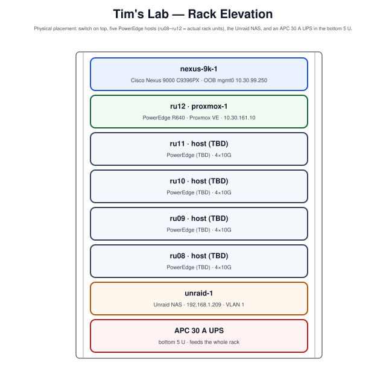

# Chapter 03: Current Diagrams

A rack of gear is only as maintainable as the picture of it. This chapter draws
the lab two ways — the **network topology** (what connects to what, and on which
VLANs) and the **rack elevation** (what sits where) — with the logical VLAN and
addressing plan from Chapter 02 as the third view. All three are generated in
the encyclopedia's house diagram style so they can be regenerated as the lab
changes rather than redrawn by hand.

## Physical and network topology

Every host lands four 10 Gb NICs on the single Nexus, which trunks the data
VLANs to them (native 1611) and routes out via `port-channel1`. The management
plane is deliberately separate: iDRACs and the switch's own `mgmt0` live on the
out-of-band `10.30.99.0/24` network, reachable from host management
(`10.30.161.0/24`, VLAN 1611) only by routing — not by an L2 hop.

Reading it: the **data path** is the trunked VLANs from each host to the Nexus
and out the uplink; the **management path** is the iDRAC/OOB segment that stays
reachable when a data VLAN breaks. `proxmox-1` (ru12) is the host built out in
Volume XXVI and running the FortiGate-VM from Volume XIX; the other four
positions are cabled and ready.

## Rack elevation

The elevation records physical placement — which rack unit holds which host, the
switch, and the NAS — so a cable traced at the switch (`ru12;vmnic1`) maps to a
physical box without opening the rack.

The switch-port descriptions (`ru08;vmnic0` … `ru12;vmnic3`) are the link
between this elevation and the topology above — the single most useful labeling
habit in the lab, and the reason a mis-cabled NIC is a lookup, not a hunt.

## Logical view — VLANs and addressing

The third view is tabular rather than drawn: the **VLAN plan** and the
**addressing** table in [Chapter 02](02-current-equipment.md). Together they
answer "what segment is this, what subnet, and where is its gateway" — the
questions the two diagrams above do not. The key structural facts they encode:

- **Native 1611 / parking 999.** Host trunks are native VLAN 1611
  (External-Mgmt) with a dedicated unused native/parking VLAN 999, so tagged
  data VLANs never leak onto an untagged path.
- **OOB is not a data VLAN.** `10.30.99.0/24` is out-of-band; it is routed to,
  not tagged onto a trunk. A device joins it through the management network, not
  by a VLAN tag.

## Keeping the diagrams current

These figures are house-style SVGs produced by the volume's generator, so the
maintenance workflow is: change the lab, update Chapter 02's tables, regenerate
the diagrams, and the picture stays true. A diagram that drifts from the running
config is worse than none — the intent here is that this volume is regenerated,
not archived.
