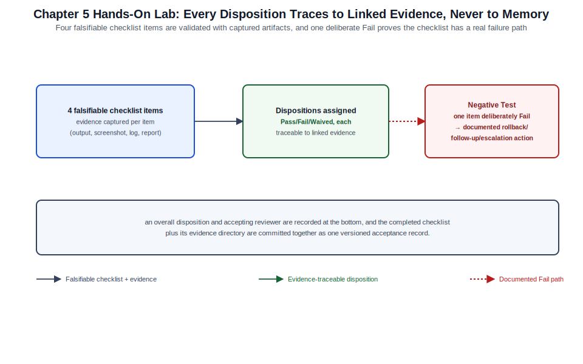

# Chapter 05: Validation, Evidence, Checklists, and Acceptance



*Figure 5-1. The acceptance checklist and evidence flow exercised in this chapter's lab, including the documented-Fail-path negative test.*

## Learning Objectives

- Distinguish validation, evidence, and acceptance as three related but
  separate steps in confirming a change succeeded, and explain why
  collapsing them into one undocumented "it looks fine" step creates
  audit and troubleshooting gaps.
- Select an evidence type (command output, screenshot, automated test
  result, log excerpt) appropriate to a given change and platform.
- Build a reusable acceptance checklist template applicable across the
  platform families covered in this encyclopedia.
- Apply a consistent pass/fail/waived disposition model to checklist
  items, including how to document a waived item defensibly.
- Retain validation evidence in a way that satisfies both operational
  troubleshooting needs and audit/compliance retention requirements.

## Theory and Architecture

**Validation** is the technical act of confirming a system behaves as
intended after a change — running a command, an automated test, or a
functional check and observing the result. **Evidence** is the durable
record of that validation: the captured output, screenshot, log excerpt,
or test report that lets someone other than the executor confirm the
validation actually happened and what it showed. **Acceptance** is the
governance act of a responsible party (often distinct from the executor)
reviewing the evidence and formally agreeing the change met its stated
objective, closing the change record opened under [Chapter 04](04-configuration-templates-baselines-and-change-records.md).

These three steps map directly onto the dry-run and validation gates
introduced in [Chapter 01](01-command-quick-reference-and-safe-administration.md) and formalized in [Chapter 04](04-configuration-templates-baselines-and-change-records.md)'s change record, but
they deserve their own treatment because each has failure modes distinct
from "did the change work":

- Validation without evidence is not auditable — a colleague or an
  auditor six months later has no way to confirm what was actually
  checked, only what the change record claims was checked.
- Evidence without a consistent format is expensive to review — a folder
  of inconsistently named screenshots is far slower to audit than a
  checklist with linked, labeled evidence per item.
- Acceptance without a named, accountable approver is not really
  acceptance — it is merely the absence of an objection, which does not
  satisfy most compliance frameworks' requirement for demonstrable review
  ([Chapter 07](07-security-hardening-incident-response-and-risk-reference.md), [Chapter 09](09-standards-certifications-vendor-documentation-and-reference-governance.md)).

A validated, well-evidenced change with no formal acceptance step is
common in smaller teams and is an acceptable risk trade-off for Tier 0/1
changes; it is not acceptable for Tier 2/3 changes under the tiering model
established in [Chapter 01](01-command-quick-reference-and-safe-administration.md).

## Design Considerations

- **Right-size evidence collection to change tier**, exactly as change
  record formality scales in [Chapter 04](04-configuration-templates-baselines-and-change-records.md): a Tier 0 read-only check may need
  no retained evidence at all; a Tier 3 change should retain command
  output, before/after diffs, and — where a UI-driven step has no CLI
  equivalent — a screenshot.
- **Prefer machine-readable evidence over prose descriptions wherever the
  platform supports it.** A captured `terraform plan` JSON output or a
  test framework's JUnit XML result is both human-reviewable and later
  machine-parseable for trend analysis ([Chapter 08](08-automation-apis-data-formats-and-integration-reference.md)); a paragraph
  describing "everything looked good" is neither.
- **Decide evidence retention duration before generating evidence, driven
  by the strictest applicable requirement** — internal audit policy,
  regulatory retention schedules ([Chapter 07](07-security-hardening-incident-response-and-risk-reference.md)/09), or, absent an external
  requirement, a default of at least one full change/audit cycle (commonly
  12 months for enterprise environments).
- **Separate the checklist template from a specific change's completed
  checklist.** As with configuration templates ([Chapter 04](04-configuration-templates-baselines-and-change-records.md)), keep the
  reusable checklist shape in version control distinct from each
  change's populated instance, so the template can be improved over time
  without altering historical records.
- **Define a waiver process before the first waiver is needed.** A
  checklist item marked "N/A" or "skipped" without a named approver and a
  stated reason is functionally identical to not having the checklist at
  all; require the same authorization rigor for a waiver as for the
  original change tier.
- **Avoid evidence that only proves the command ran, not that it
  succeeded.** Capturing `terraform apply` invocation without its exit
  code or the resulting resource state is a common evidence-quality gap;
  always capture the result, not just the action.

## Implementation and Automation

### The validation-evidence-acceptance pipeline

```text
1. VALIDATE  -> run the check (command, test, functional walkthrough)
2. CAPTURE   -> record the result as durable evidence (see table below)
3. LINK      -> attach evidence to the change record / checklist item
4. REVIEW    -> a named approver examines evidence against acceptance criteria
5. ACCEPT    -> approver records disposition: Pass / Fail / Waived
6. RETAIN    -> evidence and disposition stored per the retention policy
```

### Evidence types by platform family

| Platform / Check Type | Evidence Type | Capture Method |
| --- | --- | --- |
| Linux service state | Command output (text) | `systemctl status <unit> --no-pager > evidence.txt` |
| Network device configuration | Config diff / archive comparison | `show archive config differences` output, saved |
| Terraform-managed infrastructure | Plan/apply output (structured) | `terraform show -json <plan-file>` retained alongside the human-readable plan |
| Kubernetes deployment | Rollout status and object state | `kubectl rollout status deployment/<name>`; `kubectl get pods -o wide` |
| Web/UI-only administrative step | Screenshot with visible timestamp/hostname | Screenshot tool; annotate with date and system identity |
| Automated test suite | Structured test report | JUnit XML / TAP output archived by the CI pipeline |
| Security scan | Scan report with scan date and tool version | Exported vendor report ([Chapter 07](07-security-hardening-incident-response-and-risk-reference.md)) |
| Log-based confirmation | Log excerpt with surrounding context | `journalctl` / centralized log query output, timestamp-bounded |
| Performance/capacity check | Metric snapshot or dashboard export | Monitoring platform export ([Volume XI](../../volume-11-observability-enterprise-operations/README.md)) |

### Acceptance checklist template

```markdown
## Acceptance Checklist: <change ID / title>

| # | Item | Expected Result | Evidence Link | Disposition | Reviewer |
| - | ---- | ---------------- | -------------- | ------------ | -------- |
| 1 | <check description> | <what "pass" looks like> | <link/path> | Pass/Fail/Waived | <name> |
| 2 | ... | ... | ... | ... | ... |

**Waiver justification (if any item is Waived):**
- Item #: <n>
- Reason: <why this check does not apply or cannot be performed>
- Compensating control: <what reduces the resulting risk>
- Approved by: <name, distinct from executor for Tier 2/3>

**Overall disposition:** Accepted / Accepted with waivers / Rejected
**Accepted by:** <name>
**Date:** <YYYY-MM-DD>
```

### Disposition model

| Disposition | Meaning | Who may assign it |
| --- | --- | --- |
| Pass | Evidence confirms the expected result was observed | Executor may propose; approver confirms for Tier 2/3 |
| Fail | Evidence contradicts the expected result | Anyone reviewing the evidence |
| Waived | The check is intentionally not performed or not applicable, with a documented reason and compensating control | Approver only, never the executor alone, for Tier 1+ |

A single **Fail** on a Tier 2/3 checklist should block overall acceptance
and trigger the rollback plan from the associated change record (Chapter
04) unless a documented, approved exception process explicitly allows
partial acceptance.

### Example: populated checklist excerpt

| # | Item | Expected Result | Evidence Link | Disposition | Reviewer |
| - | ---- | ---------------- | -------------- | ------------ | -------- |
| 1 | NTP service reachable post-change | `chronyc tracking` shows stratum ≤ 3, offset < 1s | `evidence/ntp-tracking-20260718.txt` | Pass | J. Rivera |
| 2 | Firewall rule matches five-field flow statement | `nft list ruleset` matches documented flow ([Chapter 02](02-ports-protocols-services-and-traffic-flows.md)) | `evidence/nft-ruleset-20260718.txt` | Pass | J. Rivera |
| 3 | Legacy SNMPv2c community disabled | `snmpwalk` with v2c community fails; SNMPv3 succeeds | `evidence/snmp-test-20260718.txt` | Waived | M. Chen (compensating control: SNMPv2c restricted to management VLAN pending v3 migration ticket INF-4471) |

## Validation and Troubleshooting

- **If evidence cannot be produced for a checklist item, treat that as a
  Fail, not a Pass.** The absence of evidence is indistinguishable from
  the absence of validation; do not assume a check passed because no one
  recorded a problem.
- **Cross-check evidence timestamps against the change window.** Evidence
  captured before the change was applied, or long after (suggesting a
  retroactive, reconstructed check), undermines the audit value of the
  record; timestamp every captured artifact.
- **When a checklist item fails intermittently on re-run, do not simply
  re-run until it passes.** Intermittent failure is itself a finding;
  document the failure rate observed and investigate root cause
  ([Chapter 06](06-troubleshooting-decision-aids-and-escalation.md)) before
  accepting a later "lucky" pass as sufficient evidence.
- **Reconcile checklist disposition against the change record's stated
  validation plan.** A checklist that diverges from what the change
  record promised to check (more, fewer, or different items) should be
  explained, since it indicates either scope creep or an incomplete
  original plan.
- **Audit sampling: periodically re-review a sample of "Accepted"
  checklists after the fact** to confirm evidence links still resolve and
  actually support the recorded disposition; link rot and misfiled
  evidence are common failure modes discovered only during an audit.

## Security and Best Practices

- Store evidence with the same access controls as the systems it
  describes; a configuration screenshot or log excerpt can disclose
  hostnames, internal addressing, or partial credentials and should not
  be stored in a less-protected location than the source system.
- Redact secrets and tokens from captured evidence before retention —
  command output that happens to include an API key or password should be
  sanitized, not archived verbatim.
- Require a named, individually attributable reviewer for every
  acceptance disposition; shared or role-based approval accounts defeat
  the accountability purpose of the acceptance step (consistent with the
  attributable-command principle in [Chapter 01](01-command-quick-reference-and-safe-administration.md)).
- Protect evidence and checklist records from post-hoc modification after
  acceptance; store them in an append-only or version-controlled location
  so a later edit is visible as a new revision rather than a silent
  change to history.
- Align evidence retention duration with the strictest applicable
  compliance requirement ([Chapter 07](07-security-hardening-incident-response-and-risk-reference.md)/09) rather than an arbitrary internal
  default, and document the chosen retention period in the checklist
  template itself so it is not left to individual judgment per change.

## References and Knowledge Checks

**References**

- [Chapter 01](01-command-quick-reference-and-safe-administration.md) of this volume — the four safe-administration gates
  (dry run and validation origin).
- [Chapter 04](04-configuration-templates-baselines-and-change-records.md) of this volume — change records that acceptance checklists
  close out.
- [Chapter 07](07-security-hardening-incident-response-and-risk-reference.md) of this volume — compliance and retention drivers for
  evidence handling.
- [ISO/IEC 19011](https://www.iso.org/standard/70017.html) — Guidelines for auditing management systems (general
  audit-evidence principles referenced across frameworks).
- [Volume XI](../../volume-11-observability-enterprise-operations/README.md) — Observability and Enterprise Operations (metric and log
  evidence sources).

**Knowledge checks**

1. Explain the difference between validation, evidence, and acceptance,
   and give an example of a change that has the first two but not the
   third.
2. Why should a missing piece of evidence be treated as a Fail rather
   than assumed to be a Pass?
3. What two things must a valid waiver record beyond "this check does not
   apply"?
4. Why should acceptance dispositions be stored in an append-only or
   version-controlled location?

## Hands-On Lab

**Objective:** Build a reusable acceptance checklist template, populate it
for a real or lab change, and produce properly captured, linked evidence
for each item.

**Prerequisites:** A lab or work change you can validate (even a
low-risk Tier 0/1 change is sufficient); access to the system(s) involved;
a Markdown editor; a location to store evidence files.

1. Create `acceptance-checklist-template.md` using the template in this
   chapter, with columns for item, expected result, evidence link,
   disposition, and reviewer. **Expected result:** a reusable, unpopulated
   template exists in version control.
2. Copy the template to a change-specific file and define at least four
   checklist items for a real or lab change, writing a specific,
   falsifiable expected result for each (not "looks correct" but a
   concrete observable value). **Expected result:** four checklist rows
   with testable expected results.
3. Execute each check and capture evidence using the type appropriate to
   the platform (command output, screenshot, test report, or log
   excerpt), saving each artifact with a timestamped filename.
   **Expected result:** four evidence artifacts exist, each linked from
   its checklist row.
4. Assign a disposition (Pass/Fail/Waived) to each item based strictly on
   the captured evidence, not on memory or assumption. **Expected
   result:** every row has a disposition directly traceable to its linked
   evidence.
5. If any item is Waived, complete the waiver justification block with a
   reason, a compensating control, and an approver name. **Expected
   result:** the waiver section is either fully completed or no items are
   waived.
6. Negative test: intentionally record one checklist item as Fail (using
   a real observed failure, or by checking a condition you know is not
   yet met) and document what the resulting action would be (rollback,
   follow-up change, or escalation per [Chapter 06](06-troubleshooting-decision-aids-and-escalation.md)). **Expected result:**
   the checklist demonstrates a documented Fail path, not only the happy
   path.
7. Record an overall disposition and accepting reviewer at the bottom of
   the checklist, then commit the completed checklist and its evidence
   directory to version control. **Expected result:** a complete,
   versioned acceptance record exists for the change.

**Cleanup:** Redact any secrets or personal data discovered in captured
evidence before committing; remove evidence for the intentional Fail test
if it referenced a non-representative lab condition that could confuse
future readers, or clearly label it as a lab exercise artifact.

## Lab Verification

Complete this sign-off once the lab has been run end to end, including the
negative test. Until then, the lab is unverified.

- **Lab verified by:** *pending*
- **Date:** *pending*

## Summary and Completion Checklist

This chapter separated validation (the technical check), evidence (the
durable record of that check), and acceptance (the governance decision) —
three steps commonly compressed into one and, when compressed, a source of
audit and troubleshooting gaps. The evidence-type table and checklist
template give a consistent, reusable shape for capturing and reviewing
that evidence across every platform family in this encyclopedia, and the
pass/fail/waived disposition model gives a defensible way to record
exceptions.

- [ ] I can explain the difference between validation, evidence, and
      acceptance.
- [ ] I can select an appropriate evidence type for a given platform and
      change type.
- [ ] I built and populated an acceptance checklist with falsifiable
      expected results.
- [ ] I correctly completed a waiver justification, including a
      compensating control and named approver.
- [ ] I documented a Fail disposition and its resulting action, not only
      a Pass path.
